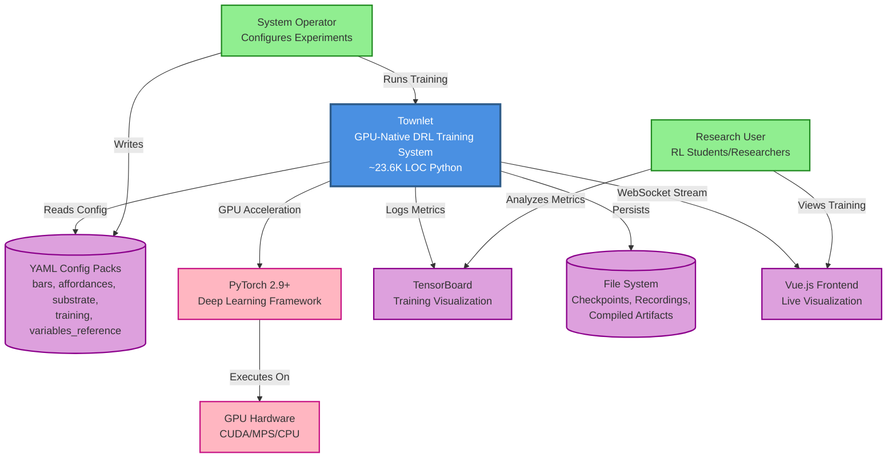
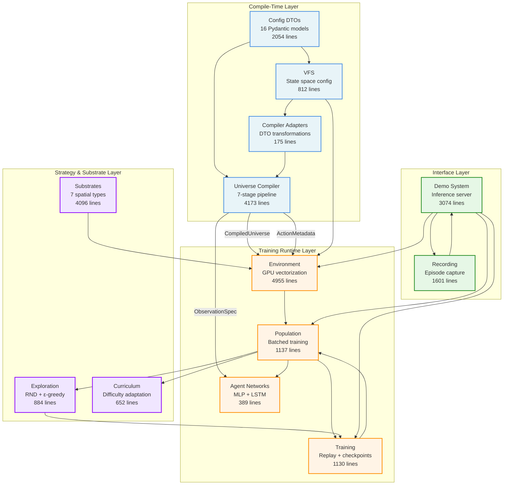
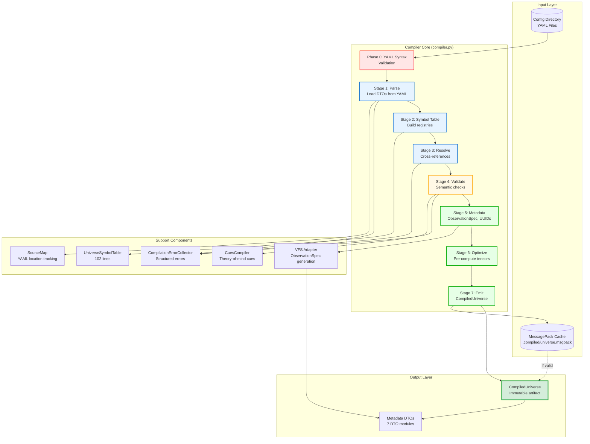
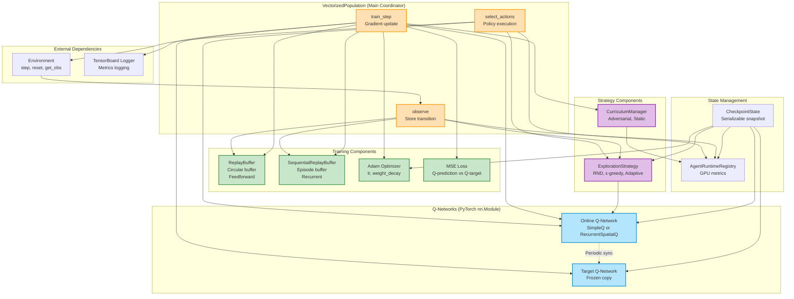

# Architecture Diagrams - Townlet DRL Training System

**Generated:** 2025-11-12
**Source:** `02-subsystem-catalog.md` (13 subsystems analyzed)
**Format:** Mermaid C4 diagrams

---

## Overview

This document presents the Townlet architecture at three levels of abstraction following the C4 model:
1. **Context Diagram** - System boundary and external interactions
2. **Container Diagram** - 13 internal subsystems with dependencies
3. **Component Diagrams** - Internal structure of 3 representative subsystems

---

## C4 Level 1: Context Diagram

**Title:** Townlet System Context - External Dependencies and Actors



**Description:**

The Townlet system sits at the center as a GPU-accelerated Deep Reinforcement Learning training platform designed for pedagogical research. External actors include research users (students learning RL) who observe training through live visualization and TensorBoard metrics, and system operators who configure experiments through declarative YAML config packs.

Key external dependencies:
- **PyTorch** provides GPU acceleration and neural network primitives
- **YAML Config Packs** define complete experiment configurations (substrate, agents, rewards)
- **File System** stores checkpoints, compiled universes, and episode recordings
- **TensorBoard** visualizes training metrics in real-time
- **Vue.js Frontend** provides WebSocket-based live visualization of agent behavior

The system is designed for zero-dependency configuration (no Python code editing required for experiments).

**Legend:**
- Blue box: Townlet system boundary
- Green boxes: Human actors (users, operators)
- Pink boxes: Technology dependencies (PyTorch, GPU)
- Purple boxes/cylinders: Data stores and external systems

---

## C4 Level 2: Container Diagram

**Title:** Townlet Internal Subsystems and Dependencies



**Description:**

The Townlet system is organized into four functional layers:

### Compile-Time Layer (Blue)
Configuration compilation happens before training begins:
- **Config DTOs** validate YAML configs using Pydantic (no-defaults principle)
- **Universe Compiler (UAC)** executes 7-stage pipeline to produce cached CompiledUniverse artifacts
- **VFS** defines state space configuration (variables, observations, access control)
- **Compiler Adapters** transform VFS schemas into compiler DTOs

The UAC outputs immutable CompiledUniverse artifacts that the runtime consumes.

### Training Runtime Layer (Orange)
GPU-accelerated training execution:
- **Environment** orchestrates dynamics engines (affordances, cascades, meters) with GPU vectorization
- **Population** coordinates batched Q-learning updates across agents
- **Agent Networks** provides Q-network architectures (SimpleQNetwork for full obs, RecurrentSpatialQNetwork for POMDP)
- **Training** manages replay buffers (dual strategy for feedforward/recurrent), checkpointing, and TensorBoard logging

The Population subsystem acts as the central coordinator, invoking Environment steps, Network forward passes, and Training utilities.

### Strategy & Substrate Layer (Purple)
Pluggable strategies and spatial representations:
- **Substrates** implements 7 spatial types (Grid2D/3D/ND, Continuous, Aspatial) via factory pattern
- **Exploration** provides RND novelty detection with adaptive intrinsic annealing
- **Curriculum** adjusts difficulty based on survival rate, learning progress, and policy entropy

### Interface Layer (Green)
Observability and visualization:
- **Demo System** runs live inference with WebSocket streaming and DemoRunner training orchestration
- **Recording** captures episodes with LZ4 compression for debugging and video export

**Key Data Flows:**
1. **Config → Runtime**: YAML → DTOs → UAC → CompiledUniverse → Environment
2. **Training Loop**: Environment.step() → Population.observe() → Training.sample() → Network.forward() → Population.train()
3. **Visualization**: Population → Demo System → WebSocket → Frontend

**Legend:**
- Light blue: Compile-time subsystems
- Orange: Training runtime core
- Purple: Strategy/substrate support
- Green: Interface/observability
- Arrows: Data/control flow dependencies

---

## C4 Level 3: Component Diagram - Universe Compiler

**Title:** Universe Compiler Internal Architecture (7-Stage Pipeline)



**Description:**

The Universe Compiler implements a classic compiler architecture with 7 distinct stages plus a validation pre-pass:

**Phase 0 (Red):** Fast-fail YAML syntax validation before expensive compilation work begins.

**Stages 1-3 (Blue - Frontend):**
- **Stage 1 (Parse):** Load YAML files into Pydantic DTOs with structured error collection
- **Stage 2 (Symbol Table):** Build registries for meters, affordances, actions, variables, cues
- **Stage 3 (Resolve):** Cross-reference resolution (affordance → meter dependencies, cascade → meter links)

**Stage 4 (Orange - Semantic Analysis):**
- Cross-config validation (batch size ≤ buffer capacity, network type vs observability)
- Cues compilation (theory-of-mind cue expressions)
- Security validation (path traversal checks, DoS limits)

**Stages 5-7 (Green - Backend):**
- **Stage 5 (Metadata Enrichment):** Generate ObservationSpec via VFS Adapter, compute UUIDs for checkpoint compatibility
- **Stage 6 (Optimization):** Pre-compute runtime lookup tensors (affordance positions, cascade strengths)
- **Stage 7 (Emit):** Serialize CompiledUniverse to MessagePack with SHA256 digest

**Support Components:**
- **UniverseSymbolTable:** Central registry for named entities (meters, affordances, etc.)
- **CompilationErrorCollector:** Accumulates errors with source locations, hints, and structured codes
- **SourceMap:** YAML line number tracking for error reporting
- **CuesCompiler:** Specialized compiler for theory-of-mind cue expressions
- **VFS Adapter:** Transforms VFS schemas into compiler DTOs

**Caching Strategy:** Two-tier validation (fast mtime check + content hash verification) before expensive recompilation.

**Key Invariants:**
- CompiledUniverse is immutable (frozen dataclasses)
- All stages must succeed for artifact emission
- Error collection never raises exceptions (accumulate all errors for batch reporting)

---

## C4 Level 3: Component Diagram - Environment Subsystem

**Title:** Environment Subsystem - Engine Composition Architecture

```mermaid
graph TB
    subgraph "VectorizedHamletEnv (Main Orchestrator)"
        Reset[reset<br/>Initialize episode]
        Step[step<br/>Execute actions]
        GetObs[get_observations<br/>Construct obs tensors]
    end

    subgraph "Dynamics Engines"
        AffEngine[AffordanceEngine<br/>Interaction processing<br/>506 lines]
        CascadeEngine[CascadeEngine<br/>Meter cascades<br/>331 lines]
        MeterDyn[MeterDynamics<br/>Depletion + updates<br/>187 lines]
        DACEngine[DACEngine<br/>Reward computation<br/>849 lines]
    end

    subgraph "State Storage (GPU Tensors)"
        Positions[agent_positions<br/>torch.Tensor]
        Meters[meter_values<br/>torch.Tensor]
        ActiveAff[active_interactions<br/>torch.Tensor]
        VarReg[VariableRegistry<br/>VFS integration]
    end

    subgraph "Configuration DTOs"
        AffConfig[AffordanceConfig<br/>Interaction definitions]
        CascConfig[CascadeConfig<br/>Meter relationships]
        ActionConfig[ActionConfig<br/>Action space]
    end

    subgraph "Support Components"
        ActionBuilder[ComposedActionSpace<br/>Substrate + custom]
        Validator[SubstrateActionValidator<br/>Compatibility checks]
        RewardStrat[RewardStrategy<br/>Multiplicative/Adaptive]
        Layout[AffordanceLayout<br/>Spatial placement]
    end

    subgraph "Substrate Interface"
        Substrate[SpatialSubstrate<br/>Polymorphic positioning]
    end

    Reset --> Substrate
    Reset --> Positions
    Reset --> Meters
    Reset --> Layout
    Reset --> VarReg

    Step --> Substrate
    Step --> Validator
    Step --> Positions
    Step --> AffEngine
    Step --> MeterDyn
    Step --> CascadeEngine
    Step --> DACEngine
    Step --> GetObs

    AffEngine --> ActiveAff
    AffEngine --> Meters
    AffEngine --> AffConfig

    MeterDyn --> Meters
    MeterDyn --> VarReg

    CascadeEngine --> Meters
    CascadeEngine --> CascConfig

    DACEngine --> Meters
    DACEngine --> RewardStrat

    GetObs --> VarReg
    GetObs --> Positions
    GetObs --> Meters

    ActionBuilder --> ActionConfig
    Validator --> Substrate

    style Reset fill:#FFE6B3,stroke:#FF9800,stroke-width:2px
    style Step fill:#FFE6B3,stroke:#FF9800,stroke-width:2px
    style GetObs fill:#FFE6B3,stroke:#FF9800,stroke-width:2px

    style AffEngine fill:#B3E5FC,stroke:#0288D1,stroke-width:2px
    style CascadeEngine fill:#B3E5FC,stroke:#0288D1,stroke-width:2px
    style MeterDyn fill:#B3E5FC,stroke:#0288D1,stroke-width:2px
    style DACEngine fill:#B3E5FC,stroke:#0288D1,stroke-width:2px

    style Positions fill:#C8E6C9,stroke:#388E3C,stroke-width:2px
    style Meters fill:#C8E6C9,stroke:#388E3C,stroke-width:2px
    style ActiveAff fill:#C8E6C9,stroke:#388E3C,stroke-width:2px
    style VarReg fill:#C8E6C9,stroke:#388E3C,stroke-width:2px
```



**Description:**

The Environment subsystem uses an **engine composition pattern** where VectorizedHamletEnv orchestrates multiple specialized dynamics engines rather than implementing all logic directly.

**Main Orchestrator Methods:**
- **reset()**: Initialize episode with substrate positioning, meter initialization, affordance layout, VFS registry setup
- **step()**: Execute action pipeline (validation → substrate movement → affordance interactions → meter updates → cascades → rewards → observations)
- **get_observations()**: Construct observation tensors from VFS registry with normalization

**Dynamics Engines** (Independent Lifecycle):
1. **AffordanceEngine** - Processes INTERACT actions using pre-compiled affordance configs, handles instant/duration/delayed interaction types, applies costs and effects
2. **CascadeEngine** - Implements meter cascades (e.g., low energy → health decay) with GPU-accelerated tensor operations
3. **MeterDynamics** - Applies depletion rates, range clamping, writes to VFS registry
4. **DACEngine** - Declarative reward computation with extrinsic/intrinsic strategies (currently basic implementation, full DAC system planned)

**State Storage** (All GPU Tensors):
- **agent_positions**: `[num_agents, position_dim]` tensor on device
- **meter_values**: `[num_agents, num_meters]` tensor on device
- **active_interactions**: Tracks duration-based affordance states
- **VariableRegistry**: VFS integration for observation construction

**Engine Coordination:**
The step() method calls engines in sequence:
```python
1. Validate actions (SubstrateActionValidator)
2. Execute substrate movement (Substrate.move())
3. Process affordance interactions (AffordanceEngine.execute())
4. Apply meter dynamics (MeterDynamics.apply())
5. Trigger cascades (CascadeEngine.apply())
6. Compute rewards (DACEngine.compute() or RewardStrategy)
7. Construct observations (VFS.get_observations())
```

**GPU Vectorization:**
All operations batched across agents with `[num_agents, ...]` tensor shapes. No Python loops in hot path.

**Key Patterns:**
- Engine pattern with clear responsibilities
- VFS integration for observation construction
- Polymorphic substrate interface (Grid2D, Aspatial, etc.)
- Dual reward strategies (multiplicative baseline, adaptive for intrinsic motivation)
- Composed action space (substrate actions + custom actions + affordance interactions)

---

## C4 Level 3: Component Diagram - Population Subsystem

**Title:** Population Subsystem - Training Loop Coordination



**Description:**

The Population subsystem coordinates the complete training loop, integrating environment interaction, exploration, learning, and curriculum adaptation.

**Core Training Cycle:**

1. **select_actions()** - Policy execution
   - Forward pass through online Q-network
   - Exploration strategy selects actions (ε-greedy exploration, RND novelty bonus)
   - Updates runtime registry (epsilon decay, intrinsic weight)

2. **observe()** - Experience storage
   - Receives transition from environment step
   - Computes intrinsic rewards via exploration strategy
   - Stores in replay buffer (dual strategy: standard for feedforward, sequential for recurrent)
   - Updates runtime registry (survival time, episode count)

3. **train_step()** - Gradient-based learning
   - Samples batch from replay buffer
   - Computes Q-predictions (online network forward pass)
   - Computes Q-targets (target network forward pass)
   - Algorithm selection: Vanilla DQN vs Double DQN (configurable)
   - MSE loss + gradient clipping (max_norm=10.0)
   - Optimizer step (Adam with configurable lr)
   - Curriculum decision (adjust difficulty if needed)
   - TensorBoard logging

**Q-Network Architecture Selection:**
- **SimpleQNetwork** for full observability (L0, L0.5, L1, L3)
- **RecurrentSpatialQNetwork** for partial observability (L2 POMDP)
- **StructuredQNetwork** for semantic observation groups (future)

**Dual Replay Buffer Strategy:**
- **ReplayBuffer** - Circular buffer for feedforward networks (individual transitions)
- **SequentialReplayBuffer** - Episode-based buffer for recurrent networks (maintains temporal dependencies)

**Q-Learning Variants:**
- **Vanilla DQN**: `Q-target = r + γ * max_a Q_target(s', a)`
- **Double DQN**: `Q-target = r + γ * Q_target(s', argmax_a Q_online(s', a))`
  Decouples action selection (online) from evaluation (target) to reduce overestimation

**Target Network Synchronization:**
Periodic hard update (copy weights from online to target every `target_update_frequency` training steps) for training stability.

**State Management:**
- **RuntimeRegistry** - GPU tensors for hot-path metrics (survival_time, curriculum_stage, epsilon, intrinsic_weight)
- **Checkpoint** - Serializable snapshot for save/load (networks, optimizer, strategies, registry)

**Strategy Integration:**
- **Exploration** - Pluggable (RND, ε-greedy, adaptive annealing)
- **Curriculum** - Adjusts environment difficulty based on performance metrics

**Key Coordination:**
Population acts as the central coordinator between Environment (rollouts), Networks (learning), and Strategies (exploration/curriculum), orchestrating the complete DQN training pipeline.

---

## Selection Rationale

**Why These 3 Component Diagrams?**

1. **Universe Compiler** - Selected for:
   - Largest subsystem (4,173 lines)
   - Shows classic compiler architecture (multi-stage pipeline)
   - Compile-time vs runtime separation pattern
   - Critical path for all experiments (config → runtime artifact)

2. **Environment** - Selected for:
   - Different architectural pattern (engine composition vs pipeline)
   - GPU vectorization patterns (all state as tensors)
   - Shows runtime dynamics coordination
   - Central to training loop (step() called every timestep)

3. **Population** - Selected for:
   - Training loop orchestration pattern (different from compiler/environment)
   - Integration point for multiple subsystems (networks, strategies, buffers)
   - Shows Q-learning algorithm implementation
   - Demonstrates strategy pattern (dual buffers, dual Q-learning variants)

**Why Not Others?**

- **Config DTOs**: 16 files but similar pattern (Pydantic validation), would be repetitive
- **Substrates**: 7 types but similar polymorphic pattern, factory already documented
- **Training**: Components already shown in Population diagram (replay buffers, checkpointing)
- **VFS**: Simple 3-component pipeline, less architecturally interesting than others
- **Demo System**: Interface layer, less critical to understanding core architecture
- **Recording, Curriculum, Exploration**: Support subsystems, patterns covered in Population
- **Compiler Adapters**: Single file (175 lines), adapter pattern straightforward
- **Agent Networks**: 2 architectures documented in catalog, network details less architectural

---

## Assumptions and Limitations

### Assumptions

1. **External Systems**: Assumed PyTorch, TensorBoard, and file system as external dependencies based on catalog imports
2. **Data Flow Directions**: Inferred from catalog "Inbound"/"Outbound" dependencies (validated bidirectionally)
3. **WebSocket Protocol**: Assumed WebSocket for frontend based on Demo System implementation details
4. **GPU Acceleration**: All training runtime components assumed to use GPU tensors based on catalog descriptions
5. **YAML Configuration**: Assumed all experiments configured via YAML (no Python code editing) per no-defaults principle

### Limitations

1. **Frontend Architecture**: Vue.js frontend not analyzed (out of scope), shown as external black box
2. **Deployment Model**: Single-node training assumed, distributed training architecture not documented
3. **Database Schema**: SQLite schema for Demo System not detailed (not in catalog)
4. **Network Internals**: Q-network layer details abstracted (focus on architecture, not ML details)
5. **Test Infrastructure**: Test architecture not documented (tests out of scope)

### Diagram Constraints

1. **Format**: Mermaid syntax (may not render in all Markdown viewers)
2. **Abstraction**: Component diagrams for 3 of 13 subsystems (23% coverage)
   - Rationale: Remaining subsystems follow similar patterns or are support components
3. **Trade-offs**: Visual clarity prioritized over exhaustive detail
   - Grouped 13 subsystems into 4 functional layers for readability
   - Omitted some internal methods to avoid clutter
   - Focused on primary data flows, not all possible interactions
4. **Color Coding**: Used consistently across diagrams
   - Context: Blue (system), Green (actors), Pink (tech), Purple (data)
   - Container: Blue (compile-time), Orange (runtime), Purple (strategy), Green (interface)
   - Components: Color by functional grouping (orchestrator, engines, state, strategies)

### Confidence Levels

**High Confidence:**
- All 13 subsystems present and validated
- Dependencies verified bidirectionally in catalog
- Data flows based on explicit catalog documentation
- Patterns observed from 23,600 LOC analysis

**Medium Confidence:**
- External system interactions (inferred from imports, not explicit architecture docs)
- Exact WebSocket message protocol (not detailed in catalog)
- Deployment topology (single vs distributed not specified)

**Low Confidence:**
- Frontend internal architecture (out of scope)
- Test infrastructure patterns (out of scope)
- Database schema details (not in catalog)

---

## Diagram Usage Guide

**For Technical Stakeholders:**
- Start with **Container Diagram** (Level 2) for subsystem overview
- Dive into **Component Diagrams** (Level 3) for implementation details
- Reference catalog for line counts, dependencies, specific patterns

**For Research Stakeholders:**
- Start with **Context Diagram** (Level 1) for system boundary understanding
- Use **Container Diagram** (Level 2) to understand compile-time vs runtime separation
- Component diagrams show three different architectural patterns (pipeline, engine composition, training coordination)

**For Integration:**
- Container diagram shows all subsystem dependencies for integration planning
- Component diagrams reveal internal extension points
- Catalog contains detailed concerns for each subsystem

---

## Diagram Statistics

**Total Subsystems Documented:** 13
**Component Diagrams Generated:** 3 (23% coverage)
**Total Relationships Mapped:** ~50+ dependencies
**Lines of Code Represented:** 23,600+ lines
**Abstraction Layers:** 4 (compile-time, runtime, strategy, interface)

**Diagram Complexity:**
- Context: 1 system + 7 external entities + 2 actors = 10 elements
- Container: 13 subsystems + 4 groupings = 17 elements
- Universe Compiler: 7 stages + 5 support components + 4 data stores = 16 elements
- Environment: 1 orchestrator + 4 engines + 4 state + 6 support = 15 elements
- Population: 1 coordinator + 2 networks + 4 training + 2 strategies + 3 state = 12 elements

All diagrams designed for readability (< 20 primary elements each).
