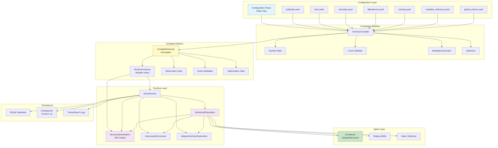

# Townlet System Architecture - Overview

## High-Level System Diagram



## System Layers

### 1. Configuration Layer (YAML)
- **Purpose**: Declarative universe specification
- **Format**: YAML configuration packs
- **Key Principle**: UNIVERSE_AS_CODE - everything is configurable
- **Files**:
  - `substrate.yaml`: Spatial substrate (Grid2D, Grid3D, GridND, Continuous, Aspatial)
  - `bars.yaml`: Meter definitions (energy, health, etc.)
  - `cascades.yaml`: Meter relationships (e.g., low satiation → drains energy)
  - `affordances.yaml`: Interaction definitions (Bed, Hospital, Job, etc.)
  - `training.yaml`: Hyperparameters and enabled affordances
  - `variables_reference.yaml`: VFS variable definitions and observations
  - `global_actions.yaml`: Global action vocabulary

### 2. Compilation Pipeline
- **Purpose**: Transform configurations into optimized runtime artifacts
- **Stages**:
  1. Parse YAML files into DTOs
  2. Build symbol tables (meters, variables, actions, affordances)
  3. Resolve cross-file references
  4. Cross-validate semantic constraints
  5. Compute metadata and observation specs
  6. Optimize (pre-compute tensors, lookup tables)
  7. Emit immutable CompiledUniverse

- **Key Components**:
  - `UniverseCompiler`: Main entry point
  - `UniverseSymbolTable`: Tracks all symbols across configs
  - `CompilationErrorCollector`: Accumulates errors/warnings
  - `VFSObservationSpecBuilder`: Builds observation specs from VFS

### 3. Compiled Artifacts
- **CompiledUniverse**: Frozen, immutable artifact
  - Contains all metadata, specs, and optimization data
  - Cacheable (stored in `.compiled/universe.msgpack`)
  - Includes provenance tracking (config hash, compiler version, git SHA)
- **RuntimeUniverse**: Mutable views for runtime execution
  - Cloneable configs for environment instantiation
  - VariableRegistry for VFS state management

### 4. Runtime Layer
- **VectorizedHamletEnv**: GPU-native vectorized environment
  - Batches multiple agents: `[num_agents, ...]` tensor operations
  - Substrate abstraction (Grid2D, Grid3D, GridND, Continuous, Aspatial)
  - Meter dynamics with cascades
  - Affordance engine with temporal mechanics
  - Action masking (operating hours, availability)

- **VectorizedPopulation**: Agent training coordinator
  - Shared Q-network across agents
  - Experience replay (standard or sequential for LSTM)
  - Training loop (sample → predict → update)
  - Curriculum and exploration integration

- **DemoRunner**: Training orchestrator
  - Episode loop management
  - Checkpoint save/load
  - Database logging
  - TensorBoard integration

### 5. Agent Layer
- **Q-Networks**:
  - `SimpleQNetwork`: MLP for full observability (L0, L0.5, L1)
  - `RecurrentSpatialQNetwork`: LSTM for partial observability (L2, L3)
- **Replay Buffer**:
  - `ReplayBuffer`: Standard experience replay
  - `SequentialReplayBuffer`: Episode sequences for LSTM
- **Optimizer**: Adam optimizer with gradient clipping

### 6. Persistence
- **SQLite Database**: Episode metrics, affordance visits, system state
- **Checkpoints**: Full training state (network, optimizer, curriculum, layout)
- **TensorBoard**: Real-time metrics visualization

## Data Flow Summary

1. **Compile-Time**:
   ```
   YAML Configs → UniverseCompiler → CompiledUniverse → Cache
   ```

2. **Training-Time**:
   ```
   CompiledUniverse → RuntimeUniverse → VectorizedHamletEnv → Observations
   Observations → Q-Network → Q-Values → Actions
   Actions → Environment → Rewards → Replay Buffer → Training
   ```

3. **Persistence**:
   ```
   Training State → Checkpoints (every 100 episodes)
   Episode Metrics → SQLite Database
   Training Metrics → TensorBoard
   ```

## Key Design Patterns

1. **Immutability**: CompiledUniverse is frozen after compilation
2. **Batch Processing**: All operations vectorized across `num_agents`
3. **GPU-Native**: PyTorch tensors on CUDA for performance
4. **Separation of Concerns**: Compilation vs Runtime vs Persistence
5. **No-Defaults Principle**: All behavioral parameters explicit in configs
6. **Provenance Tracking**: Config hash + compiler version in artifacts
