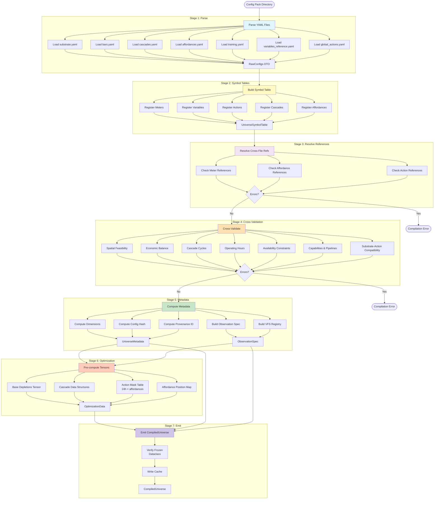
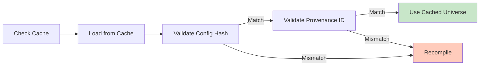
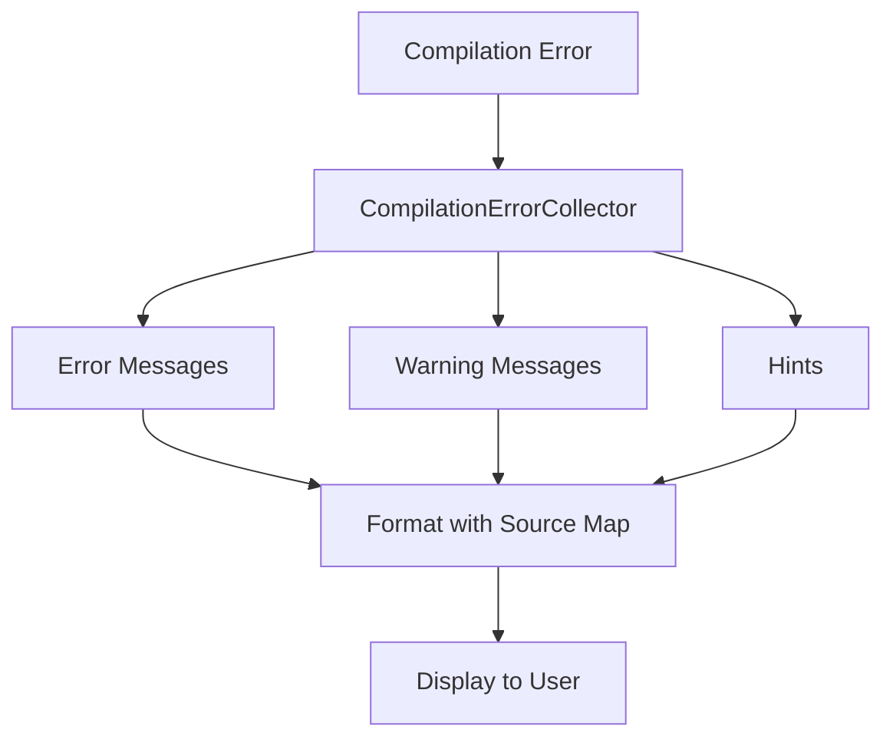

# Townlet Compilation Pipeline

## Compilation Stages



## Stage Details

### Stage 1: Parse Individual Files
- **Input**: Config pack directory path
- **Process**:
  - Load each YAML file using Pydantic DTOs
  - Validate schema compliance
  - Build source map for error reporting
- **Output**: `RawConfigs` object containing all parsed configs
- **Key Classes**:
  - `RawConfigs.from_config_dir()`
  - `SubstrateConfig`, `BarConfig`, `CascadeConfig`, etc.

### Stage 2: Build Symbol Tables
- **Input**: `RawConfigs`
- **Process**:
  - Register all meters from `bars.yaml`
  - Register all variables from `variables_reference.yaml`
  - Register all actions from `global_actions.yaml`
  - Register all cascades from `cascades.yaml`
  - Register all affordances from `affordances.yaml`
  - Register all cues from `cues.yaml`
- **Output**: `UniverseSymbolTable`
- **Purpose**: Create global namespace for cross-file reference resolution

### Stage 3: Resolve References
- **Input**: `RawConfigs`, `UniverseSymbolTable`
- **Process**:
  - Validate all meter references in cascades
  - Validate all meter references in affordances (costs, effects, capabilities)
  - Validate enabled_affordances list
  - Validate action costs/effects meter references
- **Output**: List of reference errors (if any)
- **Error Codes**: `UAC-RES-001` through `UAC-RES-005`

### Stage 4: Cross-Validation
- **Input**: `RawConfigs`, `UniverseSymbolTable`
- **Validations**:
  1. **Spatial Feasibility**: Grid has enough cells for affordances + agents
  2. **Economic Balance**: Income-generating affordances exist and are available
  3. **Cascade Cycles**: No circular dependencies in meter cascades
  4. **Operating Hours**: Valid 0-23 hour ranges
  5. **Availability Constraints**: Valid min/max bounds [0.0, 1.0]
  6. **Capabilities**: multi_tick requires per_tick or on_completion effects
  7. **Substrate-Action Compatibility**: Actions valid for substrate type
  8. **Capacity & Sustainability**: Critical meters have restoration paths
- **Output**: List of validation errors/warnings
- **Error Codes**: `UAC-VAL-001` through `UAC-VAL-010`

### Stage 5: Compute Metadata
- **Input**: `RawConfigs`, `UniverseSymbolTable`
- **Process**:
  - Build VFS observation spec from variables
  - Compute observation dimensions
  - Compute grid dimensions (if applicable)
  - Compute economic metrics (max income, total costs, balance)
  - Generate config hash (SHA256 of normalized YAMLs)
  - Generate provenance ID (hash of config + compiler + environment)
- **Output**: `UniverseMetadata`, `ObservationSpec`, VFS fields
- **Key Fields**:
  - `observation_dim`: Total observation dimensions
  - `action_count`: Number of actions
  - `meter_count`, `affordance_count`: Counts
  - `config_hash`, `provenance_id`: Provenance tracking

### Stage 6: Optimization
- **Input**: `RawConfigs`, `UniverseMetadata`
- **Process**:
  - Pre-compute base depletion tensor `[meter_count]`
  - Pre-compute cascade data structures (sorted by target)
  - Pre-compute action mask table `[24 hours, affordance_count]`
  - Pre-compute affordance position tensors
- **Output**: `OptimizationData`
- **Purpose**: Avoid runtime computation, enable GPU-native operations

### Stage 7: Emit CompiledUniverse
- **Input**: All computed artifacts
- **Process**:
  - Construct `CompiledUniverse` frozen dataclass
  - Verify immutability (frozen=True)
  - Write cache to `.compiled/universe.msgpack`
- **Output**: `CompiledUniverse`
- **Invariants**:
  - Must be frozen (immutable after creation)
  - Must be cacheable (deterministic from configs)

## Cache Management



## Error Handling



### Error Code Ranges
- **UAC-RES-001 to UAC-RES-005**: Reference resolution errors
- **UAC-VAL-001 to UAC-VAL-010**: Cross-validation errors

### Source Map
- Tracks YAML file line numbers for each config element
- Enables precise error location reporting
- Format: `filename:key:subkey[index]`

## Provenance Tracking

The compiler generates a provenance ID to track exact compilation conditions:

```python
provenance_id = SHA256(
    config_hash +           # SHA256 of all YAML files
    compiler_version +      # e.g., "0.1.0"
    compiler_git_sha +      # Git commit SHA
    python_version +        # e.g., "3.11.5"
    torch_version +         # e.g., "2.1.0"
    pydantic_version        # e.g., "2.5.0"
)
```

This enables:
- Deterministic cache invalidation
- Reproducibility tracking
- Version migration detection
