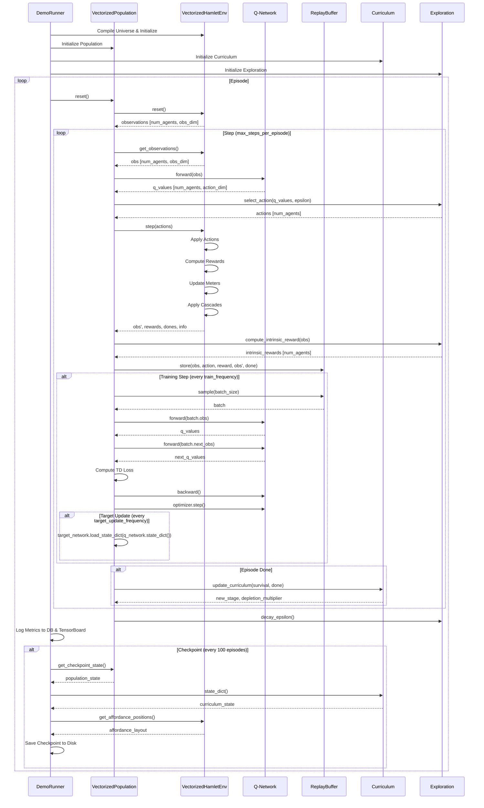
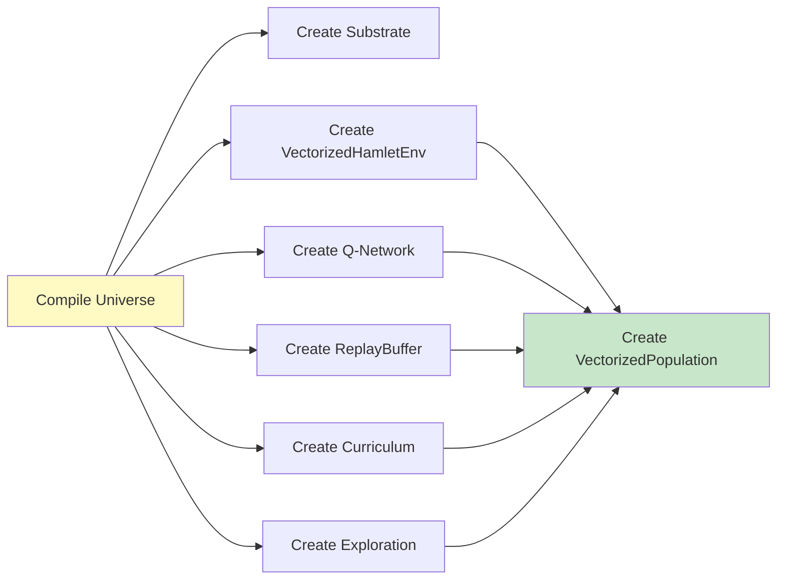
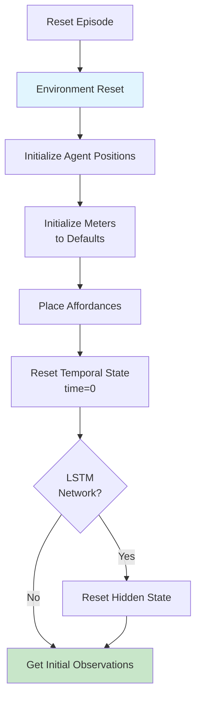
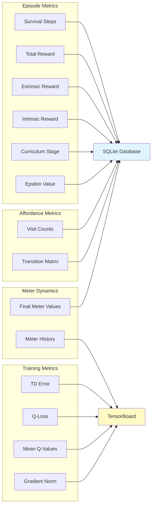

# Townlet Training Loop

## Main Training Loop (DemoRunner)

```mermaid
flowchart TD
    start([Start Training])
    compile[Compile Universe]
    init_components[Initialize Components]
    load_checkpoint{Checkpoint<br/>Exists?}
    load[Load Checkpoint]

    subgraph "Episode Loop"
        episode_start[Episode Start]
        reset_env[Reset Environment]
        reset_population[Reset Population]

        subgraph "Step Loop"
            get_obs[Get Observations]
            select_action[Select Action<br/>ε-greedy]
            env_step[Environment Step]
            compute_reward[Compute Reward]
            compute_intrinsic[Compute Intrinsic Reward]
            store_transition[Store Transition]
            update_counters[Update Counters]
            train{Train?<br/>Every N Steps}
            sample_batch[Sample Batch]
            forward_pass[Forward Pass Q-Network]
            compute_loss[Compute TD Loss]
            backward[Backward Pass]
            clip_grads[Clip Gradients]
            optimizer_step[Optimizer Step]
            update_target{Update Target?<br/>Every M Steps}
            sync_target[Sync Target Network]
            done{All Done?}
        end

        update_curriculum[Update Curriculum]
        decay_epsilon[Decay Epsilon]
        log_metrics[Log Metrics]
        checkpoint{Checkpoint?<br/>Every 100 Episodes}
        save_checkpoint[Save Checkpoint]
        max_episodes{Max<br/>Episodes?}
    end

    final_checkpoint[Save Final Checkpoint]
    close_db[Close Database]
    finish([Training Complete])

    start --> compile
    compile --> init_components
    init_components --> load_checkpoint
    load_checkpoint -->|Yes| load
    load_checkpoint -->|No| episode_start
    load --> episode_start

    episode_start --> reset_env
    reset_env --> reset_population
    reset_population --> get_obs

    get_obs --> select_action
    select_action --> env_step
    env_step --> compute_reward
    compute_reward --> compute_intrinsic
    compute_intrinsic --> store_transition
    store_transition --> update_counters
    update_counters --> train

    train -->|No| done
    train -->|Yes| sample_batch
    sample_batch --> forward_pass
    forward_pass --> compute_loss
    compute_loss --> backward
    backward --> clip_grads
    clip_grads --> optimizer_step
    optimizer_step --> update_target
    update_target -->|Yes| sync_target
    update_target -->|No| done
    sync_target --> done

    done -->|No| get_obs
    done -->|Yes| update_curriculum

    update_curriculum --> decay_epsilon
    decay_epsilon --> log_metrics
    log_metrics --> checkpoint
    checkpoint -->|Yes| save_checkpoint
    checkpoint -->|No| max_episodes
    save_checkpoint --> max_episodes
    max_episodes -->|No| episode_start
    max_episodes -->|Yes| final_checkpoint

    final_checkpoint --> close_db
    close_db --> finish

    style compile fill:#fff9c4
    style get_obs fill:#e1f5fe
    style select_action fill:#c8e6c9
    style env_step fill:#f3e5f5
    style compute_loss fill:#ffccbc
    style save_checkpoint fill:#d1c4e9
```



## Component Interactions



## Step-by-Step Breakdown

### 1. Initialization Phase



### 2. Episode Reset



### 3. Action Selection

```mermaid
flowchart TD
    obs[Observations<br/>[num_agents, obs_dim]]
    q_network[Q-Network Forward]
    q_values[Q-Values<br/>[num_agents, action_dim]]
    action_masks[Get Action Masks<br/>Operating Hours]
    mask_invalid[Mask Invalid Actions<br/>Set to -inf]
    epsilon{Random < ε?}
    random_action[Random Action<br/>from Valid Actions]
    greedy_action[Argmax Q-Value<br/>from Valid Actions]
    actions[Actions<br/>[num_agents]]

    obs --> q_network
    q_network --> q_values
    q_values --> action_masks
    action_masks --> mask_invalid
    mask_invalid --> epsilon
    epsilon -->|Yes| random_action
    epsilon -->|No| greedy_action
    random_action --> actions
    greedy_action --> actions

    style q_network fill:#c8e6c9
    style actions fill:#ffccbc
```

### 4. Environment Step

```mermaid
flowchart TD
    actions[Actions<br/>[num_agents]]
    validate[Validate Actions]
    movement[Process Movement]
    update_pos[Update Positions]
    interaction[Process Interactions]
    check_affordance{At<br/>Affordance?}
    apply_costs[Apply Costs]
    apply_effects[Apply Effects]
    update_meters[Update Meters]
    apply_cascades[Apply Cascades]
    check_temporal{Temporal<br/>Mechanics?}
    update_time[Update Time of Day]
    multi_tick[Handle Multi-Tick<br/>Interactions]
    compute_reward[Compute Reward<br/>r = energy × health]
    check_dead{Any Meter<br/>≤ 0?}
    set_done[Set Done=True]
    next_obs[Get Next Observations]

    actions --> validate
    validate --> movement
    movement --> update_pos
    update_pos --> interaction
    interaction --> check_affordance
    check_affordance -->|Yes| apply_costs
    check_affordance -->|No| update_meters
    apply_costs --> apply_effects
    apply_effects --> update_meters
    update_meters --> apply_cascades
    apply_cascades --> check_temporal
    check_temporal -->|Yes| update_time
    check_temporal -->|No| compute_reward
    update_time --> multi_tick
    multi_tick --> compute_reward
    compute_reward --> check_dead
    check_dead -->|Yes| set_done
    check_dead -->|No| next_obs
    set_done --> next_obs

    style update_pos fill:#e1f5fe
    style apply_effects fill:#c8e6c9
    style compute_reward fill:#ffccbc
```

### 5. Training Step

```mermaid
flowchart TD
    check_freq{Step %<br/>train_frequency<br/>== 0?}
    check_buffer{Buffer Size<br/>>= batch_size?}
    sample[Sample Batch]
    feedforward{Feedforward<br/>Network?}
    sample_transitions[Sample Random<br/>Transitions]
    sample_sequences[Sample Episode<br/>Sequences]

    forward_q[Q-Network Forward<br/>Current States]
    forward_target[Target Network Forward<br/>Next States]
    compute_target[Compute Target<br/>Q_target = r + γ·max(Q_next)]
    compute_loss[Compute TD Loss<br/>MSE(Q_pred, Q_target)]

    backward[Backward Pass]
    clip[Clip Gradients<br/>max_norm=10.0]
    optimizer_step[Optimizer Step]

    check_target{Step %<br/>target_update_freq<br/>== 0?}
    sync_target[Sync Target Network<br/>from Q-Network]

    log[Log Training Metrics]

    check_freq -->|No| skip([Skip Training])
    check_freq -->|Yes| check_buffer
    check_buffer -->|No| skip
    check_buffer -->|Yes| sample

    sample --> feedforward
    feedforward -->|Yes| sample_transitions
    feedforward -->|No| sample_sequences
    sample_transitions --> forward_q
    sample_sequences --> forward_q

    forward_q --> forward_target
    forward_target --> compute_target
    compute_target --> compute_loss

    compute_loss --> backward
    backward --> clip
    clip --> optimizer_step

    optimizer_step --> check_target
    check_target -->|Yes| sync_target
    check_target -->|No| log
    sync_target --> log

    style compute_loss fill:#ffccbc
    style optimizer_step fill:#c8e6c9
```

### 6. Curriculum Update

```mermaid
flowchart TD
    survival[Survival Steps<br/>[num_agents]]
    dones[Done Flags<br/>[num_agents]]

    update_tracker[Update Performance<br/>Tracker]
    compute_survival[Compute Survival Rate<br/>Last 100 Episodes]
    compute_entropy[Compute Entropy<br/>Action Distribution]

    check_advance{Survival > 70%<br/>AND<br/>Entropy < 0.5?}
    check_retreat{Survival < 30%?}

    advance[Advance Stage<br/>stage += 1]
    retreat[Retreat Stage<br/>stage -= 1]
    stay[Stay at Current Stage]

    update_difficulty[Update Difficulty<br/>depletion_multiplier]

    log_transition[Log Transition Event]

    survival --> update_tracker
    dones --> update_tracker
    update_tracker --> compute_survival
    compute_survival --> compute_entropy
    compute_entropy --> check_advance

    check_advance -->|Yes| advance
    check_advance -->|No| check_retreat
    check_retreat -->|Yes| retreat
    check_retreat -->|No| stay

    advance --> update_difficulty
    retreat --> update_difficulty
    stay --> update_difficulty

    update_difficulty --> log_transition

    style advance fill:#c8e6c9
    style retreat fill:#ffccbc
```

## Checkpoint Structure

```mermaid
graph TD
    checkpoint[Checkpoint .pt File]

    subgraph "Metadata"
        version[Version: 3]
        episode[Episode Number]
        timestamp[Timestamp]
        config_hash[Config Hash]
        substrate_meta[Substrate Metadata]
    end

    subgraph "Training State"
        population_state[Population State]
        q_network[Q-Network Weights]
        optimizer[Optimizer State]
        replay_buffer[Replay Buffer]
        epsilon[Current Epsilon]
    end

    subgraph "Curriculum State"
        agent_stages[Agent Stages]
        performance[Performance Trackers]
        difficulty[Difficulty Multiplier]
    end

    subgraph "Environment State"
        affordance_layout[Affordance Positions]
        agent_ids[Agent IDs]
    end

    checkpoint --> version
    checkpoint --> episode
    checkpoint --> timestamp
    checkpoint --> config_hash
    checkpoint --> substrate_meta

    checkpoint --> population_state
    population_state --> q_network
    population_state --> optimizer
    population_state --> replay_buffer
    population_state --> epsilon

    checkpoint --> agent_stages
    checkpoint --> performance
    checkpoint --> difficulty

    checkpoint --> affordance_layout
    checkpoint --> agent_ids

    style checkpoint fill:#d1c4e9
    style q_network fill:#c8e6c9
```



## Metrics Logging


