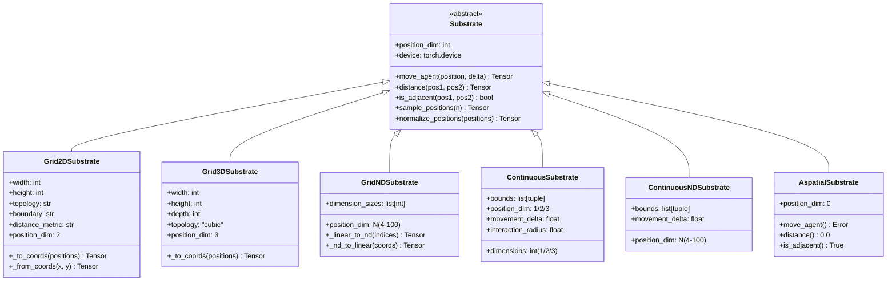
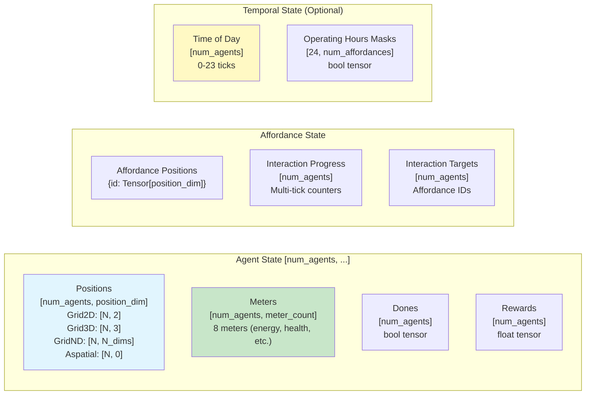
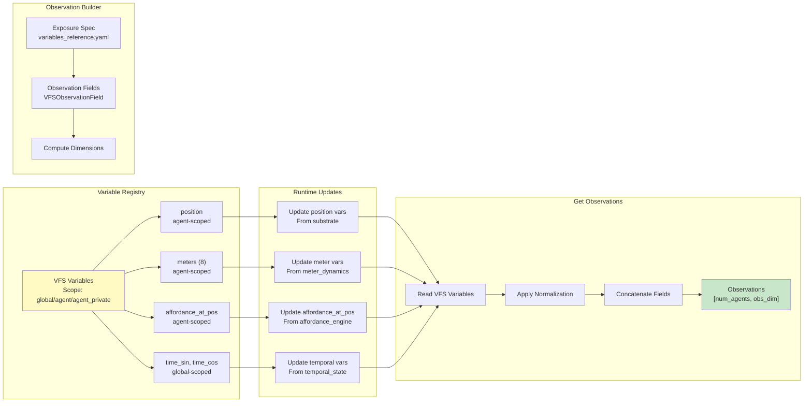
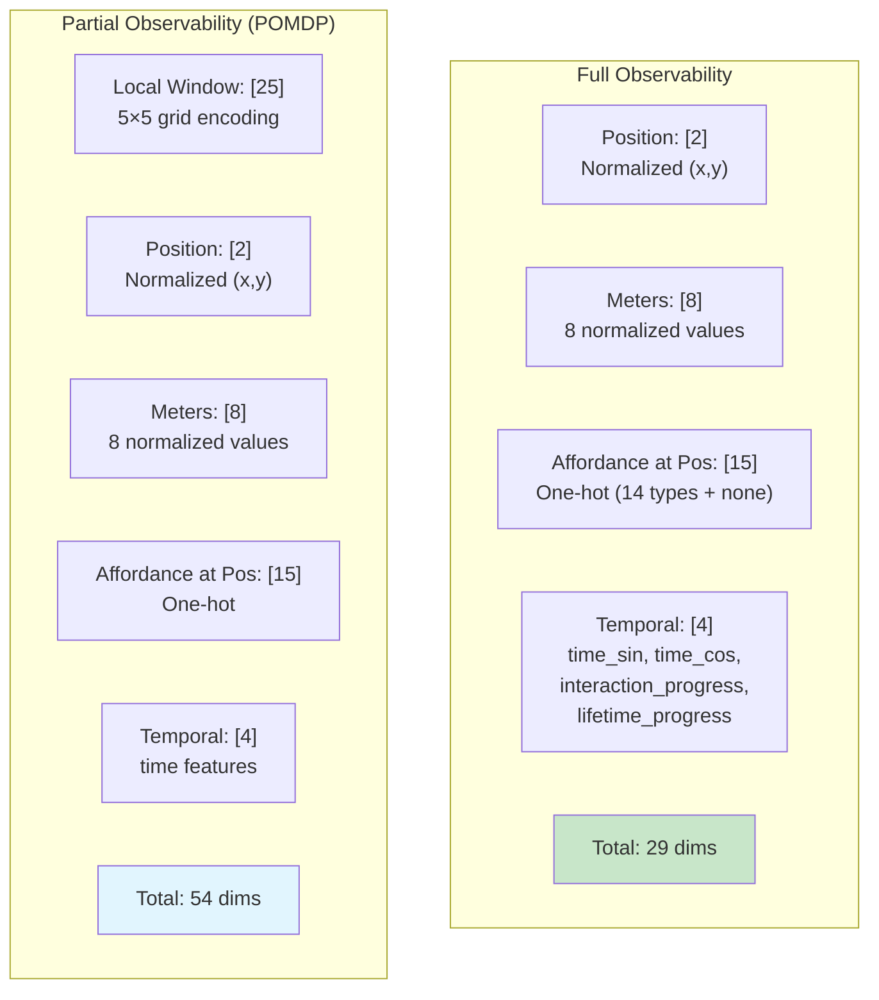
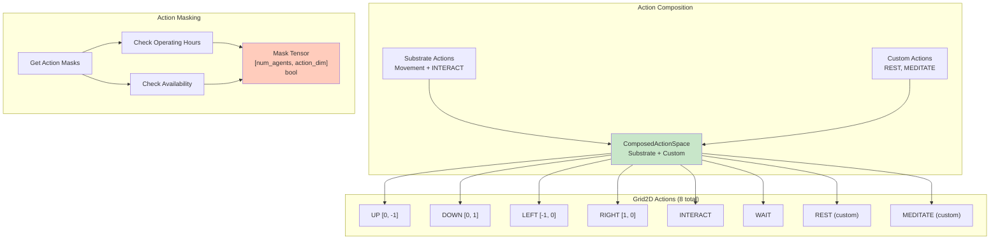
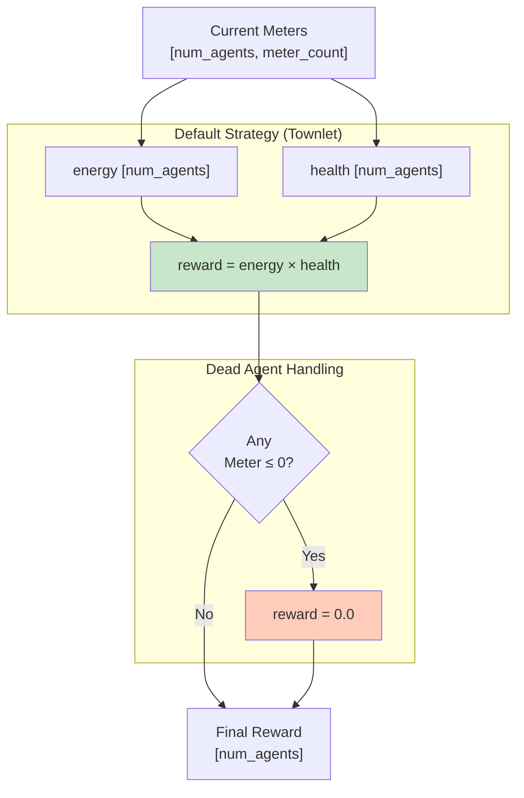

# Environment Subsystem Architecture

## VectorizedHamletEnv Overview

```mermaid
graph TB
    subgraph "VectorizedHamletEnv"
        env_core[Environment Core]

        subgraph "Substrate Layer"
            substrate[Substrate<br/>Base Class]
            grid2d[Grid2DSubstrate]
            grid3d[Grid3DSubstrate]
            gridnd[GridNDSubstrate<br/>4D-100D]
            continuous[ContinuousSubstrate<br/>1D/2D/3D]
            continuousnd[ContinuousNDSubstrate<br/>4D-100D]
            aspatial[AspatialSubstrate<br/>No Position]
        end

        subgraph "State Management"
            positions[Agent Positions<br/>[num_agents, pos_dim]]
            meters[Meters<br/>[num_agents, meter_count]]
            affordance_state[Affordance State<br/>Multi-tick Progress]
            temporal_state[Temporal State<br/>Time of Day]
        end

        subgraph "Dynamics Engines"
            meter_dynamics[MeterDynamics]
            cascade_engine[CascadeEngine]
            affordance_engine[AffordanceEngine]
            reward_strategy[RewardStrategy]
        end

        subgraph "VFS Integration"
            vfs_registry[VariableRegistry]
            vfs_obs_builder[VFSObservationBuilder]
        end

        subgraph "Optimization"
            base_depletions[Base Depletions<br/>Tensor]
            cascade_data[Cascade Data<br/>Pre-computed]
            action_masks[Action Mask Table<br/>24h × affordances]
        end
    end

    env_core --> substrate
    substrate -.-> grid2d
    substrate -.-> grid3d
    substrate -.-> gridnd
    substrate -.-> continuous
    substrate -.-> continuousnd
    substrate -.-> aspatial

    env_core --> positions
    env_core --> meters
    env_core --> affordance_state
    env_core --> temporal_state

    env_core --> meter_dynamics
    env_core --> cascade_engine
    env_core --> affordance_engine
    env_core --> reward_strategy

    env_core --> vfs_registry
    env_core --> vfs_obs_builder

    env_core --> base_depletions
    env_core --> cascade_data
    env_core --> action_masks

    meter_dynamics --> meters
    cascade_engine --> meters
    affordance_engine --> meters
    affordance_engine --> affordance_state

    vfs_registry --> vfs_obs_builder

    style env_core fill:#f3e5f5
    style substrate fill:#e1f5fe
    style meter_dynamics fill:#c8e6c9
    style vfs_registry fill:#fff9c4
```

## Substrate Hierarchy



## State Tensor Structure



## Environment Step Pipeline

```mermaid
flowchart TD
    start[step<br/>actions: [num_agents]]

    validate[Validate Actions]
    apply_masks[Apply Action Masks<br/>Temporal Mechanics]

    subgraph "Movement Phase"
        check_movement{Is<br/>Movement?}
        get_deltas[Get Movement Deltas]
        update_positions[Update Positions<br/>substrate.move_agent]
        apply_move_cost[Apply Movement Cost<br/>energy -= move_cost]
    end

    subgraph "Interaction Phase"
        check_interaction{Is<br/>INTERACT?}
        find_affordance[Find Affordance at Position]
        check_found{Affordance<br/>Found?}
        check_available{Available?<br/>Operating Hours +<br/>Availability Constraints}
        check_multitick{Multi-tick<br/>Interaction?}
        start_interaction[Start Interaction<br/>Apply Costs]
        continue_interaction[Continue Interaction<br/>Increment Progress]
        complete_interaction[Complete Interaction<br/>Apply Effects + Bonus]
        no_interaction[No Interaction<br/>Apply WAIT Cost]
    end

    subgraph "Meter Dynamics"
        apply_depletions[Apply Base Depletions<br/>meters -= base_depletions]
        apply_cascades[Apply Cascades<br/>Low source → drain target]
        clamp_meters[Clamp Meters<br/>[0.0, 1.0]]
    end

    subgraph "Reward & Termination"
        compute_reward[Compute Reward<br/>r = energy × health]
        check_death{Any Meter<br/>≤ 0?}
        set_done[Set Done=True<br/>reward=0]
    end

    subgraph "Observation"
        update_vfs[Update VFS Registry]
        build_obs[Build Observations<br/>from VFS]
    end

    finish[Return<br/>obs, rewards, dones, info]

    start --> validate
    validate --> apply_masks
    apply_masks --> check_movement

    check_movement -->|Yes| get_deltas
    check_movement -->|No| check_interaction
    get_deltas --> update_positions
    update_positions --> apply_move_cost
    apply_move_cost --> check_interaction

    check_interaction -->|Yes| find_affordance
    check_interaction -->|No| no_interaction
    find_affordance --> check_found
    check_found -->|Yes| check_available
    check_found -->|No| no_interaction
    check_available -->|Yes| check_multitick
    check_available -->|No| no_interaction
    check_multitick -->|New| start_interaction
    check_multitick -->|Continuing| continue_interaction
    check_multitick -->|Complete| complete_interaction
    check_multitick -->|Instant| start_interaction
    start_interaction --> apply_depletions
    continue_interaction --> apply_depletions
    complete_interaction --> apply_depletions
    no_interaction --> apply_depletions

    apply_depletions --> apply_cascades
    apply_cascades --> clamp_meters
    clamp_meters --> compute_reward

    compute_reward --> check_death
    check_death -->|Yes| set_done
    check_death -->|No| update_vfs
    set_done --> update_vfs

    update_vfs --> build_obs
    build_obs --> finish

    style update_positions fill:#e1f5fe
    style complete_interaction fill:#c8e6c9
    style compute_reward fill:#ffccbc
    style build_obs fill:#fff9c4
```

## Meter Dynamics

```mermaid
flowchart TD
    meters[Current Meters<br/>[num_agents, meter_count]]

    subgraph "Base Depletions"
        base[Base Depletion Tensor<br/>[meter_count]]
        apply_base[meters -= base_depletions<br/>Broadcast]
    end

    subgraph "Cascades"
        check_cascades[For Each Cascade]
        check_threshold{Source<br/>< Threshold?}
        compute_drain[drain = strength × (threshold - source)]
        apply_drain[target -= drain]
    end

    subgraph "Modulations (Optional)"
        check_mods[For Each Modulation]
        compute_multiplier[multiplier = base + range × source]
        apply_mod[target depletion ×= multiplier]
    end

    subgraph "Clamping"
        clamp[Clamp to [0.0, 1.0]]
    end

    meters_updated[Updated Meters]

    meters --> apply_base
    apply_base --> check_cascades

    check_cascades --> check_threshold
    check_threshold -->|Yes| compute_drain
    check_threshold -->|No| check_mods
    compute_drain --> apply_drain
    apply_drain --> check_cascades

    check_cascades --> check_mods
    check_mods --> compute_multiplier
    compute_multiplier --> apply_mod
    apply_mod --> check_mods

    check_mods --> clamp
    clamp --> meters_updated

    style apply_base fill:#e1f5fe
    style apply_drain fill:#ffccbc
    style clamp fill:#c8e6c9
```

## Affordance Engine

```mermaid
flowchart TD
    affordance_id[Affordance ID]

    subgraph "Availability Check"
        check_hours{Operating<br/>Hours?}
        check_time[Check Current Time]
        hours_ok{In<br/>Hours?}

        check_constraints{Meter<br/>Constraints?}
        check_meters[Check Agent Meters]
        constraints_ok{Meters in<br/>Range?}

        available[Available]
        not_available[Not Available]
    end

    subgraph "Capability Check"
        check_caps[Check Capabilities]
        instant{Instant?}
        multitick{Multi-tick?}
        cooldown{Cooldown?}
        meter_gated{Meter-gated?}
    end

    subgraph "Effect Pipeline"
        on_start[on_start Effects]
        per_tick[per_tick Effects]
        on_completion[on_completion Effects]
        on_early_exit[on_early_exit Effects]
        on_failure[on_failure Effects]
    end

    subgraph "Apply Effects"
        parse_effects[Parse Effect Entries]
        lookup_meter[Lookup Meter Index]
        apply_amount[meters[meter_idx] += amount]
    end

    affordance_id --> check_hours
    check_hours -->|Yes| check_time
    check_hours -->|No| check_constraints
    check_time --> hours_ok
    hours_ok -->|Yes| check_constraints
    hours_ok -->|No| not_available

    check_constraints -->|Yes| check_meters
    check_constraints -->|No| available
    check_meters --> constraints_ok
    constraints_ok -->|Yes| available
    constraints_ok -->|No| not_available

    available --> check_caps
    check_caps --> instant
    check_caps --> multitick
    check_caps --> cooldown
    check_caps --> meter_gated

    instant --> on_start
    multitick --> on_start
    on_start --> per_tick
    per_tick --> on_completion
    multitick --> on_early_exit
    multitick --> on_failure

    on_start --> parse_effects
    per_tick --> parse_effects
    on_completion --> parse_effects
    on_early_exit --> parse_effects
    on_failure --> parse_effects

    parse_effects --> lookup_meter
    lookup_meter --> apply_amount

    style available fill:#c8e6c9
    style not_available fill:#ffccbc
    style apply_amount fill:#e1f5fe
```

## VFS Integration



## Observation Modes



## Action Space



## Reward Strategy


