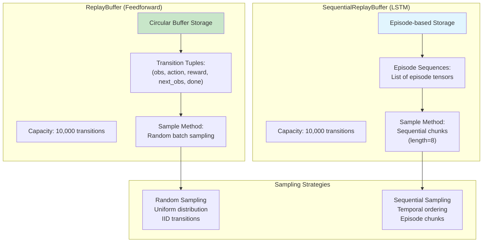
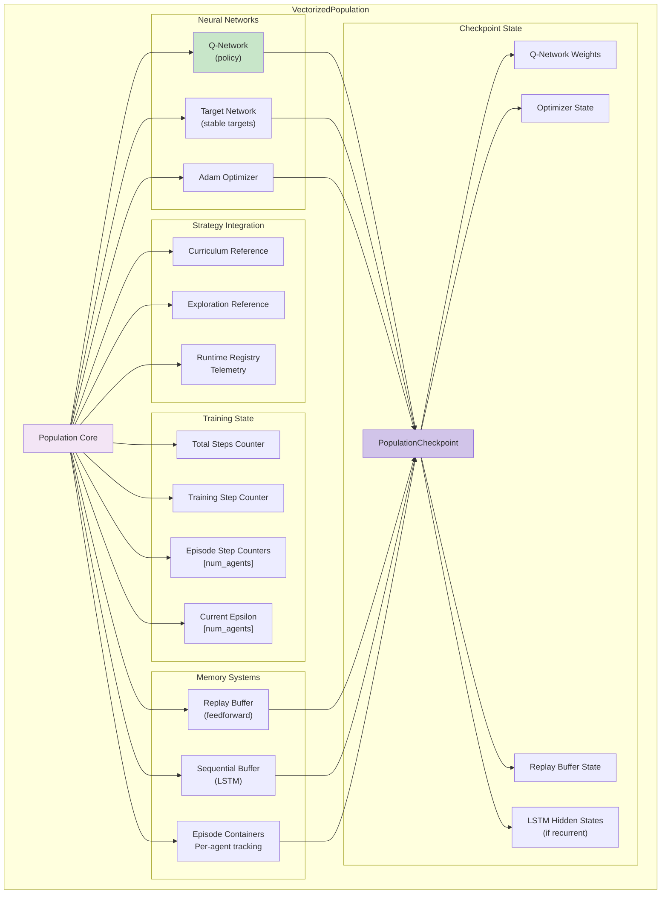

# Agent & Learning Subsystem

## Neural Network Architectures

```mermaid
graph TB
    subgraph "SimpleQNetwork (Full Observability)"
        input_simple["Input: [batch, obs_dim]<br/>L0: 29 dims<br/>L1: 29 dims"]
        fc1_simple["Linear(obs_dim, 128)"]
        ln1_simple["LayerNorm(128)"]
        relu1_simple["ReLU"]
        fc2_simple["Linear(128, 128)"]
        ln2_simple["LayerNorm(128)"]
        relu2_simple["ReLU"]
        fc3_simple["Linear(128, action_dim)"]
        output_simple["Output: [batch, action_dim]<br/>Q-values"]

        input_simple --> fc1_simple
        fc1_simple --> ln1_simple
        ln1_simple --> relu1_simple
        relu1_simple --> fc2_simple
        fc2_simple --> ln2_simple
        ln2_simple --> relu2_simple
        relu2_simple --> fc3_simple
        fc3_simple --> output_simple
    end

    subgraph "RecurrentSpatialQNetwork (Partial Observability)"
        subgraph "Encoders"
            input_vision["Vision Input: [batch, 25]<br/>5×5 local window"]
            conv1["Conv2d(1, 16, 3)"]
            conv2["Conv2d(16, 32, 3)"]
            flatten["Flatten"]
            fc_vision["Linear(32×25, 128)"]
            vision_out["Vision Features: [batch, 128]"]

            input_pos["Position Input: [batch, 2]<br/>normalized (x,y)"]
            fc_pos["Linear(2, 32)"]
            pos_out["Position Features: [batch, 32]"]

            input_meters["Meters Input: [batch, 8]"]
            fc_meters["Linear(8, 32)"]
            meters_out["Meter Features: [batch, 32]"]

            input_affordance["Affordance Input: [batch, 15]<br/>one-hot"]
            fc_affordance["Linear(15, 32)"]
            affordance_out["Affordance Features: [batch, 32]"]
        end

        concat["Concatenate<br/>[batch, 224]<br/>128+32+32+32"]

        subgraph "LSTM"
            lstm["LSTM(224, 256, 1)<br/>Bidirectional=False"]
            hidden_state["Hidden State: [1, batch, 256]<br/>Cell State: [1, batch, 256]"]
            lstm_out["LSTM Output: [batch, 256]"]
        end

        subgraph "Q-Head"
            fc_q1["Linear(256, 128)"]
            relu_q["ReLU"]
            fc_q2["Linear(128, action_dim)"]
            output_recurrent["Output: [batch, action_dim]<br/>Q-values"]
        end

        input_vision --> conv1 --> conv2 --> flatten --> fc_vision --> vision_out
        input_pos --> fc_pos --> pos_out
        input_meters --> fc_meters --> meters_out
        input_affordance --> fc_affordance --> affordance_out

        vision_out --> concat
        pos_out --> concat
        meters_out --> concat
        affordance_out --> concat

        concat --> lstm
        hidden_state --> lstm
        lstm --> lstm_out

        lstm_out --> fc_q1 --> relu_q --> fc_q2 --> output_recurrent
    end

    style input_simple fill:#e1f5fe
    style output_simple fill:#c8e6c9
    style vision_out fill:#fff9c4
    style lstm_out fill:#f3e5f5
    style output_recurrent fill:#c8e6c9
```



## Network Architecture Comparison

| Feature | SimpleQNetwork | RecurrentSpatialQNetwork |
|---------|---------------|--------------------------|
| **Use Case** | Full Observability (L0, L0.5, L1) | Partial Observability (L2, L3) |
| **Input** | Flattened observation vector | Multi-modal (vision, pos, meters, affordance) |
| **Architecture** | 3-layer MLP with LayerNorm | CNN encoders + LSTM + MLP head |
| **Parameters** | ~26K | ~600K |
| **Memory** | None (feedforward) | Hidden state [1, batch, 256] |
| **Training** | Standard experience replay | Sequential episode replay |
| **Observation Dim** | 29 (L0), 29 (L1) | 54 (local window + context) |

## Replay Buffer Architecture



## VectorizedPopulation Architecture



## Training Pipeline

```mermaid
flowchart TD
    start[step_population<br/>env: VectorizedHamletEnv]

    get_obs[Get Observations<br/>[num_agents, obs_dim]]

    subgraph "Action Selection"
        forward[Q-Network Forward Pass]
        q_values["Q-Values<br/>[num_agents, action_dim]"]
        get_masks[Get Action Masks]
        mask_invalid[Mask Invalid Actions<br/>Set to -inf]
        epsilon_greedy[ε-greedy Selection]
        actions["Actions<br/>[num_agents]"]
    end

    env_step[Environment Step]
    next_obs["Next Observations<br/>[num_agents, obs_dim]"]
    rewards["Rewards<br/>[num_agents]"]
    dones["Dones<br/>[num_agents]"]

    subgraph "Intrinsic Rewards"
        compute_intrinsic[Compute Intrinsic<br/>RND Network]
        intrinsic_rewards["Intrinsic Rewards<br/>[num_agents]"]
        combine[Combine:<br/>total = extrinsic + α·intrinsic]
        total_rewards["Total Rewards<br/>[num_agents]"]
    end

    subgraph "Store Transition"
        check_recurrent{Recurrent<br/>Network?}
        store_episode[Store in Episode Container]
        store_buffer[Store in Replay Buffer]
    end

    subgraph "Curriculum Update"
        update_curriculum[Update Curriculum Tracker]
        check_done{Done?}
        flush_episode[Flush Episode to<br/>Sequential Buffer]
    end

    check_train{Step %<br/>train_frequency<br/>== 0?}

    subgraph "Training Step"
        sample[Sample Batch/Sequences]
        train_q[Train Q-Network]
        update_target{Update<br/>Target?}
        sync_target[Sync Target Network]
    end

    log_metrics[Log Training Metrics]
    return_state[Return BatchedAgentState]

    start --> get_obs
    get_obs --> forward
    forward --> q_values
    q_values --> get_masks
    get_masks --> mask_invalid
    mask_invalid --> epsilon_greedy
    epsilon_greedy --> actions

    actions --> env_step
    env_step --> next_obs
    env_step --> rewards
    env_step --> dones

    next_obs --> compute_intrinsic
    compute_intrinsic --> intrinsic_rewards
    intrinsic_rewards --> combine
    rewards --> combine
    combine --> total_rewards

    total_rewards --> check_recurrent
    check_recurrent -->|Yes| store_episode
    check_recurrent -->|No| store_buffer

    store_episode --> update_curriculum
    store_buffer --> update_curriculum
    update_curriculum --> check_done
    check_done -->|Yes| flush_episode
    check_done -->|No| check_train
    flush_episode --> check_train

    check_train -->|No| return_state
    check_train -->|Yes| sample
    sample --> train_q
    train_q --> update_target
    update_target -->|Yes| sync_target
    update_target -->|No| log_metrics
    sync_target --> log_metrics
    log_metrics --> return_state

    style forward fill:#c8e6c9
    style env_step fill:#f3e5f5
    style train_q fill:#ffccbc
    style return_state fill:#e1f5fe
```

## Q-Learning Training Step

```mermaid
flowchart TD
    sample[Sample from Buffer]
    batch["Batch:<br/>obs, actions, rewards,<br/>next_obs, dones"]

    subgraph "Compute Current Q-Values"
        forward_q[Q-Network Forward<br/>Q(obs)]
        all_q_values["All Q-Values<br/>[batch, action_dim]"]
        gather[Gather Q(obs, action)]
        current_q["Current Q-Values<br/>[batch]"]
    end

    subgraph "Compute Target Q-Values"
        forward_target[Target Network Forward<br/>Q_target(next_obs)]
        next_q_values["Next Q-Values<br/>[batch, action_dim]"]
        max_next_q[Max Q-Value<br/>max_a Q(next_obs, a)]
        compute_target[Compute Target:<br/>r + γ·max_next_q·(1-done)]
        target_q["Target Q-Values<br/>[batch]"]
    end

    subgraph "Loss & Optimization"
        compute_loss[Compute MSE Loss<br/>loss = MSE(current_q, target_q)]
        backward[Backward Pass]
        clip_grads[Clip Gradients<br/>max_norm=10.0]
        optimizer_step[Optimizer Step]
    end

    subgraph "Metrics"
        td_error[Compute TD Error<br/>|current_q - target_q|]
        mean_q[Mean Q-Values]
        grad_norm[Gradient Norm]
        log_metrics[Log to TensorBoard]
    end

    sample --> batch
    batch --> forward_q
    forward_q --> all_q_values
    all_q_values --> gather
    gather --> current_q

    batch --> forward_target
    forward_target --> next_q_values
    next_q_values --> max_next_q
    max_next_q --> compute_target
    batch --> compute_target
    compute_target --> target_q

    current_q --> compute_loss
    target_q --> compute_loss
    compute_loss --> backward
    backward --> clip_grads
    clip_grads --> optimizer_step

    current_q --> td_error
    target_q --> td_error
    all_q_values --> mean_q
    clip_grads --> grad_norm

    td_error --> log_metrics
    mean_q --> log_metrics
    grad_norm --> log_metrics

    style compute_loss fill:#ffccbc
    style optimizer_step fill:#c8e6c9
    style log_metrics fill:#fff9c4
```

## LSTM Training (Sequential Replay)

```mermaid
flowchart TD
    sample[Sample Episode Sequences]
    sequences["Sequences:<br/>[batch, seq_len, ...]<br/>seq_len=8"]

    subgraph "LSTM Forward Pass"
        reset_hidden[Reset Hidden State<br/>(h, c) = zeros]
        forward_lstm[Forward Pass<br/>LSTM processes sequence]
        hidden_evolution["Hidden state evolves<br/>across sequence"]
        lstm_out["LSTM Output:<br/>[batch, seq_len, 256]"]
        q_head[Q-Head:<br/>[batch, seq_len, action_dim]"]
    end

    subgraph "Compute Targets"
        forward_target_lstm[Target Network<br/>LSTM Forward]
        target_out["Target Output:<br/>[batch, seq_len, action_dim]"]
        compute_targets[Compute TD Targets<br/>Per timestep]
        targets["Targets:<br/>[batch, seq_len]"]
    end

    subgraph "Loss Computation"
        gather_q[Gather Q(s,a)<br/>Per timestep]
        current_q["Current Q:<br/>[batch, seq_len]"]
        compute_loss[MSE Loss<br/>Mean over sequence]
        loss[Loss scalar]
    end

    subgraph "Optimization"
        backward[Backward Pass<br/>BPTT through time]
        clip[Clip Gradients]
        step[Optimizer Step]
    end

    sample --> sequences
    sequences --> reset_hidden
    reset_hidden --> forward_lstm
    forward_lstm --> hidden_evolution
    hidden_evolution --> lstm_out
    lstm_out --> q_head

    sequences --> forward_target_lstm
    forward_target_lstm --> target_out
    target_out --> compute_targets
    compute_targets --> targets

    q_head --> gather_q
    gather_q --> current_q
    current_q --> compute_loss
    targets --> compute_loss
    compute_loss --> loss

    loss --> backward
    backward --> clip
    clip --> step

    style forward_lstm fill:#f3e5f5
    style compute_loss fill:#ffccbc
    style step fill:#c8e6c9
```

## Exploration Strategies

```mermaid
graph TB
    subgraph "AdaptiveIntrinsicExploration"
        rnd[RND Network<br/>Random Network Distillation]
        target_net[Target Network<br/>Fixed random weights]
        predictor_net[Predictor Network<br/>Learned]

        compute_novelty[Compute Novelty<br/>||target(obs) - predictor(obs)||²]
        intrinsic_reward[Intrinsic Reward<br/>Proportional to prediction error]

        annealing[Adaptive Annealing]
        variance_check[Check Survival Variance]
        consistency_check[Check Mean Survival > 50]
        anneal_weight[Anneal Intrinsic Weight<br/>weight *= 0.99]

        epsilon_decay[Epsilon Decay<br/>ε *= decay_rate]
    end

    subgraph "Epsilon-Greedy Selection"
        random_val[Sample uniform(0,1)]
        check_epsilon{val < ε?}
        random_action[Select Random<br/>Valid Action]
        greedy_action[Select Argmax<br/>Q-Value]
    end

    rnd --> target_net
    rnd --> predictor_net
    target_net --> compute_novelty
    predictor_net --> compute_novelty
    compute_novelty --> intrinsic_reward

    annealing --> variance_check
    annealing --> consistency_check
    variance_check --> anneal_weight
    consistency_check --> anneal_weight

    random_val --> check_epsilon
    check_epsilon -->|Yes| random_action
    check_epsilon -->|No| greedy_action

    style compute_novelty fill:#c8e6c9
    style intrinsic_reward fill:#fff9c4
    style greedy_action fill:#e1f5fe
```

## Curriculum System

```mermaid
graph TB
    subgraph "AdversarialCurriculum"
        tracker[Performance Tracker]
        stages["Agent Stages<br/>[num_agents]"]
        survival_history["Survival History<br/>Last 100 episodes"]

        compute_metrics[Compute Metrics]
        survival_rate[Survival Rate:<br/>mean(survival) / max_steps]
        entropy[Action Entropy:<br/>H(action_dist)]

        check_advance{Survival > 70%<br/>AND<br/>Entropy < 0.5?}
        check_retreat{Survival < 30%?}

        advance[Advance Stage<br/>stage += 1]
        retreat[Retreat Stage<br/>stage -= 1]
        stay[Stay at Current]

        update_difficulty[Update Difficulty<br/>depletion_multiplier = f(stage)]

        log_transition[Log Transition Event]
    end

    tracker --> stages
    tracker --> survival_history
    survival_history --> compute_metrics
    compute_metrics --> survival_rate
    compute_metrics --> entropy

    survival_rate --> check_advance
    entropy --> check_advance
    check_advance -->|Yes| advance
    check_advance -->|No| check_retreat
    check_retreat -->|Yes| retreat
    check_retreat -->|No| stay

    advance --> update_difficulty
    retreat --> update_difficulty
    stay --> update_difficulty

    update_difficulty --> log_transition

    style advance fill:#c8e6c9
    style retreat fill:#ffccbc
    style stay fill:#e1f5fe
```

## Checkpoint State

```mermaid
graph TB
    checkpoint[PopulationCheckpoint]

    subgraph "Network State"
        q_state[Q-Network State Dict]
        target_state[Target Network State Dict]
        optimizer_state[Optimizer State Dict]
    end

    subgraph "Replay State"
        buffer_data[Replay Buffer Data]
        buffer_pos[Buffer Position]
        buffer_size[Buffer Size]
    end

    subgraph "Episode State (LSTM only)"
        current_episodes[Current Episodes<br/>Per-agent containers]
        hidden_states[LSTM Hidden States<br/>(h, c) per agent]
    end

    subgraph "Training Progress"
        total_steps[Total Steps]
        training_steps[Training Steps]
        episode_steps[Episode Step Counters]
    end

    subgraph "Exploration State"
        epsilon[Current Epsilon]
        rnd_predictor[RND Predictor State]
        intrinsic_weight[Intrinsic Weight]
    end

    checkpoint --> q_state
    checkpoint --> target_state
    checkpoint --> optimizer_state
    checkpoint --> buffer_data
    checkpoint --> buffer_pos
    checkpoint --> buffer_size
    checkpoint --> current_episodes
    checkpoint --> hidden_states
    checkpoint --> total_steps
    checkpoint --> training_steps
    checkpoint --> episode_steps
    checkpoint --> epsilon
    checkpoint --> rnd_predictor
    checkpoint --> intrinsic_weight

    style checkpoint fill:#d1c4e9
    style q_state fill:#c8e6c9
    style hidden_states fill:#f3e5f5
```
