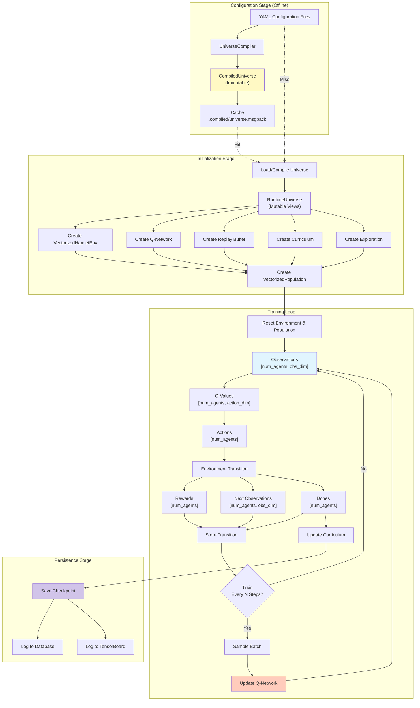
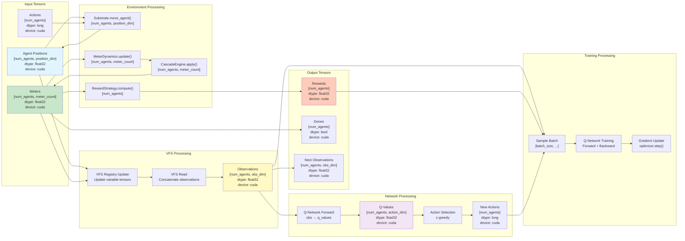
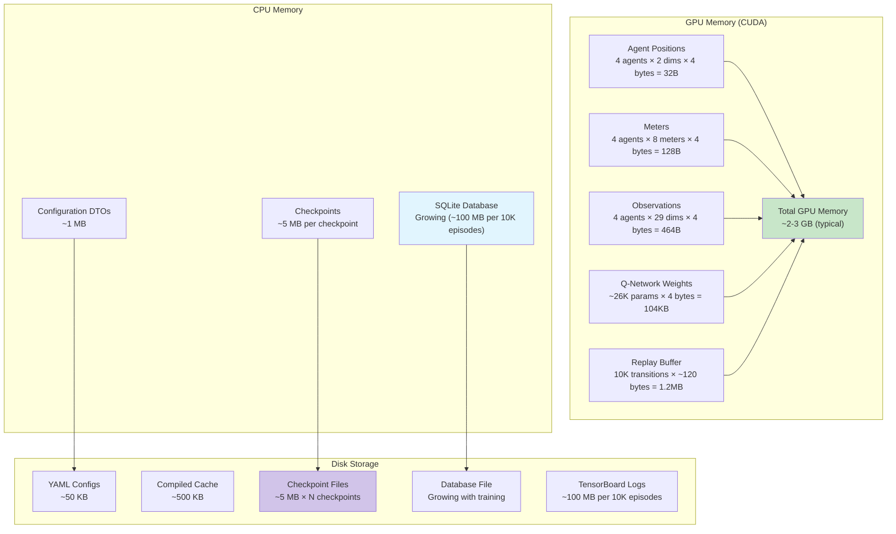
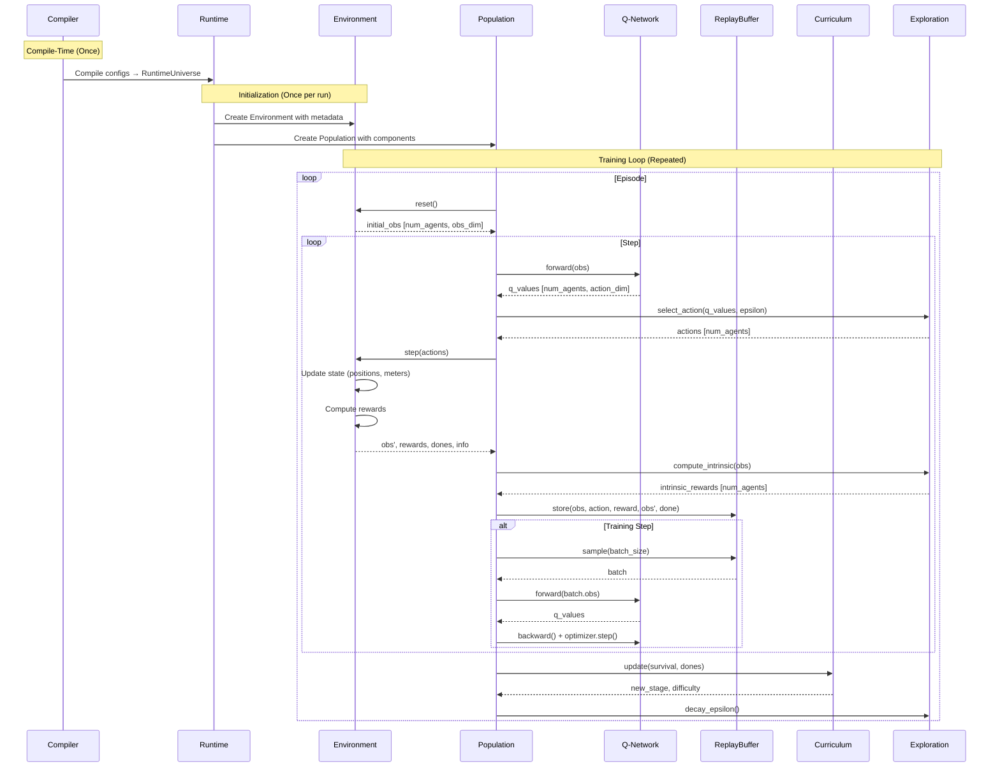
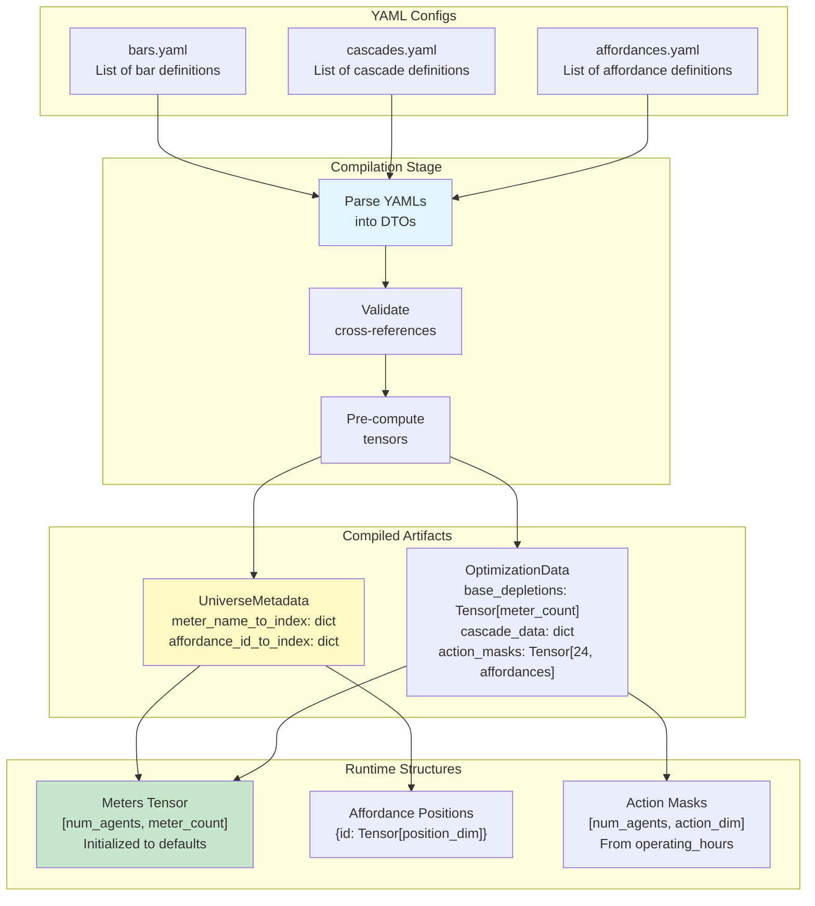
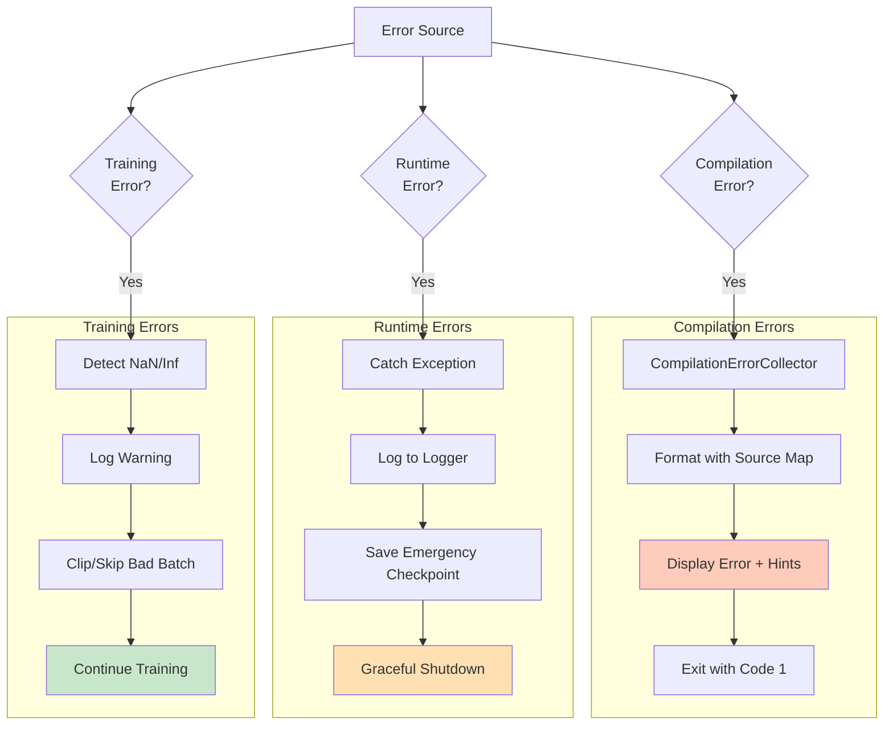

# Data Flow & Module Interactions

## Complete Data Flow Pipeline

## Module Dependency Graph

```mermaid
graph TB
    subgraph "Configuration Layer"
        config_hamlet[hamlet.py]
        config_bar[bar.py]
        config_cascade[cascade.py]
        config_affordance[affordance.py]
        config_training[training.py]
        config_substrate[substrate/config.py]
    end

    subgraph "Universe Layer"
        compiler[universe/compiler.py]
        compiled[universe/compiled.py]
        runtime[universe/runtime.py]
        symbol_table[universe/symbol_table.py]
        metadata[universe/dto/*]
    end

    subgraph "VFS Layer"
        vfs_schema[vfs/schema.py]
        vfs_registry[vfs/registry.py]
        vfs_obs_builder[vfs/observation_builder.py]
        vfs_adapter[universe/adapters/vfs_adapter.py]
    end

    subgraph "Substrate Layer"
        substrate_base[substrate/base.py]
        substrate_grid2d[substrate/grid2d.py]
        substrate_grid3d[substrate/grid3d.py]
        substrate_gridnd[substrate/gridnd.py]
        substrate_continuous[substrate/continuous.py]
        substrate_aspatial[substrate/aspatial.py]
        substrate_factory[substrate/factory.py]
    end

    subgraph "Environment Layer"
        env_vectorized[environment/vectorized_env.py]
        env_meter_dynamics[environment/meter_dynamics.py]
        env_cascade_engine[environment/cascade_engine.py]
        env_affordance_engine[environment/affordance_engine.py]
        env_reward_strategy[environment/reward_strategy.py]
        env_action_builder[environment/action_builder.py]
    end

    subgraph "Agent Layer"
        agent_networks[agent/networks.py]
    end

    subgraph "Training Layer"
        training_state[training/state.py]
        training_replay[training/replay_buffer.py]
        training_sequential[training/sequential_replay_buffer.py]
        training_checkpoint[training/checkpoint_utils.py]
    end

    subgraph "Population Layer"
        population_vectorized[population/vectorized.py]
        population_runtime_registry[population/runtime_registry.py]
    end

    subgraph "Curriculum Layer"
        curriculum_adversarial[curriculum/adversarial.py]
        curriculum_base[curriculum/base.py]
    end

    subgraph "Exploration Layer"
        exploration_adaptive[exploration/adaptive_intrinsic.py]
        exploration_rnd[exploration/rnd.py]
        exploration_epsilon[exploration/epsilon_greedy.py]
    end

    subgraph "Demo Layer"
        demo_runner[demo/runner.py]
        demo_database[demo/database.py]
        demo_unified_server[demo/unified_server.py]
        demo_live_inference[demo/live_inference.py]
    end

    config_hamlet --> compiler
    config_bar --> compiler
    config_cascade --> compiler
    config_affordance --> compiler
    config_training --> compiler
    config_substrate --> compiler

    compiler --> symbol_table
    compiler --> metadata
    compiler --> compiled
    compiler --> vfs_adapter
    compiled --> runtime

    vfs_schema --> vfs_registry
    vfs_schema --> vfs_obs_builder
    vfs_registry --> vfs_obs_builder
    vfs_obs_builder --> vfs_adapter
    vfs_adapter --> compiler

    config_substrate --> substrate_factory
    substrate_base --> substrate_grid2d
    substrate_base --> substrate_grid3d
    substrate_base --> substrate_gridnd
    substrate_base --> substrate_continuous
    substrate_base --> substrate_aspatial
    substrate_factory --> env_vectorized

    runtime --> env_vectorized
    substrate_factory --> env_vectorized
    vfs_registry --> env_vectorized
    vfs_obs_builder --> env_vectorized
    env_meter_dynamics --> env_vectorized
    env_cascade_engine --> env_vectorized
    env_affordance_engine --> env_vectorized
    env_reward_strategy --> env_vectorized
    env_action_builder --> env_vectorized

    agent_networks --> population_vectorized
    training_replay --> population_vectorized
    training_sequential --> population_vectorized
    training_state --> population_vectorized
    population_runtime_registry --> population_vectorized

    curriculum_base --> curriculum_adversarial
    curriculum_adversarial --> population_vectorized

    exploration_rnd --> exploration_adaptive
    exploration_epsilon --> exploration_adaptive
    exploration_adaptive --> population_vectorized

    env_vectorized --> population_vectorized
    population_vectorized --> demo_runner
    curriculum_adversarial --> demo_runner
    exploration_adaptive --> demo_runner
    demo_database --> demo_runner
    training_checkpoint --> demo_runner

    demo_runner --> demo_unified_server
    demo_runner --> demo_live_inference

    style compiler fill:#fff9c4
    style env_vectorized fill:#f3e5f5
    style population_vectorized fill:#c8e6c9
    style demo_runner fill:#d1c4e9
```

## Tensor Flow Through System

## Memory Layout

## Communication Patterns

## Config → Runtime Data Transformation

## Error Propagation

## Performance Characteristics

### Compilation Phase
- **Time**: 1-5 seconds (first run)
- **Memory**: ~50 MB
- **Cache Hit**: <100 ms
- **Output**: 500 KB - 2 MB compiled artifact

### Training Phase (per episode)
- **Time**: 0.1-2 seconds (depends on max_steps)
- **GPU Memory**: 2-3 GB
- **CPU Memory**: 200-500 MB
- **Throughput**: ~500-1000 steps/second (GPU)

### Checkpoint Operations
- **Save Time**: 100-500 ms
- **Load Time**: 200-800 ms
- **Size**: ~5 MB per checkpoint
- **Frequency**: Every 100 episodes

### Database Operations
- **Insert Time**: <1 ms per episode
- **Query Time**: 1-10 ms (recent episodes)
- **Growth Rate**: ~10 KB per episode
- **Total Size**: ~100 MB per 10K episodes

## Key Optimization Strategies

1. **Pre-computation**:
   - Base depletions → Tensor
   - Cascade data → Sorted structures
   - Action masks → 24×affordances table
   - Affordance positions → Tensor map

2. **Vectorization**:
   - All operations on `[num_agents, ...]` tensors
   - Parallel agent processing
   - GPU-native computations

3. **Caching**:
   - Compiled universe → Disk cache
   - Provenance-based invalidation
   - Lazy loading of large artifacts

4. **Batching**:
   - Experience replay batching
   - Sequential episode batching (LSTM)
   - Target network updates (every M steps)

5. **Memory Management**:
   - Circular replay buffer
   - Episode flushing (LSTM)
   - Checkpoint compression
