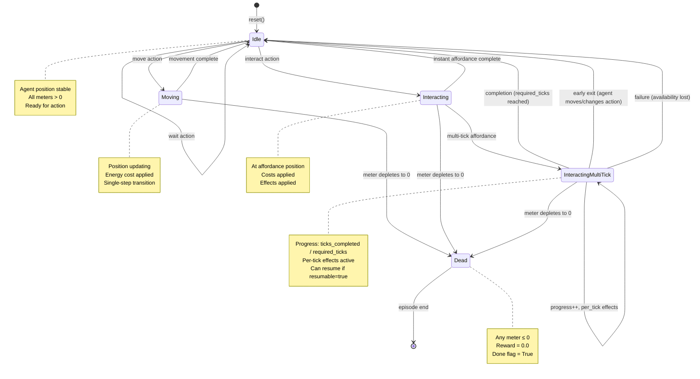
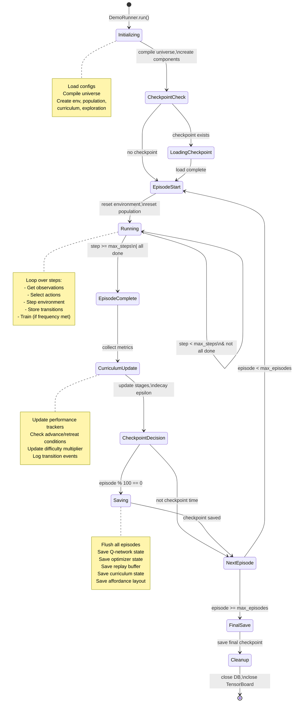
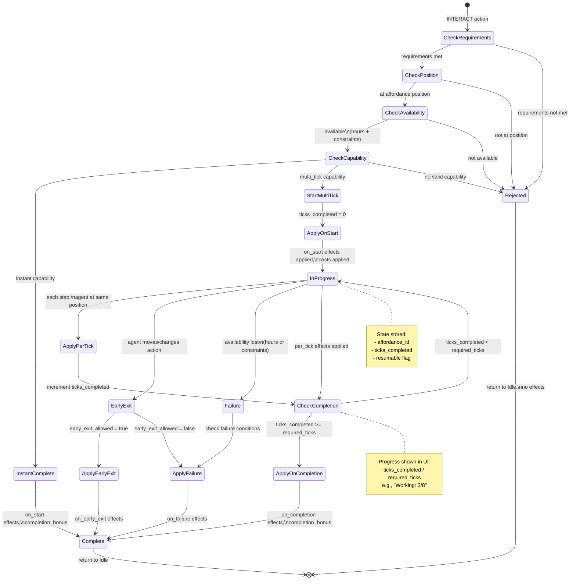
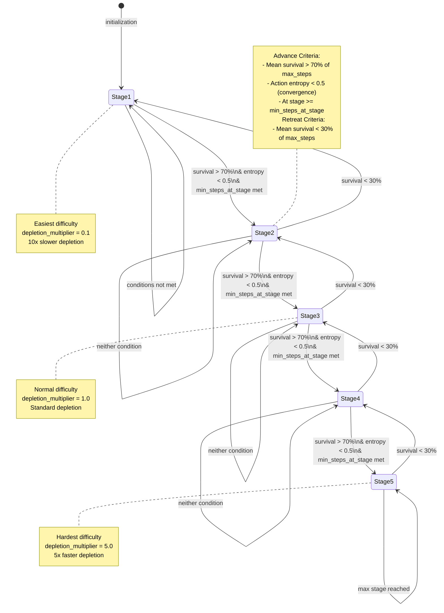
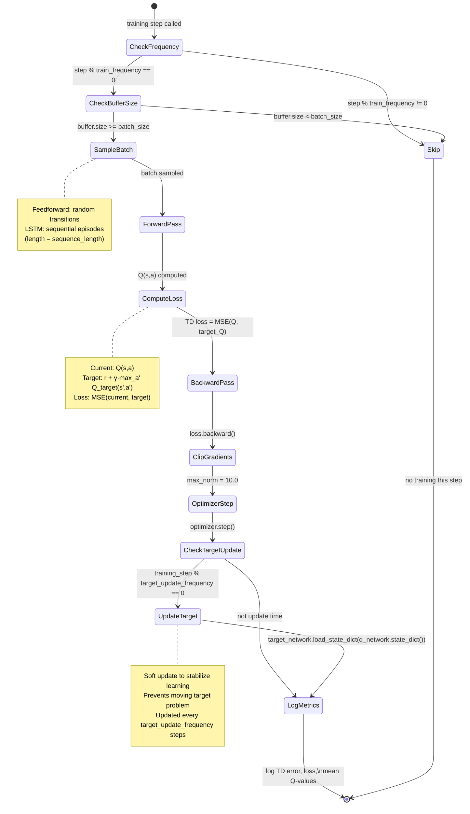
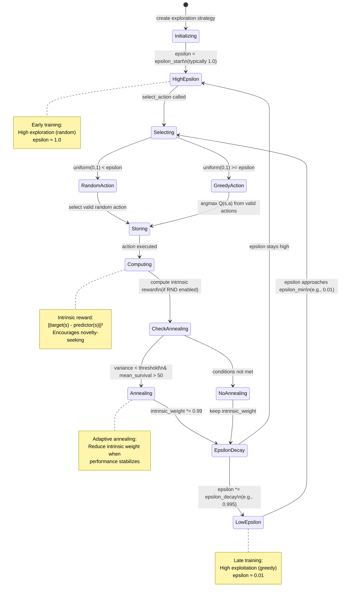
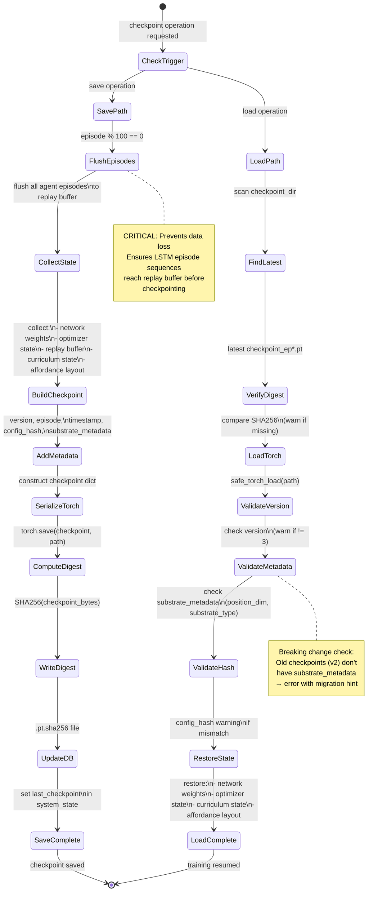
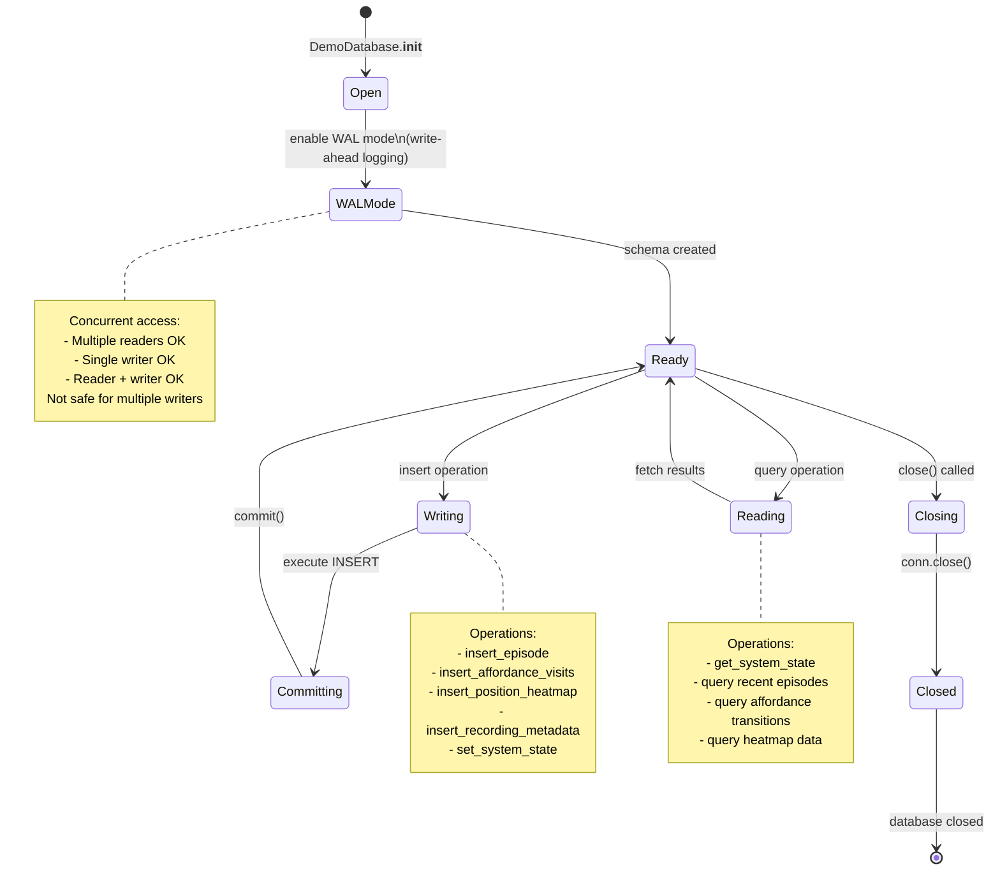
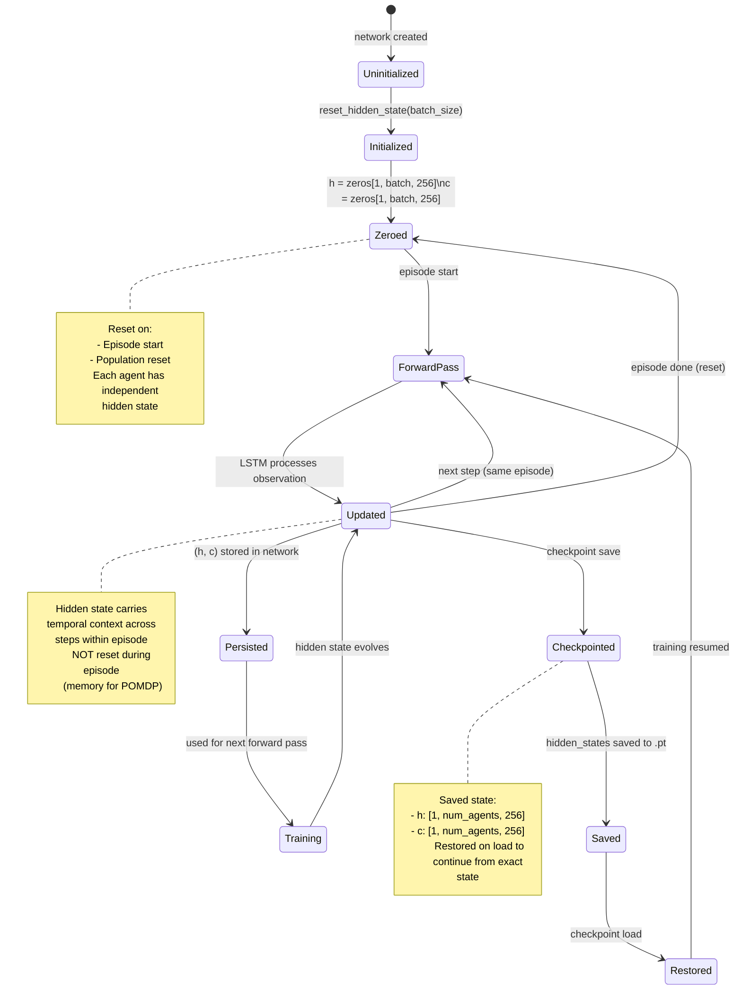

# State Machine Diagrams

## Agent Lifecycle State Machine

## Episode State Machine

## Multi-Tick Interaction State Machine

## Curriculum Stage Transition State Machine

## Training Step State Machine

## Exploration Strategy State Machine

## Checkpoint Save/Load State Machine

## Database Transaction States

## LSTM Hidden State Lifecycle

## State Transition Summary

### Agent States
- **Idle**: Ready for action, all meters > 0
- **Moving**: Transitioning position (single step)
- **Interacting**: At affordance, applying effects
- **InteractingMultiTick**: Multi-step interaction with progress tracking
- **Dead**: Any meter ≤ 0, episode terminated

### Episode States
- **Initializing**: Loading configs, creating components
- **CheckpointCheck**: Scanning for existing checkpoint
- **LoadingCheckpoint**: Restoring from .pt file
- **Running**: Active training loop
- **EpisodeComplete**: All agents done or max_steps reached
- **CurriculumUpdate**: Adjusting difficulty
- **Saving**: Writing checkpoint to disk
- **Cleanup**: Closing resources

### Curriculum Stages
- **Stage 1-5**: Progressive difficulty levels
- **Advance**: Triggered by high survival (>70%) and low entropy (<0.5)
- **Retreat**: Triggered by low survival (<30%)
- **Stay**: Neither condition met

### Training States
- **CheckFrequency**: Determine if training this step
- **SampleBatch**: Pull from replay buffer
- **ForwardPass**: Compute Q-values
- **ComputeLoss**: TD error calculation
- **BackwardPass**: Gradient computation
- **ClipGradients**: Prevent exploding gradients
- **OptimizerStep**: Weight update
- **UpdateTarget**: Periodic target network sync

### Exploration States
- **HighEpsilon**: Early exploration phase (ε ≈ 1.0)
- **LowEpsilon**: Late exploitation phase (ε ≈ 0.01)
- **RandomAction**: Exploration (with probability ε)
- **GreedyAction**: Exploitation (with probability 1-ε)
- **Annealing**: Intrinsic weight reduction when stable

### Checkpoint States
- **SavePath**: Collect and serialize state
- **LoadPath**: Restore from disk
- **VerifyDigest**: SHA256 integrity check
- **ValidateVersion**: Compatibility check
- **ValidateMetadata**: Substrate dimension check

All state machines are deterministic and can be traced through logs for debugging.
