# VFS (Variable & Feature System) Deep Dive

## VFS Architecture Overview

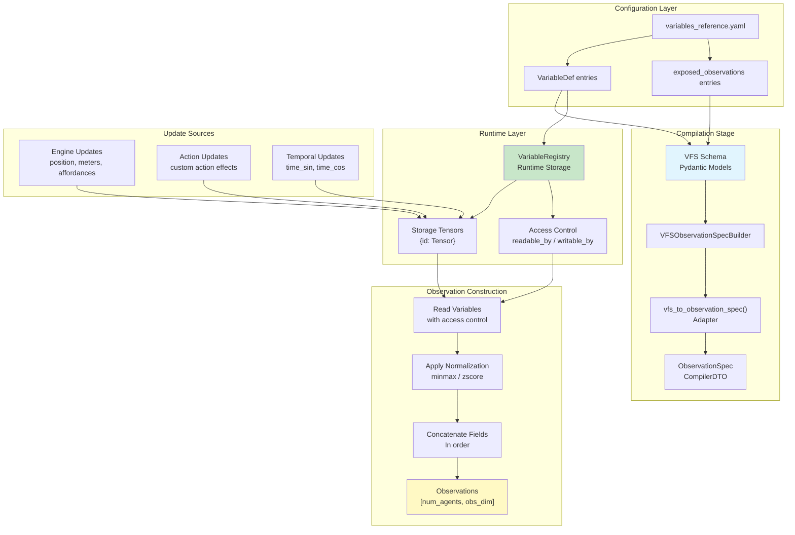

## Variable Scope Hierarchy

```mermaid
graph TB
    subgraph "Global Scope"
        global_vars["Global Variables<br/>Single value, all agents share"]
        time_sin["time_sin: scalar<br/>Shape: []"]
        time_cos["time_cos: scalar<br/>Shape: []"]
        global_storage["Storage: Tensor([value])<br/>No agent dimension"]
    end

    subgraph "Agent Scope"
        agent_vars["Agent Variables<br/>Per-agent, publicly observable"]
        energy["energy: scalar<br/>Shape: [num_agents]"]
        position["position: vec2i<br/>Shape: [num_agents, 2]"]
        meters["meters (8): scalar<br/>Shape: [num_agents]"]
        agent_storage["Storage: Tensor([agent0, agent1, ...])<br/>Agent dimension first"]
    end

    subgraph "Agent-Private Scope"
        private_vars["Agent-Private Variables<br/>Per-agent, only owner observes"]
        home_pos["home_position: vec2i<br/>Shape: [num_agents, 2]"]
        internal_state["internal_state: scalar<br/>Shape: [num_agents]"]
        private_storage["Storage: Tensor([agent0, agent1, ...])<br/>Same as agent scope storage"]
    end

    global_vars --> time_sin
    global_vars --> time_cos
    time_sin --> global_storage
    time_cos --> global_storage

    agent_vars --> energy
    agent_vars --> position
    agent_vars --> meters
    energy --> agent_storage
    position --> agent_storage
    meters --> agent_storage

    private_vars --> home_pos
    private_vars --> internal_state
    home_pos --> private_storage
    internal_state --> private_storage

    style global_vars fill:#fff9c4
    style agent_vars fill:#c8e6c9
    style private_vars fill:#f3e5f5
```

## Access Control Matrix

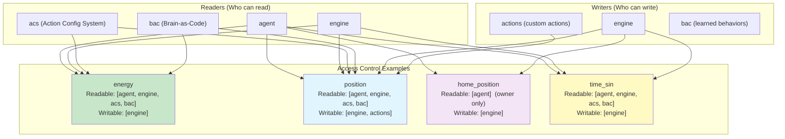

## Variable Type System

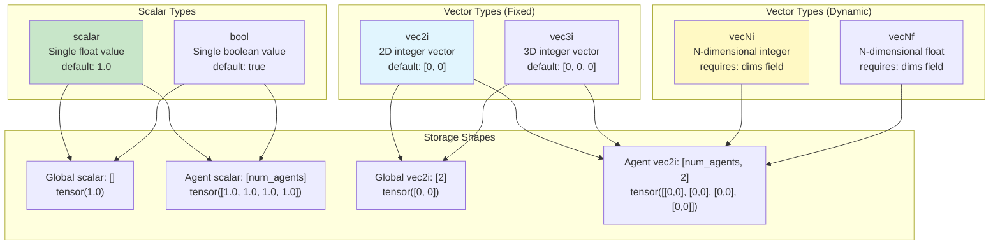

## Observation Field Construction

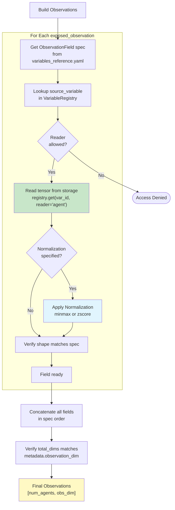

## Normalization Types

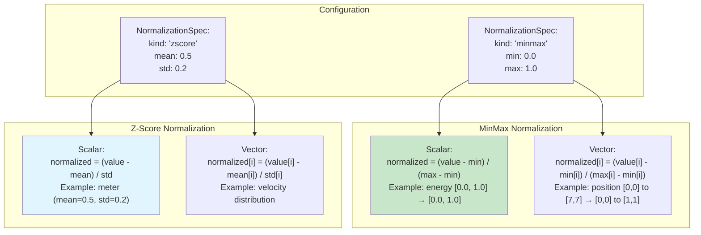

## Runtime Update Cycle

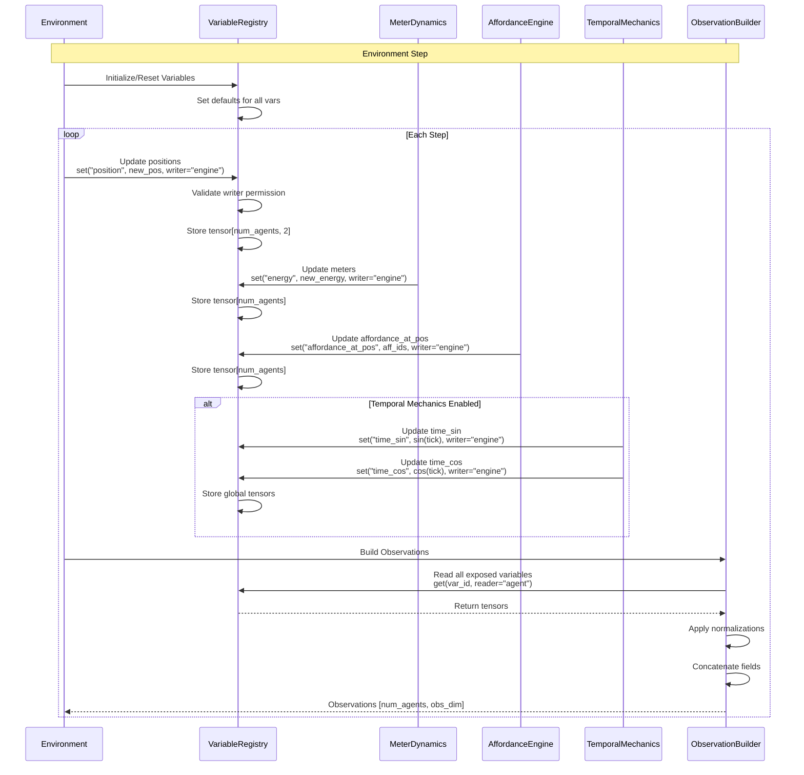

## Example Variable Definitions

```mermaid
graph TB
    subgraph "Position Variable"
        pos_def["VariableDef:<br/>id: 'position'<br/>scope: 'agent'<br/>type: 'vec2i'<br/>lifetime: 'episode'<br/>readable_by: [agent, engine, acs, bac]<br/>writable_by: [engine, actions]<br/>default: [0, 0]"]
        pos_storage["Storage:<br/>Shape: [num_agents, 2]<br/>dtype: int64<br/>device: cuda"]
        pos_obs["Observation:<br/>id: 'obs_position'<br/>source_variable: 'position'<br/>exposed_to: [agent]<br/>shape: [2]<br/>normalization: minmax [0,0] to [7,7]"]
    end

    subgraph "Energy Variable"
        energy_def["VariableDef:<br/>id: 'energy'<br/>scope: 'agent'<br/>type: 'scalar'<br/>lifetime: 'episode'<br/>readable_by: [agent, engine, acs, bac]<br/>writable_by: [engine]<br/>default: 1.0"]
        energy_storage["Storage:<br/>Shape: [num_agents]<br/>dtype: float32<br/>device: cuda"]
        energy_obs["Observation:<br/>id: 'obs_energy'<br/>source_variable: 'energy'<br/>exposed_to: [agent]<br/>shape: []<br/>normalization: minmax [0.0, 1.0]"]
    end

    subgraph "Time Variable"
        time_def["VariableDef:<br/>id: 'time_sin'<br/>scope: 'global'<br/>type: 'scalar'<br/>lifetime: 'episode'<br/>readable_by: [agent, engine, acs, bac]<br/>writable_by: [engine]<br/>default: 0.0"]
        time_storage["Storage:<br/>Shape: []<br/>dtype: float32<br/>device: cuda"]
        time_obs["Observation:<br/>id: 'obs_time_sin'<br/>source_variable: 'time_sin'<br/>exposed_to: [agent]<br/>shape: []<br/>normalization: none"]
    end

    pos_def --> pos_storage
    pos_storage --> pos_obs

    energy_def --> energy_storage
    energy_storage --> energy_obs

    time_def --> time_storage
    time_storage --> time_obs

    style pos_def fill:#e1f5fe
    style energy_def fill:#c8e6c9
    style time_def fill:#fff9c4
```

## Full Observability Example

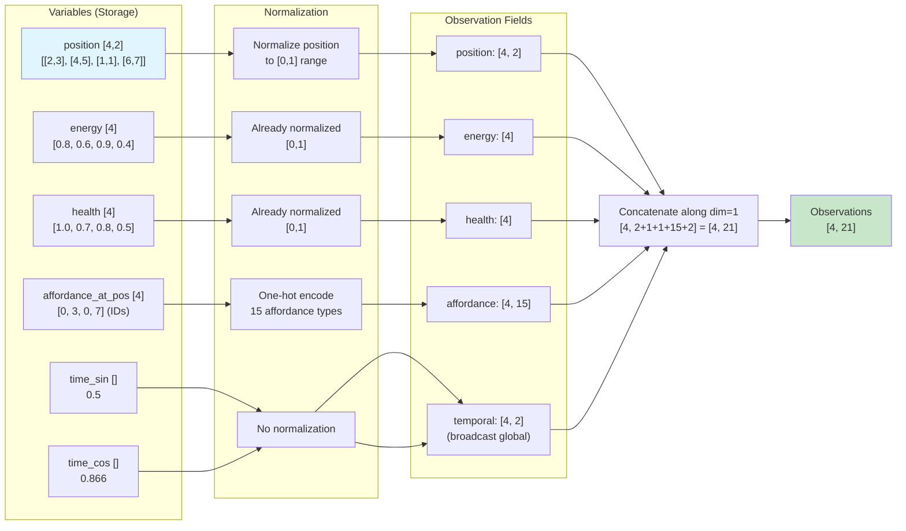

## POMDP (Partial Observability) Example

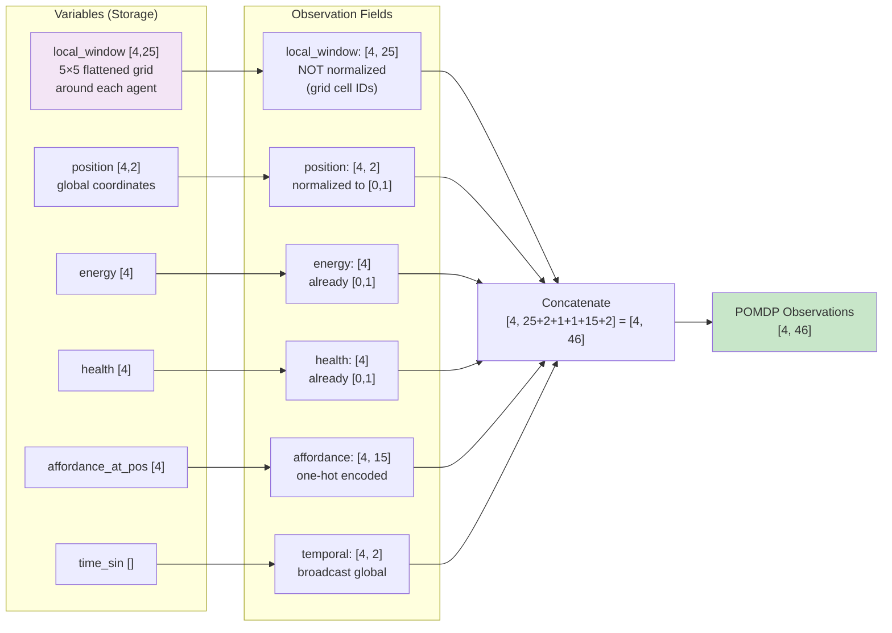

## Variable Lifecycle States

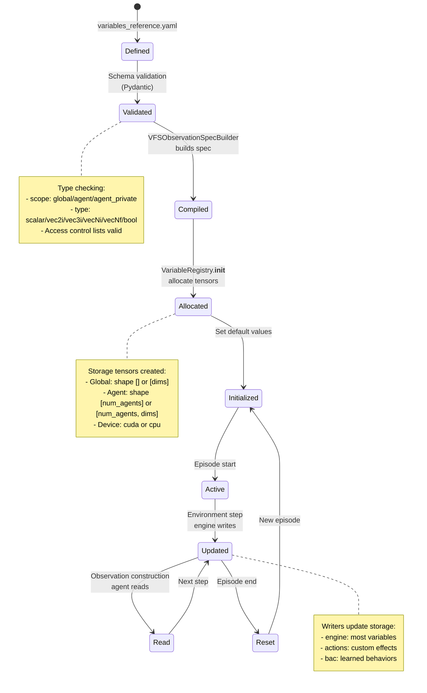

## Performance Characteristics

### Memory Usage (4 agents)

| Variable Type | Scope | Storage Size | Example |
|---------------|-------|--------------|---------|
| scalar | global | 4 bytes | `time_sin: tensor(0.5)` |
| scalar | agent | 16 bytes | `energy: tensor([0.8, 0.6, 0.9, 0.4])` |
| vec2i | global | 16 bytes | `global_pos: tensor([3, 5])` |
| vec2i | agent | 32 bytes | `position: tensor([[2,3], [4,5], [1,1], [6,7]])` |
| bool | global | 1 byte | `daytime: tensor(True)` |
| bool | agent | 4 bytes | `alive: tensor([T, T, F, T])` |

### Access Control Overhead

- **Read**: O(1) dictionary lookup + permission check
- **Write**: O(1) dictionary lookup + permission check + tensor assignment
- **Initialization**: O(num_variables) tensor allocation

### Normalization Overhead

- **MinMax**: 2 ops per value (subtract, divide)
- **Z-Score**: 2 ops per value (subtract, divide)
- **Batch operations**: Vectorized across `num_agents`

## Common VFS Patterns

### Pattern 1: Adding a New Meter

```yaml
# variables_reference.yaml
variables:
  - id: "stamina"
    scope: "agent"
    type: "scalar"
    lifetime: "episode"
    readable_by: ["agent", "engine", "acs", "bac"]
    writable_by: ["engine"]
    default: 1.0

exposed_observations:
  - id: "obs_stamina"
    source_variable: "stamina"
    exposed_to: ["agent"]
    shape: []
    normalization:
      kind: "minmax"
      min: 0.0
      max: 1.0
```

### Pattern 2: Adding Temporal Features

```yaml
# Global temporal variables
variables:
  - id: "hour_of_day"
    scope: "global"
    type: "scalar"
    lifetime: "episode"
    readable_by: ["agent", "engine"]
    writable_by: ["engine"]
    default: 0.0

exposed_observations:
  - id: "obs_hour"
    source_variable: "hour_of_day"
    exposed_to: ["agent"]
    shape: []
    normalization:
      kind: "minmax"
      min: 0.0
      max: 23.0
```

### Pattern 3: Private Agent State

```yaml
# Agent-private variable (hidden from other agents)
variables:
  - id: "internal_motivation"
    scope: "agent_private"
    type: "scalar"
    lifetime: "episode"
    readable_by: ["agent"]  # Only owner can read
    writable_by: ["bac"]    # BAC can write
    default: 0.5
```

## Error Handling

### Access Control Violations

```python
# Attempting to read without permission
try:
    value = registry.get("energy", reader="unauthorized")
except PermissionError as e:
    # "'unauthorized' is not allowed to read variable 'energy'"
    # "Readable by: ['agent', 'engine', 'acs', 'bac']"
```

### Missing Variables

```python
# Attempting to read non-existent variable
try:
    value = registry.get("nonexistent", reader="agent")
except KeyError as e:
    # "Variable 'nonexistent' not found in registry"
```

### Type Mismatches

```python
# Attempting to write wrong-shaped tensor
try:
    registry.set("position", wrong_shape_tensor, writer="engine")
except ValueError as e:
    # "Expected shape [num_agents, 2], got [num_agents, 3]"
```

## Future Extensions (Phase 2)

1. **Expression Parsing**: Parse `WriteSpec.expression` into AST for validation
2. **Derivation Graphs**: Compute variables from other variables (e.g., `speed = ||velocity||`)
3. **Complex Types**: Structured types (objects, arrays)
4. **Dynamic Shapes**: Variables with runtime-determined dimensions
5. **Temporal Queries**: Access historical variable values (e.g., `energy[t-5]`)
6. **Conditional Normalization**: Apply different normalization based on conditions
7. **Multi-Agent Coordination**: Cross-agent variable dependencies
