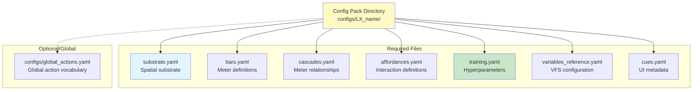
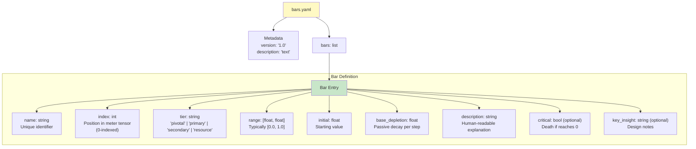
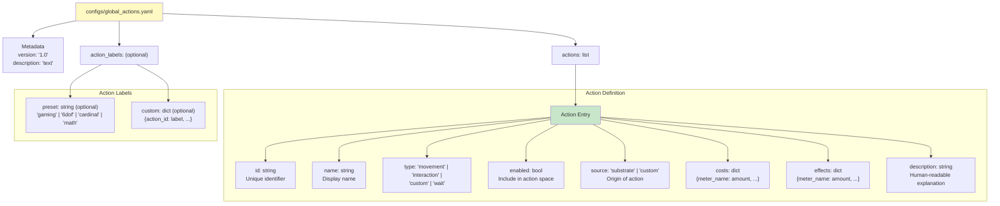
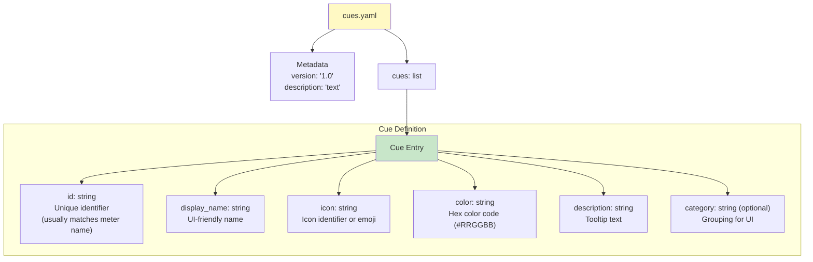
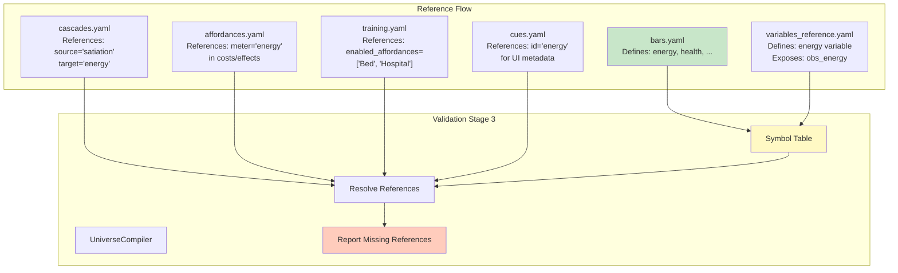

# Configuration Schema Diagrams

## Config Pack Structure



## substrate.yaml Schema

```mermaid
graph TB
    substrate_root["substrate.yaml"]

    metadata["Metadata<br/>version: '1.0'<br/>description: 'text'"]

    type["type: string<br/>grid | grid3d | gridnd |<br/>continuous | continuousnd | aspatial"]

    subgraph "Grid Configuration (type: grid)"
        grid_config["grid:"]
        topology["topology: 'square' | 'hex' | 'cubic'"]
        width["width: int<br/>grid width"]
        height["height: int<br/>grid height"]
        depth["depth: int | null<br/>for 3D grids"]
        boundary["boundary: 'clamp' | 'wrap' | 'bounce' | 'sticky'"]
        distance["distance_metric: 'manhattan' | 'euclidean' | 'chebyshev'"]
        encoding["observation_encoding: 'relative' | 'scaled' | 'absolute'"]
    end

    subgraph "GridND Configuration (type: gridnd)"
        gridnd_config["gridnd:"]
        dim_sizes["dimension_sizes: list[int]<br/>[width, height, depth, ...]"]
        gridnd_boundary["boundary: string"]
    end

    subgraph "Continuous Configuration (type: continuous)"
        continuous_config["continuous:"]
        dimensions["dimensions: 1 | 2 | 3"]
        bounds["bounds: list[tuple]<br/>[(min, max), ...]"]
        movement_delta["movement_delta: float"]
        interaction_radius["interaction_radius: float"]
    end

    subgraph "Aspatial Configuration (type: aspatial)"
        aspatial_note["No spatial configuration<br/>No position concept<br/>Pure resource management"]
    end

    substrate_root --> metadata
    substrate_root --> type

    type --> grid_config
    type --> gridnd_config
    type --> continuous_config
    type --> aspatial_note

    grid_config --> topology
    grid_config --> width
    grid_config --> height
    grid_config --> depth
    grid_config --> boundary
    grid_config --> distance
    grid_config --> encoding

    gridnd_config --> dim_sizes
    gridnd_config --> gridnd_boundary

    continuous_config --> dimensions
    continuous_config --> bounds
    continuous_config --> movement_delta
    continuous_config --> interaction_radius

    style substrate_root fill:#fff9c4
    style grid_config fill:#e1f5fe
    style continuous_config fill:#c8e6c9
```



## bars.yaml Schema



## cascades.yaml Schema

```mermaid
graph TB
    cascades_root["cascades.yaml"]

    metadata["Metadata<br/>version: '1.0'<br/>description: 'text'"]

    cascades_list["cascades: list"]

    subgraph "Cascade Definition"
        cascade_item["Cascade Entry"]
        cascade_name["name: string<br/>Unique identifier"]
        source["source: string<br/>Source meter name"]
        target["target: string<br/>Target meter name"]
        threshold["threshold: float<br/>Trigger when source < threshold"]
        strength["strength: float<br/>Drain rate on target"]
        category["category: string (optional)<br/>Grouping for telemetry"]
        description_cas["description: string<br/>Explanation"]
        teaching_note["teaching_note: string (optional)<br/>Pedagogical context"]
    end

    modulations_list["modulations: list (optional)"]

    subgraph "Modulation Definition"
        modulation_item["Modulation Entry"]
        mod_source["source: string<br/>Source meter name"]
        mod_target["target: string<br/>Target meter name"]
        base_mult["base_multiplier: float<br/>Baseline multiplier"]
        mod_range["range: float<br/>Modulation range"]
        baseline_dep["baseline_depletion: float<br/>Reference depletion rate"]
    end

    cascades_root --> metadata
    cascades_root --> cascades_list
    cascades_root --> modulations_list

    cascades_list --> cascade_item
    cascade_item --> cascade_name
    cascade_item --> source
    cascade_item --> target
    cascade_item --> threshold
    cascade_item --> strength
    cascade_item --> category
    cascade_item --> description_cas
    cascade_item --> teaching_note

    modulations_list --> modulation_item
    modulation_item --> mod_source
    modulation_item --> mod_target
    modulation_item --> base_mult
    modulation_item --> mod_range
    modulation_item --> baseline_dep

    style cascades_root fill:#fff9c4
    style cascade_item fill:#ffccbc
    style modulation_item fill:#e1f5fe
```



## affordances.yaml Schema

```mermaid
graph TB
    affordances_root["affordances.yaml"]

    metadata["Metadata<br/>version: '1.0'<br/>description: 'text'<br/>status: 'DRAFT' | 'STABLE' | 'COMPILED'"]

    affordances_list["affordances: list"]

    subgraph "Affordance Definition"
        affordance_item["Affordance Entry"]

        basic["Basic Fields:<br/>id: string<br/>name: string<br/>category: string<br/>description: string"]

        interaction_type["interaction_type: 'instant' | 'multi_tick'"]

        required_ticks["required_ticks: int (optional)<br/>For multi_tick affordances"]

        operating_hours["operating_hours: [int, int]<br/>[open_hour, close_hour]<br/>0-23 for open, 1-28 for close"]

        position["position: varies (optional)<br/>Grid: [x, y]<br/>Hex: {q: int, r: int}<br/>Continuous: [x, y, ...]<br/>Graph: node_id"]
    end

    subgraph "Cost/Effect Lists (Legacy)"
        costs["costs: list (optional)<br/>[{meter: string, amount: float}]"]
        costs_per_tick["costs_per_tick: list (optional)"]
        effects["effects: list (optional)"]
        effects_per_tick["effects_per_tick: list (optional)"]
        completion_bonus["completion_bonus: list (optional)"]
    end

    subgraph "Effect Pipeline (New)"
        effect_pipeline["effect_pipeline: (optional)"]
        on_start["on_start: list<br/>[{meter: string, amount: float}]"]
        per_tick["per_tick: list"]
        on_completion["on_completion: list"]
        on_early_exit["on_early_exit: list"]
        on_failure["on_failure: list"]
    end

    subgraph "Capabilities"
        capabilities["capabilities: list (optional)"]
        instant_cap["type: 'instant'"]
        multitick_cap["type: 'multi_tick'<br/>required_ticks: int<br/>resumable: bool<br/>early_exit_allowed: bool"]
        cooldown_cap["type: 'cooldown'<br/>cooldown_ticks: int"]
        meter_gated_cap["type: 'meter_gated'<br/>meter: string<br/>min: float<br/>max: float"]
    end

    subgraph "Availability Constraints"
        availability["availability: list (optional)<br/>[{meter: string, min: float, max: float}]"]
    end

    subgraph "Modes (Future)"
        modes["modes: dict (optional)<br/>{mode_name: {hours: [int, int], ...}}"]
    end

    affordances_root --> metadata
    affordances_root --> affordances_list

    affordances_list --> affordance_item
    affordance_item --> basic
    affordance_item --> interaction_type
    affordance_item --> required_ticks
    affordance_item --> operating_hours
    affordance_item --> position

    affordance_item --> costs
    affordance_item --> costs_per_tick
    affordance_item --> effects
    affordance_item --> effects_per_tick
    affordance_item --> completion_bonus

    affordance_item --> effect_pipeline
    effect_pipeline --> on_start
    effect_pipeline --> per_tick
    effect_pipeline --> on_completion
    effect_pipeline --> on_early_exit
    effect_pipeline --> on_failure

    affordance_item --> capabilities
    capabilities --> instant_cap
    capabilities --> multitick_cap
    capabilities --> cooldown_cap
    capabilities --> meter_gated_cap

    affordance_item --> availability
    affordance_item --> modes

    style affordances_root fill:#fff9c4
    style affordance_item fill:#c8e6c9
    style effect_pipeline fill:#e1f5fe
```



## training.yaml Schema

```mermaid
graph TB
    training_root["training.yaml"]

    metadata["Metadata<br/>version: '1.0'"]

    subgraph "Training Section"
        training_config["training:"]
        device["device: 'cpu' | 'cuda'"]
        max_episodes["max_episodes: int<br/>Total episodes to train"]
        epsilon_start["epsilon_start: float<br/>Initial exploration rate"]
        epsilon_decay["epsilon_decay: float<br/>Decay rate per episode"]
        epsilon_min["epsilon_min: float<br/>Minimum exploration rate"]
        train_frequency["train_frequency: int<br/>Train every N steps"]
        target_update_frequency["target_update_frequency: int<br/>Update target every N training steps"]
        batch_size["batch_size: int<br/>Experience replay batch size"]
        sequence_length["sequence_length: int<br/>LSTM sequence length"]
        max_grad_norm["max_grad_norm: float<br/>Gradient clipping threshold"]
    end

    subgraph "Environment Section"
        environment_config["environment:"]
        grid_size["grid_size: int<br/>Grid dimensions"]
        partial_observability["partial_observability: bool<br/>Enable POMDP"]
        vision_range["vision_range: int<br/>Local window radius (if POMDP)"]
        randomize_affordances["randomize_affordances: bool<br/>Randomize positions"]
        enable_temporal["enable_temporal_mechanics: bool<br/>Time-of-day system"]
        energy_costs["energy_move_depletion: float<br/>energy_wait_depletion: float<br/>energy_interact_depletion: float"]
        enabled_affordances["enabled_affordances: list[string] (optional)<br/>Subset to deploy"]
    end

    subgraph "Population Section"
        population_config["population:"]
        num_agents["num_agents: int<br/>Parallel agents"]
        learning_rate["learning_rate: float<br/>Optimizer learning rate"]
        gamma["gamma: float<br/>Discount factor"]
        replay_capacity["replay_buffer_capacity: int<br/>Max transitions"]
        network_type["network_type: 'simple' | 'recurrent'"]
    end

    subgraph "Curriculum Section"
        curriculum_config["curriculum:"]
        max_steps["max_steps_per_episode: int<br/>Episode length limit"]
        survival_advance["survival_advance_threshold: float<br/>Advance stage if survival > threshold"]
        survival_retreat["survival_retreat_threshold: float<br/>Retreat stage if survival < threshold"]
        entropy_gate["entropy_gate: float<br/>Action entropy threshold for advancement"]
        min_steps_stage["min_steps_at_stage: int<br/>Minimum episodes before transition"]
    end

    subgraph "Exploration Section"
        exploration_config["exploration:"]
        embed_dim["embed_dim: int<br/>RND network dimension"]
        initial_intrinsic["initial_intrinsic_weight: float<br/>Starting intrinsic reward weight"]
        variance_threshold["variance_threshold: float<br/>Annealing trigger threshold"]
        survival_window["survival_window: int<br/>Window for variance computation"]
    end

    subgraph "Optional Sections"
        recording["recording: (optional)<br/>enabled: bool<br/>output_dir: string<br/>criteria: ..."]
        allow_unfeasible["allow_unfeasible_universe: bool (optional)<br/>Allow unwinnable configs (for testing)"]
    end

    training_root --> metadata
    training_root --> training_config
    training_root --> environment_config
    training_root --> population_config
    training_root --> curriculum_config
    training_root --> exploration_config
    training_root --> recording
    training_root --> allow_unfeasible

    training_config --> device
    training_config --> max_episodes
    training_config --> epsilon_start
    training_config --> epsilon_decay
    training_config --> epsilon_min
    training_config --> train_frequency
    training_config --> target_update_frequency
    training_config --> batch_size
    training_config --> sequence_length
    training_config --> max_grad_norm

    environment_config --> grid_size
    environment_config --> partial_observability
    environment_config --> vision_range
    environment_config --> randomize_affordances
    environment_config --> enable_temporal
    environment_config --> energy_costs
    environment_config --> enabled_affordances

    population_config --> num_agents
    population_config --> learning_rate
    population_config --> gamma
    population_config --> replay_capacity
    population_config --> network_type

    curriculum_config --> max_steps
    curriculum_config --> survival_advance
    curriculum_config --> survival_retreat
    curriculum_config --> entropy_gate
    curriculum_config --> min_steps_stage

    exploration_config --> embed_dim
    exploration_config --> initial_intrinsic
    exploration_config --> variance_threshold
    exploration_config --> survival_window

    style training_root fill:#fff9c4
    style training_config fill:#ffccbc
    style environment_config fill:#c8e6c9
    style population_config fill:#e1f5fe
```



## variables_reference.yaml Schema

```mermaid
graph TB
    variables_root["variables_reference.yaml"]

    metadata["Metadata<br/>version: '1.0'"]

    variables_list["variables: list"]

    subgraph "Variable Definition"
        variable_item["Variable Entry"]
        var_id["id: string<br/>Unique identifier"]
        scope["scope: 'global' | 'agent' | 'agent_private'"]
        var_type["type: 'scalar' | 'bool' |<br/>'vec2i' | 'vec3i' | 'vecNi' | 'vecNf'"]
        dims["dims: int (optional)<br/>Required for vecNi/vecNf"]
        lifetime["lifetime: 'episode' | 'persistent'"]
        readable_by["readable_by: list[string]<br/>['agent', 'engine', 'acs', 'bac']"]
        writable_by["writable_by: list[string]<br/>['engine', 'actions', 'bac']"]
        default["default: varies<br/>Scalar: float<br/>Vector: list<br/>Bool: bool"]
    end

    exposures_list["exposed_observations: list"]

    subgraph "Observation Exposure"
        exposure_item["Exposure Entry"]
        obs_id["id: string<br/>Unique observation ID"]
        source_var["source_variable: string<br/>Variable ID to expose"]
        exposed_to["exposed_to: list[string]<br/>['agent', 'acs', 'bac']"]
        shape["shape: list[int]<br/>[] for scalar, [N] for vector"]
        normalization["normalization: (optional)"]
        norm_kind["kind: 'minmax' | 'zscore'"]
        norm_params["Parameters:<br/>minmax: min, max<br/>zscore: mean, std"]
    end

    variables_root --> metadata
    variables_root --> variables_list
    variables_root --> exposures_list

    variables_list --> variable_item
    variable_item --> var_id
    variable_item --> scope
    variable_item --> var_type
    variable_item --> dims
    variable_item --> lifetime
    variable_item --> readable_by
    variable_item --> writable_by
    variable_item --> default

    exposures_list --> exposure_item
    exposure_item --> obs_id
    exposure_item --> source_var
    exposure_item --> exposed_to
    exposure_item --> shape
    exposure_item --> normalization
    normalization --> norm_kind
    normalization --> norm_params

    style variables_root fill:#fff9c4
    style variable_item fill:#c8e6c9
    style exposure_item fill:#e1f5fe
```



## global_actions.yaml Schema



## cues.yaml Schema



## Config Cross-References



## Example Configuration Values

### Typical Grid2D (L1)
```yaml
# substrate.yaml
type: "grid"
grid:
  width: 8
  height: 8
  topology: "square"
  boundary: "clamp"
  distance_metric: "manhattan"
  observation_encoding: "relative"

# training.yaml
training:
  max_episodes: 10000
  epsilon_start: 1.0
  epsilon_decay: 0.995
  epsilon_min: 0.01
  train_frequency: 4
  batch_size: 64

environment:
  grid_size: 8
  partial_observability: false
  randomize_affordances: true
  enable_temporal_mechanics: false

population:
  num_agents: 4
  learning_rate: 0.00025
  gamma: 0.99
  network_type: "simple"
```

### Typical POMDP (L2)
```yaml
# training.yaml
environment:
  grid_size: 8
  partial_observability: true
  vision_range: 2  # 5×5 local window
  enable_temporal_mechanics: false

population:
  network_type: "recurrent"  # LSTM for memory
  batch_size: 16  # Smaller for sequences
  sequence_length: 8  # BPTT length
```

### Temporal Mechanics (L3)
```yaml
# training.yaml
environment:
  enable_temporal_mechanics: true

# affordances.yaml (example)
- id: "aff_job_office"
  operating_hours: [9, 17]  # 9am-5pm
  # Only available during business hours
```

## Schema Validation Principles

### No-Defaults Principle (PDR-002)
All behavioral parameters must be explicitly specified:
- ✅ **Good**: `epsilon_start: 1.0` (explicit)
- ❌ **Bad**: Relying on code default value

### Exemptions
Only metadata and computed values:
- `version`, `description` (metadata)
- `observation_dim` (computed from VFS)
- `action_count` (computed from actions)

### Validation Stages
1. **Parse**: YAML → Pydantic DTO (schema validation)
2. **Resolve**: Cross-file references exist
3. **Validate**: Semantic constraints (feasibility, balance)
4. **Compile**: Generate optimized artifacts
