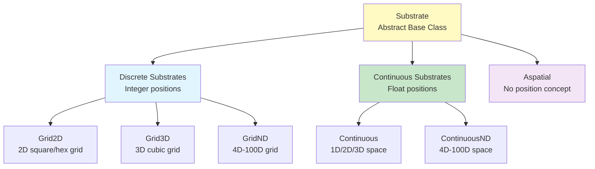
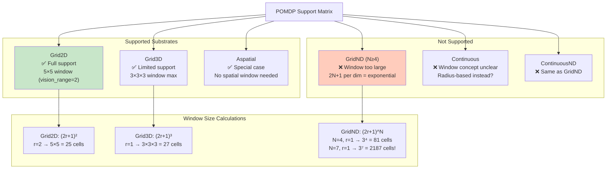
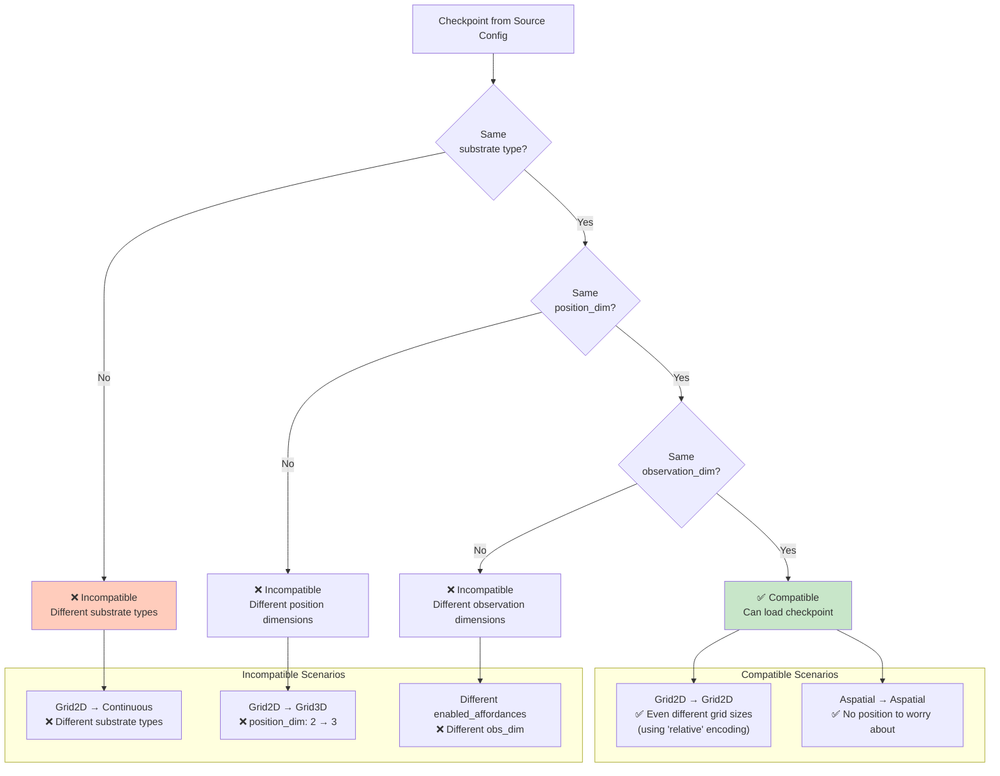
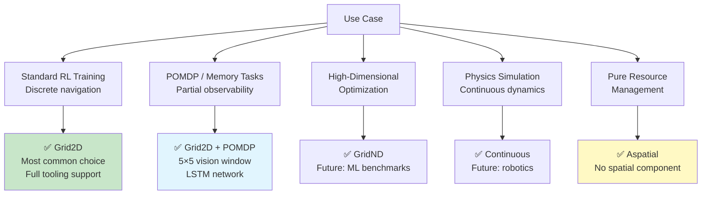

# Substrate Feature Comparison Matrix

## Substrate Type Overview



## Feature Comparison Table

| Feature | Grid2D | Grid3D | GridND | Continuous | ContinuousND | Aspatial |
|---------|--------|--------|--------|------------|--------------|----------|
| **Position Dim** | 2 | 3 | 4-100 | 1-3 | 4-100 | 0 |
| **Position Type** | Integer | Integer | Integer | Float | Float | N/A |
| **Topologies** | square, hex | cubic | hypercube | euclidean | euclidean | N/A |
| **Boundaries** | clamp, wrap, bounce, sticky | clamp, wrap | clamp, wrap | clamp, wrap, bounce | clamp, wrap | N/A |
| **Distance Metrics** | manhattan, euclidean, chebyshev | manhattan, euclidean | manhattan, euclidean | euclidean | euclidean | 0.0 |
| **POMDP Support** | ✅ Yes | ✅ Yes (limited) | ❌ No (window too large) | ✅ Yes | ❌ No | ✅ Special case |
| **Action Space** | 6-8 actions | 8-10 actions | 2N+2 actions | 2-6 actions | 2N+2 actions | 2 actions |
| **Observation Encoding** | relative, scaled, absolute | relative, scaled, absolute | relative | coordinate | coordinate | N/A |
| **Transfer Learning** | ✅ Full support | ✅ Full support | ⚠️ Position dim varies | ⚠️ Position dim varies | ❌ Dimension-specific | ✅ No position |
| **Typical Use Case** | Standard RL | 3D navigation | High-dim optimization | Physics simulation | ML optimization | Resource management |
| **Example Config** | L1_full_observability | None (future) | None (future) | None (future) | None (future) | None (future) |

## Grid2D Detailed Features

```mermaid
graph TB
    grid2d_root["Grid2DSubstrate"]

    subgraph "Topologies"
        square["Square Grid<br/>4-connected or 8-connected"]
        hex["Hex Grid<br/>Axial coordinates (q, r)"]
    end

    subgraph "Boundary Modes"
        clamp["clamp: Hard walls<br/>position clamped to valid range"]
        wrap["wrap: Toroidal<br/>edges connect (Pac-Man)"]
        bounce["bounce: Elastic<br/>reflect off boundaries"]
        sticky["sticky: One-way<br/>can't leave once at edge"]
    end

    subgraph "Distance Metrics"
        manhattan["manhattan (L1)<br/>|x1-x2| + |y1-y2|"]
        euclidean["euclidean (L2)<br/>sqrt((x1-x2)² + (y1-y2)²)"]
        chebyshev["chebyshev (L∞)<br/>max(|x1-x2|, |y1-y2|)"]
    end

    subgraph "Observation Encodings"
        relative["relative: [0,1] normalized<br/>Best for transfer learning"]
        scaled["scaled: normalized + metadata<br/>Network learns grid size"]
        absolute["absolute: raw coords<br/>For physical simulation"]
    end

    subgraph "Action Space (Square)"
        up["UP: [0, -1]"]
        down["DOWN: [0, 1]"]
        left["LEFT: [-1, 0]"]
        right["RIGHT: [1, 0]"]
        interact["INTERACT: special"]
        wait["WAIT: [0, 0]"]
        custom["Custom actions (e.g., REST)"]
    end

    grid2d_root --> square
    grid2d_root --> hex

    grid2d_root --> clamp
    grid2d_root --> wrap
    grid2d_root --> bounce
    grid2d_root --> sticky

    grid2d_root --> manhattan
    grid2d_root --> euclidean
    grid2d_root --> chebyshev

    grid2d_root --> relative
    grid2d_root --> scaled
    grid2d_root --> absolute

    grid2d_root --> up
    grid2d_root --> down
    grid2d_root --> left
    grid2d_root --> right
    grid2d_root --> interact
    grid2d_root --> wait
    grid2d_root --> custom

    style grid2d_root fill:#e1f5fe
    style relative fill:#c8e6c9
    style up fill:#fff9c4
```



## POMDP Compatibility



## Position Representation

```mermaid
graph TB
    subgraph "Grid2D Positions"
        grid2d_pos["Stored: Tensor[num_agents, 2]<br/>dtype: int64<br/>Example: [[2, 3], [4, 5]]"]
        grid2d_norm["Normalized: divide by grid_size<br/>[[2/8, 3/8], [4/8, 5/8]]<br/>= [[0.25, 0.375], [0.5, 0.625]]"]
    end

    subgraph "Grid3D Positions"
        grid3d_pos["Stored: Tensor[num_agents, 3]<br/>dtype: int64<br/>Example: [[2, 3, 1], [4, 5, 2]]"]
        grid3d_norm["Normalized: divide by dims<br/>[[2/8, 3/8, 1/4], ...]"]
    end

    subgraph "GridND Positions"
        gridnd_pos["Stored: Tensor[num_agents, N]<br/>dtype: int64<br/>N can be 4-100"]
        gridnd_norm["Normalized: per-dimension<br/>pos[i] / dimension_sizes[i]"]
    end

    subgraph "Continuous Positions"
        continuous_pos["Stored: Tensor[num_agents, dims]<br/>dtype: float32<br/>Example: [[1.5, 2.3], [4.1, 5.9]]"]
        continuous_norm["Normalized: (pos - min) / (max - min)<br/>Based on bounds"]
    end

    subgraph "Aspatial Positions"
        aspatial_pos["No positions!<br/>Tensor[num_agents, 0]<br/>Empty tensor"]
        aspatial_note["All agents at 'same' location<br/>is_adjacent() always returns True"]
    end

    grid2d_pos --> grid2d_norm
    grid3d_pos --> grid3d_norm
    gridnd_pos --> gridnd_norm
    continuous_pos --> continuous_norm

    style grid2d_pos fill:#e1f5fe
    style continuous_pos fill:#c8e6c9
    style aspatial_pos fill:#f3e5f5
```



## Action Space Comparison

```mermaid
graph TB
    subgraph "Grid2D Action Space"
        grid2d_actions["Total: 8 actions<br/>(6 substrate + 2 custom)"]
        grid2d_movement["Movement: 4 cardinal<br/>UP, DOWN, LEFT, RIGHT"]
        grid2d_special["Special: INTERACT, WAIT"]
        grid2d_custom["Custom: REST, MEDITATE"]
    end

    subgraph "Grid3D Action Space"
        grid3d_actions["Total: 10 actions<br/>(8 substrate + 2 custom)"]
        grid3d_movement["Movement: 6 directions<br/>±X, ±Y, ±Z"]
        grid3d_special["Special: INTERACT, WAIT"]
        grid3d_custom["Custom: REST, MEDITATE"]
    end

    subgraph "GridND Action Space"
        gridnd_actions["Total: 2N+2 actions<br/>N dimensions"]
        gridnd_movement["Movement: 2N directions<br/>±dim[i] for each dim"]
        gridnd_special["Special: INTERACT, WAIT"]
    end

    subgraph "Continuous Action Space"
        continuous_actions["Varies by dimensions<br/>1D: 4 actions<br/>2D: 6 actions<br/>3D: 8 actions"]
        continuous_movement["Movement: ±delta per axis<br/>delta from config"]
        continuous_special["Special: INTERACT, WAIT"]
    end

    subgraph "Aspatial Action Space"
        aspatial_actions["Total: 2 actions<br/>(0 movement + 2 custom)"]
        aspatial_no_move["No movement actions<br/>(no position concept)"]
        aspatial_custom["Custom: REST, MEDITATE<br/>OR INTERACT (affordances)"]
    end

    grid2d_actions --> grid2d_movement
    grid2d_actions --> grid2d_special
    grid2d_actions --> grid2d_custom

    grid3d_actions --> grid3d_movement
    grid3d_actions --> grid3d_special
    grid3d_actions --> grid3d_custom

    gridnd_actions --> gridnd_movement
    gridnd_actions --> gridnd_special

    continuous_actions --> continuous_movement
    continuous_actions --> continuous_special

    aspatial_actions --> aspatial_no_move
    aspatial_actions --> aspatial_custom

    style grid2d_actions fill:#e1f5fe
    style aspatial_actions fill:#f3e5f5
```



## Transfer Learning Compatibility



## Performance Characteristics

### Memory Footprint (4 agents)

| Substrate | Position Storage | Typical Size |
|-----------|------------------|--------------|
| Grid2D | `[4, 2]` int64 | 64 bytes |
| Grid3D | `[4, 3]` int64 | 96 bytes |
| GridND (N=7) | `[4, 7]` int64 | 224 bytes |
| Continuous (3D) | `[4, 3]` float32 | 48 bytes |
| Aspatial | `[4, 0]` - | 0 bytes |

### Movement Computation Cost

| Substrate | Operation | Cost |
|-----------|-----------|------|
| Grid2D | Add delta, clamp bounds | O(1) per agent |
| Grid3D | Add delta, clamp bounds | O(1) per agent |
| GridND | Add delta, clamp N dims | O(N) per agent |
| Continuous | Add delta, check bounds | O(dims) per agent |
| Aspatial | No-op (always succeeds) | O(1) |

### Distance Computation

| Substrate | Metric | Formula |
|-----------|--------|---------|
| Grid2D | Manhattan | `|x1-x2| + |y1-y2|` |
| Grid2D | Euclidean | `sqrt((x1-x2)² + (y1-y2)²)` |
| Grid2D | Chebyshev | `max(|x1-x2|, |y1-y2|)` |
| Grid3D | Euclidean | `sqrt((x1-x2)² + (y1-y2)² + (z1-z2)²)` |
| Continuous | Euclidean | `sqrt(sum((p1[i]-p2[i])²))` |
| Aspatial | Always 0 | `0.0` |

## Use Case Recommendations



## Configuration Examples

### Grid2D (Square, 8×8)
```yaml
type: "grid"
grid:
  topology: "square"
  width: 8
  height: 8
  boundary: "clamp"
  distance_metric: "manhattan"
  observation_encoding: "relative"
```

### Grid2D (Hex)
```yaml
type: "grid"
grid:
  topology: "hex"
  width: 10
  height: 10
  boundary: "wrap"
  distance_metric: "manhattan"
  observation_encoding: "relative"
```

### Grid3D (Cubic)
```yaml
type: "grid3d"
grid3d:
  width: 5
  height: 5
  depth: 5
  boundary: "clamp"
```

### GridND (7D)
```yaml
type: "gridnd"
gridnd:
  dimension_sizes: [3, 3, 3, 3, 3, 3, 3]
  boundary: "wrap"
```

### Continuous (2D)
```yaml
type: "continuous"
continuous:
  dimensions: 2
  bounds: [[0.0, 10.0], [0.0, 10.0]]
  movement_delta: 0.1
  interaction_radius: 0.5
```

### Aspatial
```yaml
type: "aspatial"
# No additional configuration needed
```

## Future Substrate Extensions

1. **Graph Substrate**: Arbitrary graph topology
2. **Hybrid Substrate**: Mixed discrete/continuous
3. **Dynamic Substrate**: Changing topology over time
4. **Multi-Scale Substrate**: Hierarchical grids
5. **Wrapped Continuous**: Toroidal continuous space
