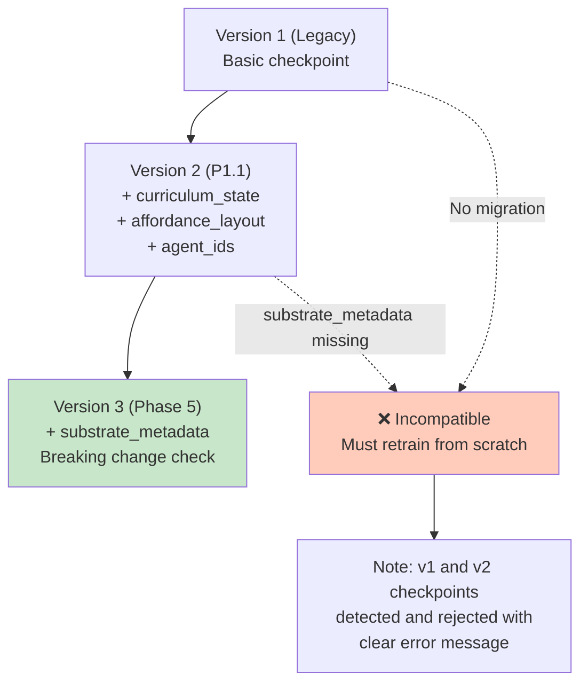
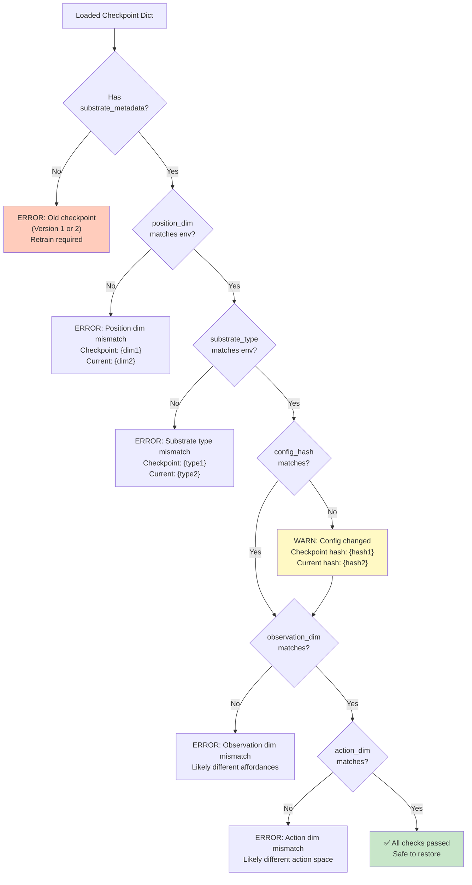
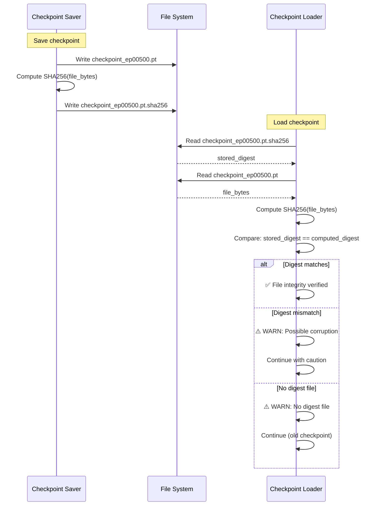
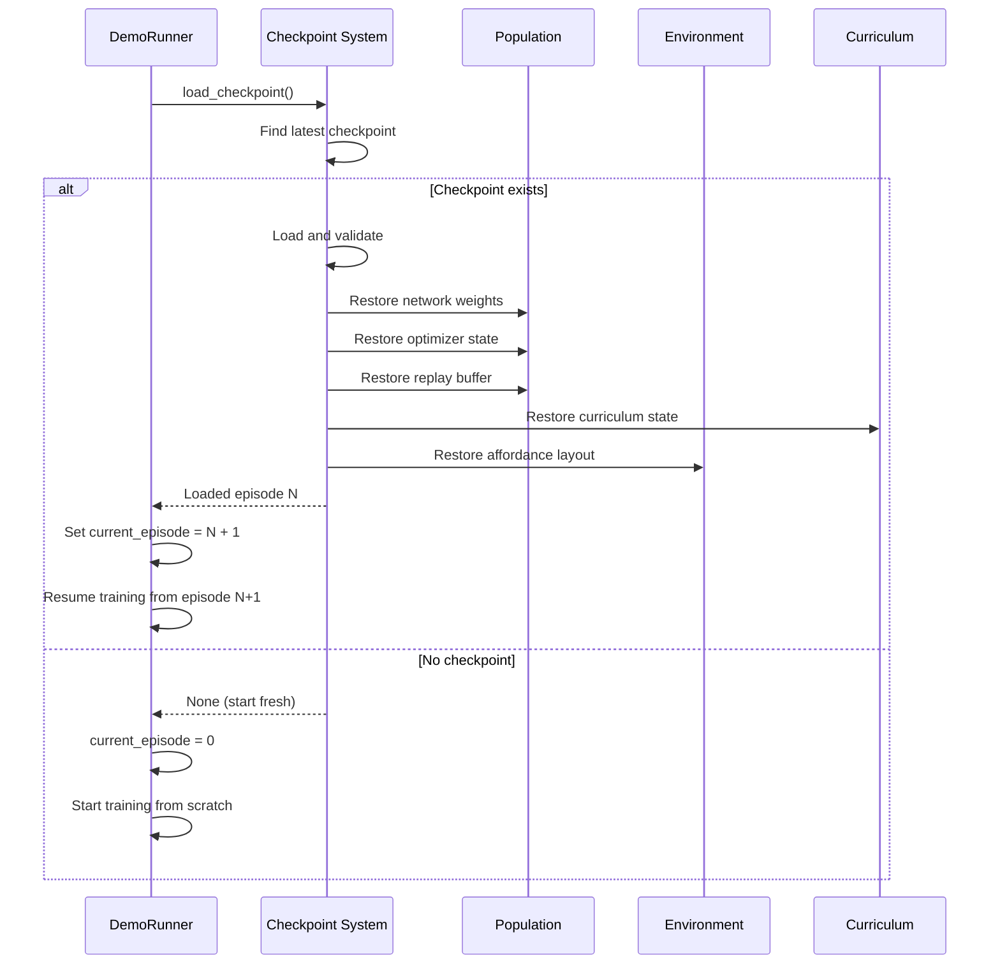
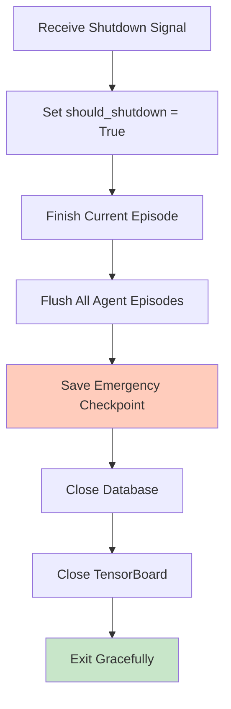

# Checkpoint/Restore Flow

## Checkpoint File Structure

```mermaid
graph TB
    checkpoint_file["checkpoint_ep00500.pt<br/>PyTorch checkpoint file"]

    metadata_section["Metadata Section"]
    version["version: 3<br/>(Phase 5)"]
    episode_num["episode: 500"]
    timestamp["timestamp: 1699123456.789"]
    config_hash["config_hash: sha256(...)"]
    substrate_meta["substrate_metadata:<br/>position_dim, substrate_type"]

    training_section["Training State Section"]
    pop_state["population_state:"]
    q_network["q_network: state_dict()<br/>Network weights"]
    optimizer["optimizer: state_dict()<br/>Adam state"]
    replay_buffer["replay_buffer: buffer data"]
    epsilon_val["epsilon: 0.245"]
    training_step["total_steps: 125000"]

    curriculum_section["Curriculum State Section"]
    curriculum_state["curriculum_state:"]
    agent_stages["agent_stages: [3, 3, 2, 3]"]
    performance["performance_trackers:<br/>survival history, entropy"]
    difficulty["depletion_multiplier: 1.5"]

    environment_section["Environment State Section"]
    affordance_layout["affordance_layout:<br/>{aff_id: position}"]
    agent_ids["agent_ids: ['agent_0', ...]"]

    config_section["Config Provenance"]
    training_config["training_config: dict<br/>Full training.yaml content"]
    config_dir["config_dir: 'configs/L1_full_observability'"]

    checkpoint_file --> metadata_section
    checkpoint_file --> training_section
    checkpoint_file --> curriculum_section
    checkpoint_file --> environment_section
    checkpoint_file --> config_section

    metadata_section --> version
    metadata_section --> episode_num
    metadata_section --> timestamp
    metadata_section --> config_hash
    metadata_section --> substrate_meta

    training_section --> pop_state
    pop_state --> q_network
    pop_state --> optimizer
    pop_state --> replay_buffer
    pop_state --> epsilon_val
    pop_state --> training_step

    curriculum_section --> curriculum_state
    curriculum_state --> agent_stages
    curriculum_state --> performance
    curriculum_state --> difficulty

    environment_section --> affordance_layout
    environment_section --> agent_ids

    config_section --> training_config
    config_section --> config_dir

    style checkpoint_file fill:#d1c4e9
    style q_network fill:#c8e6c9
    style affordance_layout fill:#e1f5fe
```



## Checkpoint Save Flow

```mermaid
flowchart TD
    trigger[Save Checkpoint Triggered<br/>Episode % 100 == 0]

    flush[Flush All Agent Episodes<br/>to Replay Buffer]
    note_flush["CRITICAL: Prevents data loss<br/>LSTM episodes reach buffer"]

    collect_network[Collect Q-Network State<br/>population.q_network.state_dict()]
    collect_optimizer[Collect Optimizer State<br/>population.optimizer.state_dict()]
    collect_replay[Collect Replay Buffer<br/>population.replay_buffer state]
    collect_epsilon[Get Current Epsilon<br/>population._get_current_epsilon_value()]

    collect_curriculum[Collect Curriculum State<br/>curriculum.state_dict()]
    collect_layout[Get Affordance Positions<br/>env.get_affordance_positions()]
    collect_agent_ids[Get Agent IDs<br/>population.agent_ids]

    build_metadata[Build Metadata<br/>version, episode, timestamp]
    add_substrate[Add Substrate Metadata<br/>position_dim, substrate_type]
    add_config_hash[Add Config Hash<br/>universe.metadata.config_hash]
    add_provenance[Add Training Config<br/>Full YAML dict]

    construct_dict[Construct Checkpoint Dict<br/>All sections combined]

    torch_save[torch.save(checkpoint, path)<br/>Serialize to disk]
    compute_digest[Compute SHA256 Digest<br/>hashlib.sha256(file_bytes)]
    write_digest[Write .pt.sha256 File<br/>Integrity verification]

    update_db[Update Database<br/>set_system_state('last_checkpoint')]

    complete[Checkpoint Save Complete]

    trigger --> flush
    flush --> note_flush
    note_flush --> collect_network

    collect_network --> collect_optimizer
    collect_optimizer --> collect_replay
    collect_replay --> collect_epsilon

    collect_epsilon --> collect_curriculum
    collect_curriculum --> collect_layout
    collect_layout --> collect_agent_ids

    collect_agent_ids --> build_metadata
    build_metadata --> add_substrate
    add_substrate --> add_config_hash
    add_config_hash --> add_provenance

    add_provenance --> construct_dict

    construct_dict --> torch_save
    torch_save --> compute_digest
    compute_digest --> write_digest
    write_digest --> update_db

    update_db --> complete

    style flush fill:#ffccbc
    style torch_save fill:#c8e6c9
    style write_digest fill:#e1f5fe
```

## Checkpoint Load Flow

```mermaid
flowchart TD
    start[Load Checkpoint Request]

    find_latest[Find Latest Checkpoint<br/>Sort checkpoint_ep*.pt by episode]
    check_exists{Checkpoint<br/>Exists?}
    no_checkpoint[No Checkpoint Found<br/>Start Fresh Training]

    load_digest[Load .pt.sha256 File<br/>(if exists)]
    verify_digest{Digest<br/>Matches?}
    warn_digest[Warn: No digest or mismatch<br/>Continue with caution]

    torch_load[safe_torch_load(path)<br/>Load checkpoint dict]

    check_version{version<br/>== 3?}
    warn_version[Warn: Different version<br/>v{version} vs v3]

    validate_substrate{substrate_metadata<br/>matches?}
    error_substrate[ERROR: Substrate mismatch<br/>position_dim or type changed]

    check_config_hash{config_hash<br/>matches?}
    warn_hash[Warn: Config changed<br/>Log hash mismatch]

    restore_network[Restore Q-Network State<br/>q_network.load_state_dict()]
    restore_optimizer[Restore Optimizer State<br/>optimizer.load_state_dict()]
    restore_replay[Restore Replay Buffer<br/>replay_buffer.restore()]
    restore_epsilon[Restore Epsilon Value]

    restore_curriculum[Restore Curriculum State<br/>curriculum.load_state_dict()]
    restore_layout[Restore Affordance Layout<br/>env.set_affordance_positions()]
    restore_agent_ids[Restore Agent IDs<br/>population.agent_ids]

    update_episode[Set Current Episode<br/>episode + 1]

    complete[Load Complete<br/>Resume Training]

    start --> find_latest
    find_latest --> check_exists
    check_exists -->|No| no_checkpoint
    check_exists -->|Yes| load_digest

    load_digest --> verify_digest
    verify_digest -->|Match| torch_load
    verify_digest -->|Mismatch| warn_digest
    warn_digest --> torch_load

    torch_load --> check_version
    check_version -->|Match| validate_substrate
    check_version -->|Mismatch| warn_version
    warn_version --> validate_substrate

    validate_substrate -->|Match| check_config_hash
    validate_substrate -->|Mismatch| error_substrate

    check_config_hash -->|Match| restore_network
    check_config_hash -->|Mismatch| warn_hash
    warn_hash --> restore_network

    restore_network --> restore_optimizer
    restore_optimizer --> restore_replay
    restore_replay --> restore_epsilon

    restore_epsilon --> restore_curriculum
    restore_curriculum --> restore_layout
    restore_layout --> restore_agent_ids

    restore_agent_ids --> update_episode
    update_episode --> complete

    style torch_load fill:#c8e6c9
    style error_substrate fill:#ffccbc
    style warn_hash fill:#fff9c4
```

## Version Migration



## Checkpoint Validation Checks



## Digest Verification



## Checkpoint Directory Structure

```bash
checkpoints/
├── checkpoint_ep00000.pt          # Episode 0
├── checkpoint_ep00000.pt.sha256   # Digest
├── checkpoint_ep00100.pt          # Episode 100
├── checkpoint_ep00100.pt.sha256
├── checkpoint_ep00200.pt
├── checkpoint_ep00200.pt.sha256
├── ...
└── checkpoint_ep01000.pt          # Latest (Episode 1000)
    └── checkpoint_ep01000.pt.sha256
```

## Checkpoint Size Breakdown

Typical checkpoint (~5 MB):

| Component | Size | Percentage |
|-----------|------|------------|
| Q-Network weights | ~104 KB | 2% |
| Target network weights | ~104 KB | 2% |
| Optimizer state (Adam) | ~200 KB | 4% |
| Replay buffer (10K transitions) | ~4.5 MB | 90% |
| Curriculum state | ~10 KB | 0.2% |
| Affordance layout | ~1 KB | 0.02% |
| Metadata | ~5 KB | 0.1% |
| Config provenance | ~50 KB | 1% |

## LSTM Checkpoint Additions

For recurrent networks, checkpoints also store:

```python
{
    "population_state": {
        # ... standard fields ...
        "current_episodes": [
            # Per-agent episode containers
            {
                "observations": tensor([...]),
                "actions": tensor([...]),
                "rewards": tensor([...]),
                "dones": tensor([...]),
                "hidden_states": (h, c),  # LSTM state
            },
            # ... for each agent
        ],
        "hidden_states": {
            "h": tensor([1, num_agents, 256]),
            "c": tensor([1, num_agents, 256]),
        },
    }
}
```

## Checkpoint Naming Convention

```python
checkpoint_path = f"checkpoint_ep{episode:05d}.pt"
# Examples:
# checkpoint_ep00000.pt  (episode 0)
# checkpoint_ep00100.pt  (episode 100)
# checkpoint_ep01234.pt  (episode 1234)
# checkpoint_ep10000.pt  (episode 10000)
```

## Resume Training Sequence



## Emergency Checkpoint

On shutdown (SIGTERM/SIGINT):



## Checkpoint Best Practices

1. **Frequency**: Every 100 episodes (configurable)
2. **Flush Before Save**: Always flush episodes for LSTM
3. **Validate on Load**: Check substrate, dimensions, version
4. **Digest Verification**: Detect file corruption
5. **Atomic Writes**: Write to temp file, then rename
6. **Retention**: Keep all checkpoints (or implement rotation policy)
7. **Provenance**: Store full config for reproducibility
8. **Versioning**: Increment version on breaking changes
