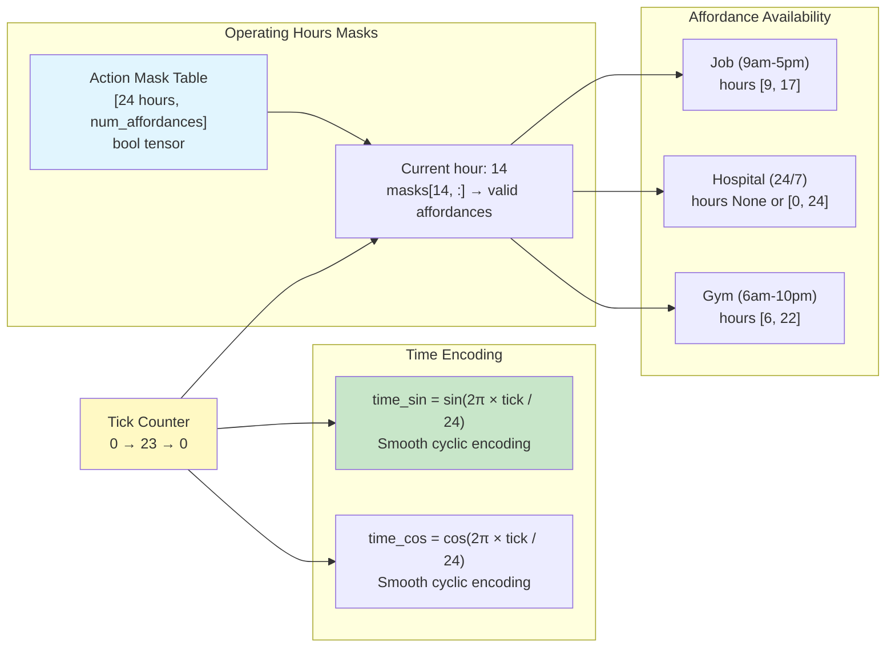
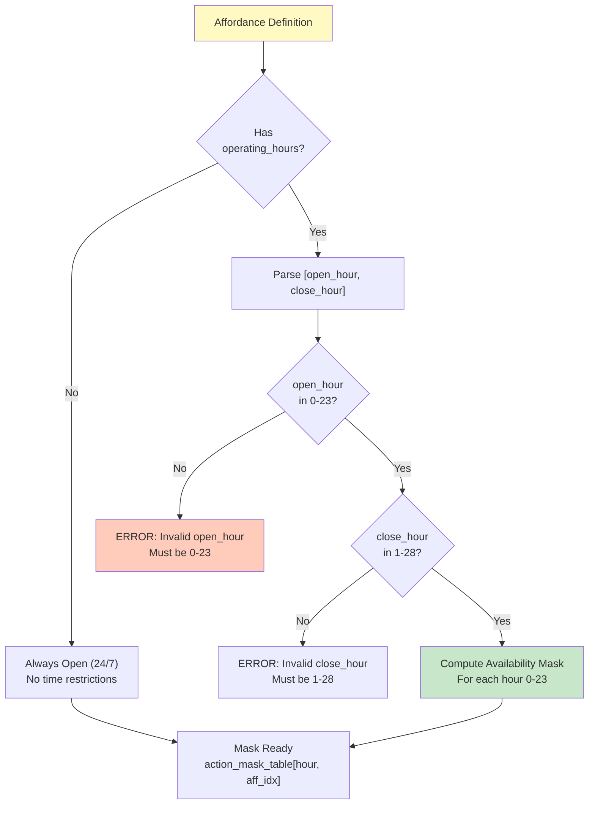
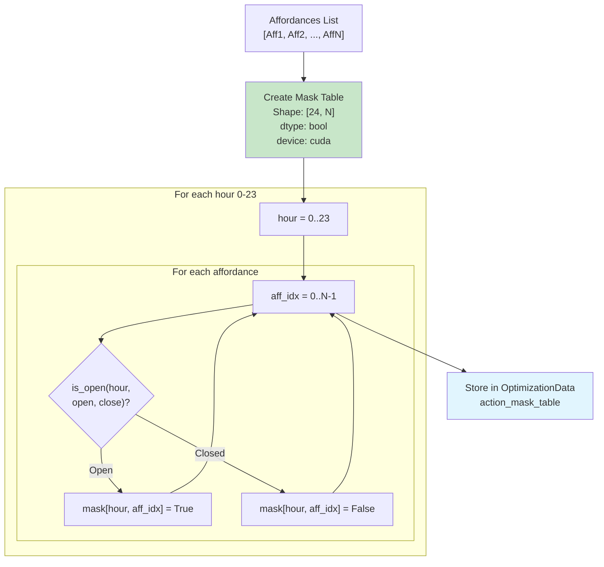
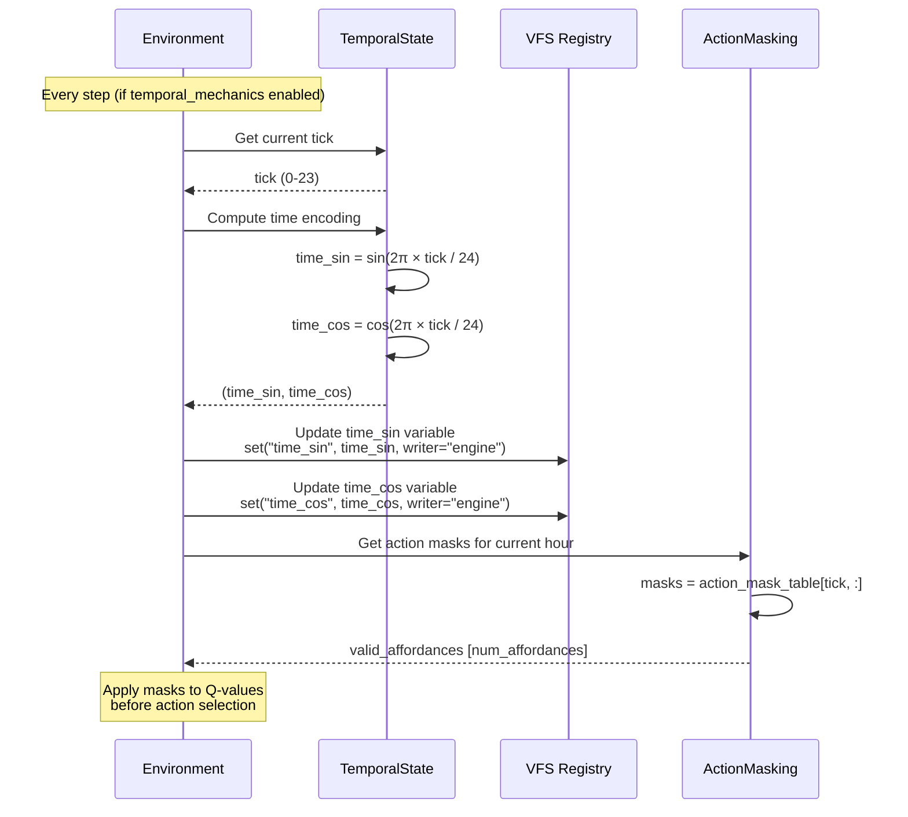

# Temporal Mechanics System

## Time-of-Day System



## Operating Hours Validation



## Hour Wrapping Logic

Operating hours can span midnight:

```python
# Example: Restaurant (5pm - 2am)
operating_hours: [17, 26]  # 17:00 to 02:00 next day

# Logic:
open_hour = 17 % 24 = 17
close_hour = 26 % 24 = 2

# For hour=18: 18 >= 17 → OPEN
# For hour=1:  1 < 2 → OPEN  
# For hour=10: Not (10 >= 17 or 10 < 2) → CLOSED
```

Examples:
- `[9, 17]`: 9am-5pm (standard business hours)
- `[0, 24]` or `[0, 28]`: 24/7 (always open)
- `[22, 30]` → `[22, 6]`: 10pm-6am (overnight)
- `[6, 22]`: 6am-10pm (gym hours)

## Action Mask Table Pre-computation

Compiled during Stage 6 (Optimization):



## Runtime Temporal Update



## Multi-Tick Interaction Timeline

```mermaid
gantt
    title Multi-Tick Interaction with Operating Hours
    dateFormat X
    axisFormat %H:00
    
    section Job (9am-5pm)
    Available: 9, 17
    Unavailable: 0, 9
    Unavailable: 17, 24
    
    section Agent Interaction
    Start Job (9:15am): milestone, 9.25, 0
    Working (Ticks 1-5): 9.25, 12.5
    Completion (12:30pm): milestone, 12.5, 0
    
    section Failure Scenario
    Start Job (4:45pm): milestone, 16.75, 0
    Working (15 min): 16.75, 17
    Job Closes (5pm): crit, milestone, 17, 0
    Failure Triggered: crit, 17, 17.25
```

## Temporal Observation Features

If `enable_temporal_mechanics: true`:

```yaml
# variables_reference.yaml additions
variables:
  - id: "time_sin"
    scope: "global"
    type: "scalar"
    lifetime: "episode"
    readable_by: ["agent", "engine", "acs", "bac"]
    writable_by: ["engine"]
    default: 0.0
    
  - id: "time_cos"
    scope: "global"
    type: "scalar"
    lifetime: "episode"
    readable_by: ["agent", "engine", "acs", "bac"]
    writable_by: ["engine"]
    default: 1.0
    
exposed_observations:
  - id: "obs_time_sin"
    source_variable: "time_sin"
    exposed_to: ["agent"]
    shape: []
    
  - id: "obs_time_cos"
    source_variable: "time_cos"
    exposed_to: ["agent"]
    shape: []
```

Observation dimensions:
- Without temporal: 29 dims
- With temporal: 31 dims (+2 for time_sin/time_cos)

## Temporal Mechanics Configuration

```yaml
# training.yaml
environment:
  enable_temporal_mechanics: true  # Enable time-of-day system

# affordances.yaml
affordances:
  - id: "aff_job_office"
    name: "Office Job"
    operating_hours: [9, 17]  # 9am-5pm
    
  - id: "aff_gym"
    name: "Gym"
    operating_hours: [6, 22]  # 6am-10pm
    
  - id: "aff_hospital"
    name: "Hospital"
    # No operating_hours = 24/7
    
  - id: "aff_bar"
    name: "Bar"
    operating_hours: [17, 26]  # 5pm-2am (overnight)
```

## Time-Based Reward Shaping (Future)

Potential extension:

```yaml
# affordances.yaml (future)
affordances:
  - id: "aff_job"
    modes:
      daytime:
        hours: [9, 17]
        effects:
          - meter: "money"
            amount: 0.225  # Normal pay
      overtime:
        hours: [17, 21]
        effects:
          - meter: "money"
            amount: 0.3375  # 1.5x pay
```

## Temporal State Persistence

```python
# Checkpoint includes temporal state
checkpoint["temporal_state"] = {
    "current_tick": 14,  # Current hour (0-23)
    "time_sin": 0.866,   # Encoded time
    "time_cos": 0.5,
}

# On restore:
env.temporal_state.tick = checkpoint["temporal_state"]["current_tick"]
# Time variables restored via VFS
```
