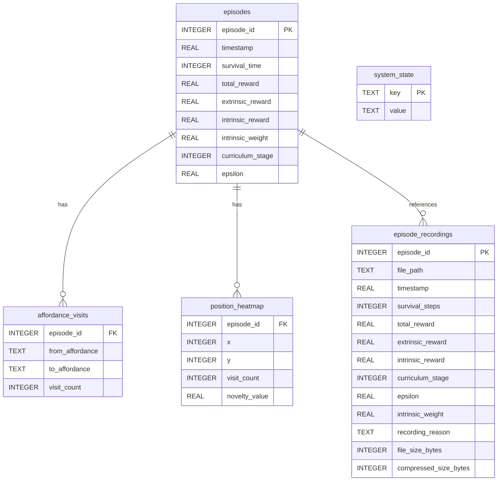
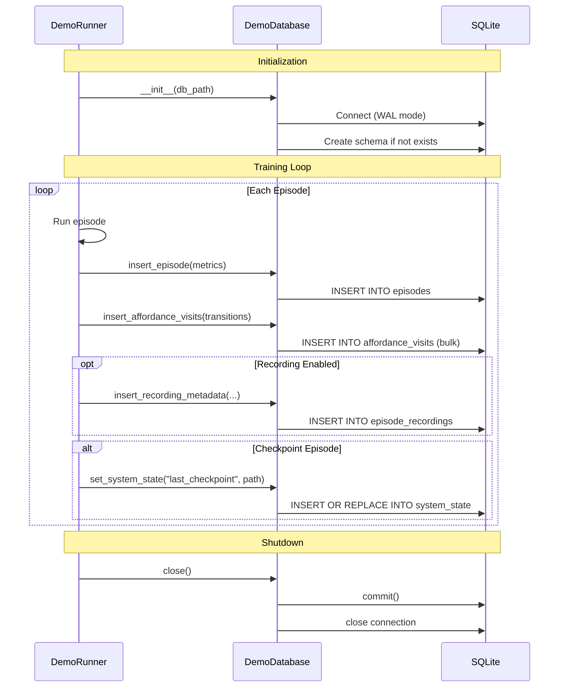
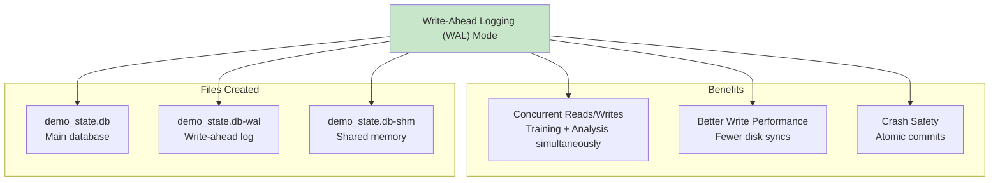

# Database Schema

## SQLite Database Structure



## Table Details

### episodes

Primary metrics table storing one row per episode.

| Column | Type | Description |
|--------|------|-------------|
| `episode_id` | INTEGER PRIMARY KEY | Episode number (0, 1, 2, ...) |
| `timestamp` | REAL | Unix timestamp (episode completion time) |
| `survival_time` | INTEGER | Steps survived (0 to max_steps_per_episode) |
| `total_reward` | REAL | Combined reward (extrinsic + weighted intrinsic) |
| `extrinsic_reward` | REAL | Pure environment reward (energy × health) |
| `intrinsic_reward` | REAL | Unweighted RND novelty reward |
| `intrinsic_weight` | REAL | Current intrinsic weight multiplier |
| `curriculum_stage` | INTEGER | Agent's curriculum stage (1-5) |
| `epsilon` | REAL | Current exploration rate (0.0-1.0) |

**Indexes**:
- `idx_episodes_timestamp` on `timestamp`

### affordance_visits

Affordance transition matrix (from → to).

| Column | Type | Description |
|--------|------|-------------|
| `episode_id` | INTEGER FK | References episodes(episode_id) |
| `from_affordance` | TEXT | Previous affordance visited |
| `to_affordance` | TEXT | Current affordance visited |
| `visit_count` | INTEGER | Number of transitions this episode |

**Indexes**:
- `idx_visits_episode` on `episode_id`

**Example Data**:
```sql
episode_id | from_affordance | to_affordance | visit_count
-----------+-----------------+---------------+-------------
500        | Bed             | Hospital      | 2
500        | Hospital        | Job           | 1
500        | Job             | Restaurant    | 3
```

### position_heatmap

Spatial visit density (Grid2D only).

| Column | Type | Description |
|--------|------|-------------|
| `episode_id` | INTEGER FK | References episodes(episode_id) |
| `x` | INTEGER | Grid x-coordinate |
| `y` | INTEGER | Grid y-coordinate |
| `visit_count` | INTEGER | Times visited this cell |
| `novelty_value` | REAL | RND novelty score (optional) |

**Indexes**:
- `idx_heatmap_episode` on `episode_id`

### episode_recordings

Metadata for recorded episodes (if recording enabled).

| Column | Type | Description |
|--------|------|-------------|
| `episode_id` | INTEGER PK | Episode number |
| `file_path` | TEXT | Path to .msgpack recording file |
| `timestamp` | REAL | Unix timestamp |
| `survival_steps` | INTEGER | Steps survived |
| `total_reward` | REAL | Combined reward |
| `extrinsic_reward` | REAL | Environment reward |
| `intrinsic_reward` | REAL | RND reward |
| `curriculum_stage` | INTEGER | Curriculum stage |
| `epsilon` | REAL | Exploration rate |
| `intrinsic_weight` | REAL | Intrinsic weight |
| `recording_reason` | TEXT | Why recorded (milestone/failure/etc) |
| `file_size_bytes` | INTEGER | Uncompressed size |
| `compressed_size_bytes` | INTEGER | Compressed size (if applicable) |

**Indexes**:
- `idx_recordings_stage` on `curriculum_stage`
- `idx_recordings_reason` on `recording_reason`
- `idx_recordings_reward` on `total_reward`

### system_state

Key-value store for system-wide state.

| Column | Type | Description |
|--------|------|-------------|
| `key` | TEXT PRIMARY KEY | State key |
| `value` | TEXT | State value (JSON or plain text) |

**Common Keys**:
- `training_status`: "running" / "completed"
- `start_time`: Unix timestamp
- `last_checkpoint`: Path to latest checkpoint
- `affordance_randomization_episode`: Episode when positions randomized
- `old_affordance_positions`: JSON of positions before randomization
- `new_affordance_positions`: JSON of positions after randomization

## Database Operations Flow



## Query Patterns

### Recent Performance

```sql
SELECT 
    episode_id,
    survival_time,
    total_reward,
    curriculum_stage,
    epsilon
FROM episodes
ORDER BY episode_id DESC
LIMIT 100;
```

### Curriculum Progression

```sql
SELECT 
    curriculum_stage,
    COUNT(*) as episode_count,
    AVG(survival_time) as avg_survival,
    AVG(total_reward) as avg_reward
FROM episodes
GROUP BY curriculum_stage
ORDER BY curriculum_stage;
```

### Affordance Transition Matrix

```sql
SELECT 
    from_affordance,
    to_affordance,
    SUM(visit_count) as total_transitions
FROM affordance_visits
WHERE episode_id >= 9000  -- Last 1000 episodes
GROUP BY from_affordance, to_affordance
ORDER BY total_transitions DESC;
```

### Heatmap Data

```sql
SELECT 
    x, y,
    SUM(visit_count) as total_visits
FROM position_heatmap
WHERE episode_id BETWEEN 9000 AND 10000
GROUP BY x, y;
```

## Database Size Estimates

| Episodes | Database Size | Notes |
|----------|---------------|-------|
| 1,000 | ~10 MB | Basic metrics only |
| 10,000 | ~100 MB | + affordance visits |
| 100,000 | ~1 GB | + position heatmap |
| 1,000,000 | ~10 GB | Long-term training |

**Growth Rate**: ~10 KB per episode (varies with affordance interactions)

## WAL Mode Benefits



## Data Retention Policy

Default: **Keep all data indefinitely**

Optional cleanup strategies:

1. **Rolling Window**: Keep last N episodes
```sql
DELETE FROM episodes WHERE episode_id < (SELECT MAX(episode_id) - 100000 FROM episodes);
```

2. **Aggregate Old Data**: Keep summaries
```sql
-- Move old episodes to summary table
INSERT INTO episodes_summary 
SELECT 
    (episode_id / 1000) * 1000 as episode_range,
    COUNT(*) as count,
    AVG(survival_time) as avg_survival
FROM episodes
WHERE episode_id < 900000
GROUP BY episode_range;

DELETE FROM episodes WHERE episode_id < 900000;
```

3. **Archive to Files**: Export and delete
```bash
# Export old data
sqlite3 demo_state.db ".mode csv" ".output episodes_archive.csv" "SELECT * FROM episodes WHERE episode_id < 900000"

# Delete from DB
sqlite3 demo_state.db "DELETE FROM episodes WHERE episode_id < 900000; VACUUM;"
```

## Database Initialization

```python
# demo/database.py
def _create_schema(self):
    self.conn.executescript("""
        PRAGMA journal_mode=WAL;
        
        CREATE TABLE IF NOT EXISTS episodes (
            episode_id INTEGER PRIMARY KEY,
            timestamp REAL NOT NULL,
            survival_time INTEGER NOT NULL,
            total_reward REAL NOT NULL,
            extrinsic_reward REAL NOT NULL,
            intrinsic_reward REAL NOT NULL,
            intrinsic_weight REAL NOT NULL,
            curriculum_stage INTEGER NOT NULL,
            epsilon REAL NOT NULL
        );
        CREATE INDEX IF NOT EXISTS idx_episodes_timestamp 
            ON episodes(timestamp);
        
        -- Additional tables...
    """)
```

## Thread Safety

- **WAL mode**: Enables concurrent readers + single writer
- **check_same_thread=False**: Allow multi-threaded access
- **Not safe for**: Multiple concurrent writers (serialization required)

Safe pattern:
```python
# Training thread (writer)
db.insert_episode(...)

# Analysis thread (reader)
results = db.query("SELECT * FROM episodes...")
```

Unsafe pattern:
```python
# Thread 1 (writer)
db.insert_episode(...)

# Thread 2 (writer) - CONFLICT!
db.insert_episode(...)  # May cause SQLite BUSY error
```
