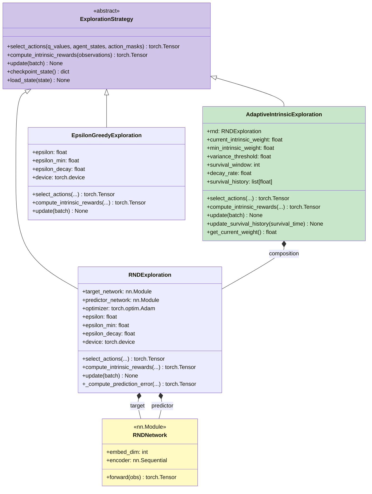

# Class Hierarchies

## Overview

This document details the class hierarchies for the major subsystems in Townlet, including:
- **Substrate Hierarchy**: Spatial abstraction layer
- **Curriculum Hierarchy**: Difficulty progression strategies
- **Exploration Hierarchy**: Action selection and intrinsic motivation
- **Network Hierarchy**: Neural network architectures
- **Replay Buffer Hierarchy**: Experience storage strategies

## 1. Substrate Hierarchy

### Abstract Base: SpatialSubstrate


### Substrate Feature Matrix

| Substrate | position_dim | position_dtype | action_space_size | Supports POMDP | Enumerable Positions |
|-----------|--------------|----------------|-------------------|----------------|----------------------|
| Grid2D | 2 | torch.long | 8 (6 + INTERACT + WAIT) | ✅ Yes (vision_range ≤ 2) | ✅ Yes |
| Grid3D | 3 | torch.long | 10 (8 + INTERACT + WAIT) | ✅ Yes (vision_range ≤ 2) | ✅ Yes |
| GridND(N) | N | torch.long | 2*N + 2 | ❌ No (N≥4, window too large) | ✅ Yes |
| Continuous | 1-3 | torch.float32 | 2*N + 2 | ❌ No (infinite positions) | ❌ No |
| ContinuousND(N) | N | torch.float32 | 2*N + 2 | ❌ No (infinite positions) | ❌ No |
| Aspatial | 0 | torch.long | 2 (INTERACT + WAIT) | ✅ Special case | ❌ No |

### Boundary Mode Implementations


### Distance Metric Implementations


## 2. Curriculum Hierarchy

### Abstract Base: CurriculumManager


### Adversarial Curriculum Stage Progression

```mermaid
stateDiagram-v2
    [*] --> Stage1
    Stage1 --> Stage2 : High survival + low variance
    Stage2 --> Stage3 : High survival + low variance
    Stage3 --> Stage4 : High survival + low variance
    Stage4 --> Stage5 : High survival + low variance
    Stage5 --> [*] : Graduated!

    state Stage1 {
        [*] --> Stage1Config
        state Stage1Config {
            active_meters: energy, hygiene
            depletion: 0.2x
            reward_mode: shaped
        }
    }

    state Stage2 {
        [*] --> Stage2Config
        state Stage2Config {
            active_meters: energy, hygiene, satiation
            depletion: 0.5x
            reward_mode: shaped
        }
    }

    state Stage3 {
        [*] --> Stage3Config
        state Stage3Config {
            active_meters: +money
            depletion: 0.8x
            reward_mode: shaped
        }
    }

    state Stage4 {
        [*] --> Stage4Config
        state Stage4Config {
            active_meters: all 6 meters
            depletion: 1.0x
            reward_mode: shaped
        }
    }

    state Stage5 {
        [*] --> Stage5Config
        state Stage5Config {
            active_meters: all 6 meters
            depletion: 1.0x
            reward_mode: SPARSE
        }
    }
```

## 3. Exploration Hierarchy

### Abstract Base: ExplorationStrategy



### Exploration Strategy Comparison

| Strategy | Intrinsic Rewards | Epsilon Decay | Network Training | Use Case |
|----------|-------------------|---------------|------------------|----------|
| **EpsilonGreedy** | ❌ None (returns zeros) | ✅ Exponential decay | ❌ No networks | Simple exploration |
| **RND** | ✅ Prediction error (novelty) | ✅ Exponential decay | ✅ Predictor network | Novelty-driven exploration |
| **AdaptiveIntrinsic** | ✅ Weighted RND rewards | ✅ Exponential decay | ✅ RND networks | Adaptive novelty with annealing |

### RND (Random Network Distillation) Architecture

```mermaid
graph TB
    obs[Observations<br/>[batch, obs_dim]]
    
    target_net[Target Network<br/>Fixed random weights]
    predictor_net[Predictor Network<br/>Trained weights]
    
    target_embed[Target Embeddings<br/>[batch, embed_dim]]
    predictor_embed[Predictor Embeddings<br/>[batch, embed_dim]]
    
    mse[MSE Loss<br/>Prediction Error]
    intrinsic[Intrinsic Rewards<br/>[batch]]
    
    obs --> target_net
    obs --> predictor_net
    
    target_net --> target_embed
    predictor_net --> predictor_embed
    
    target_embed --> mse
    predictor_embed --> mse
    
    mse --> intrinsic
    
    style target_net fill:#ffccbc
    style predictor_net fill:#c8e6c9
    style intrinsic fill:#e1f5fe
```

## 4. Network Hierarchy

### PyTorch nn.Module Subclasses


### SimpleQNetwork Architecture

```mermaid
graph TB
    input[Input<br/>[batch, obs_dim]]
    
    fc1[Linear: obs_dim → 256]
    ln1[LayerNorm: 256]
    relu1[ReLU]
    
    fc2[Linear: 256 → 128]
    ln2[LayerNorm: 128]
    relu2[ReLU]
    
    fc3[Linear: 128 → action_dim]
    
    output[Q-Values<br/>[batch, action_dim]]
    
    input --> fc1
    fc1 --> ln1
    ln1 --> relu1
    relu1 --> fc2
    fc2 --> ln2
    ln2 --> relu2
    relu2 --> fc3
    fc3 --> output
    
    style input fill:#d1c4e9
    style output fill:#c8e6c9
```

### RecurrentSpatialQNetwork Architecture

```mermaid
graph TB
    subgraph "Input Parsing"
        obs[Observations<br/>[batch, seq_len, obs_dim]]
        parse[Parse Components]
        
        local_window[Local Window<br/>[batch, seq, window²]]
        position[Position<br/>[batch, seq, 2]]
        meters[Meters<br/>[batch, seq, 8]]
        affordances[Affordances<br/>[batch, seq, 15]]
        temporal[Temporal<br/>[batch, seq, 4]]
    end
    
    subgraph "Encoders"
        vision_cnn[Vision Encoder<br/>CNN: window² → 128]
        position_mlp[Position Encoder<br/>MLP: 2 → 32]
        meter_mlp[Meter Encoder<br/>MLP: 8 → 32]
        affordance_mlp[Affordance Encoder<br/>MLP: 15 → 32]
    end
    
    subgraph "Recurrent Layer"
        concat[Concatenate<br/>128+32+32+32 = 224]
        lstm[LSTM<br/>224 → 256 hidden]
        hidden_state["(h, c)<br/>[1, batch, 256]"]
    end
    
    subgraph "Q-Head"
        fc1[Linear: 256 → 128]
        relu[ReLU]
        fc2[Linear: 128 → action_dim]
        q_values[Q-Values<br/>[batch, seq, action_dim]]
    end
    
    obs --> parse
    parse --> local_window
    parse --> position
    parse --> meters
    parse --> affordances
    parse --> temporal
    
    local_window --> vision_cnn
    position --> position_mlp
    meters --> meter_mlp
    affordances --> affordance_mlp
    
    vision_cnn --> concat
    position_mlp --> concat
    meter_mlp --> concat
    affordance_mlp --> concat
    
    concat --> lstm
    lstm --> hidden_state
    
    hidden_state --> fc1
    fc1 --> relu
    relu --> fc2
    fc2 --> q_values
    
    style vision_cnn fill:#c8e6c9
    style lstm fill:#e1f5fe
    style q_values fill:#fff9c4
```

### Network Architecture Comparison

| Network | Architecture | Params | Observability | Use Case |
|---------|-------------|--------|---------------|----------|
| **SimpleQNetwork** | 3-layer MLP | ~26K | Full observability | L0, L0.5, L1, L3 |
| **RecurrentSpatialQNetwork** | CNN + LSTM + MLP | ~650K | Partial observability (POMDP) | L2 |

**Key Insight**: SimpleQNetwork uses fixed 29→256→128→8 architecture for all Grid2D configs, enabling checkpoint transfer across curriculum levels!

## 5. Replay Buffer Hierarchy

### Buffer Type Selection

```mermaid
graph TB
    buffer_type[Replay Buffer Type]
    
    standard[StandardReplayBuffer<br/>Feedforward networks<br/>IID transitions]
    sequential[SequentialReplayBuffer<br/>LSTM networks<br/>Temporal sequences]
    
    buffer_type --> standard
    buffer_type --> sequential
    
    subgraph "StandardReplayBuffer"
        store_standard[Store: (s, a, r, s', done)]
        sample_standard[Sample: Random batch<br/>[batch_size]]
        iid[IID assumption<br/>No temporal order]
    end
    
    subgraph "SequentialReplayBuffer"
        store_sequential[Store: Episodes as sequences]
        sample_sequential[Sample: Random subsequences<br/>[batch_size, seq_len]]
        temporal[Preserve temporal order<br/>LSTM hidden state]
    end
    
    standard --> store_standard
    standard --> sample_standard
    standard --> iid
    
    sequential --> store_sequential
    sequential --> sample_sequential
    sequential --> temporal
    
    style buffer_type fill:#d1c4e9
    style standard fill:#c8e6c9
    style sequential fill:#e1f5fe
```

### Replay Buffer Interfaces


## 6. Population Architecture

### VectorizedPopulation Composition


## 7. Configuration DTOs

### Training Configuration Hierarchy


## Summary

### Class Hierarchy Patterns

1. **Strategy Pattern**: Curriculum, Exploration, Replay Buffer
2. **Composition Over Inheritance**: AdaptiveIntrinsicExploration contains RNDExploration
3. **Abstract Base Classes**: Define interfaces for hot path (GPU) methods
4. **Pydantic DTOs**: Enforce no-defaults principle (PDR-002) for configuration
5. **PyTorch nn.Module**: All neural networks inherit from nn.Module

### Polymorphism Usage

| Abstraction | Runtime Selection | Selection Criteria |
|-------------|-------------------|-------------------|
| **SpatialSubstrate** | SubstrateFactory | substrate.yaml type field |
| **CurriculumManager** | Training config | training.yaml curriculum.type |
| **ExplorationStrategy** | Training config | training.yaml exploration.type |
| **QNetwork** | POMDP flag | environment.yaml pomdp_enabled |
| **ReplayBuffer** | Network type | "simple" → Standard, "recurrent" → Sequential |

### Inheritance vs Composition

| Pattern | Use Case | Example |
|---------|----------|---------|
| **Inheritance** | Interface polymorphism | Grid2D inherits SpatialSubstrate |
| **Composition** | Behavior delegation | AdaptiveIntrinsic contains RND |
| **Aggregation** | Loose coupling | Population holds Exploration reference |
