# Observation Construction Pipeline

## Overview

This document details how observations flow from YAML configuration through compilation into runtime tensors that neural networks consume. The pipeline has three phases:

1. **Compile-Time**: VFS schema validation → observation spec generation
2. **Initialization-Time**: Registry setup → substrate encoding configuration
3. **Step-Time**: State update → VFS registry → observation tensor construction

## Pipeline Stages

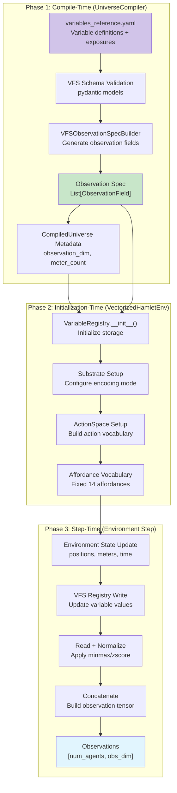

## Phase 1: Compile-Time (YAML → Observation Spec)

### VFS Variable Definition

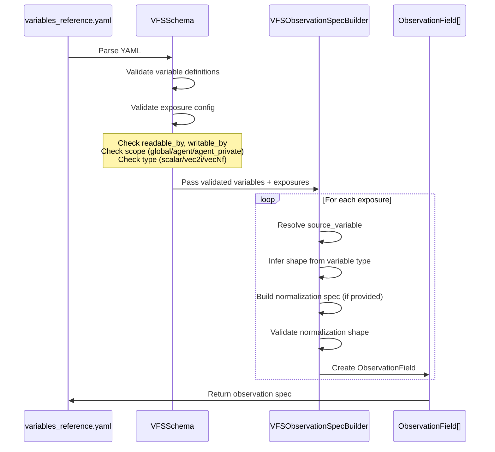

### Variable Type → Observation Shape Inference

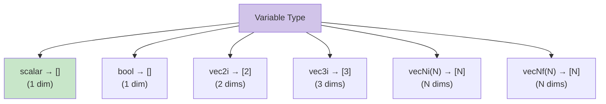

### ObservationField Schema

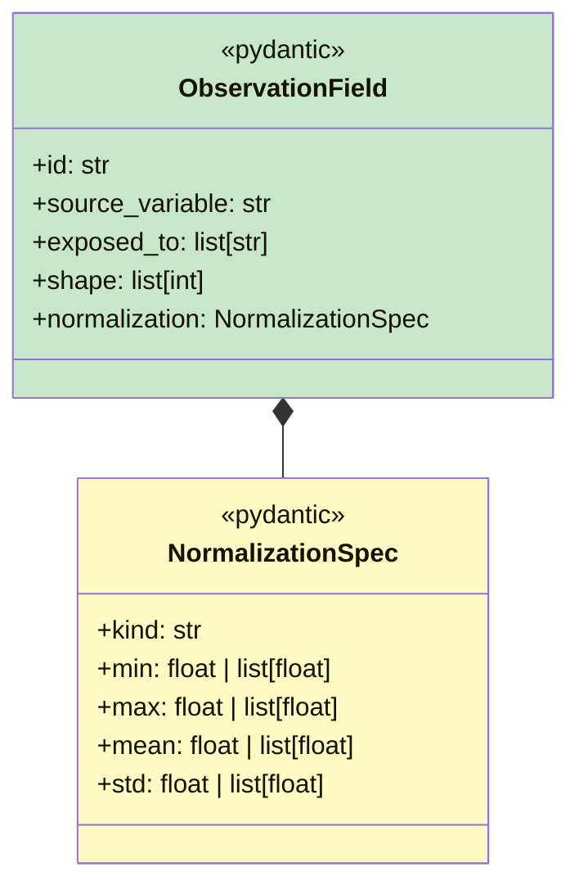

## Phase 2: Initialization-Time (Registry Setup)

### VFS Registry Initialization

```mermaid
flowchart TD
    start[VectorizedHamletEnv.__init__]
    
    load_spec[Load observation spec<br/>from CompiledUniverse]
    compute_dim[Compute observation_dim<br/>sum(field.shape)]
    validate_dim{Matches<br/>metadata?}
    error[ERROR: Dimension mismatch]
    
    init_registry[Initialize VariableRegistry<br/>Create storage for each variable]
    setup_substrate[Setup substrate encoding<br/>Configure observation_encoding mode]
    build_action_space[Build ActionSpace<br/>Substrate + custom actions]
    build_affordance_vocab[Build affordance vocabulary<br/>Fixed 14 types + "none"]
    
    complete[Initialization Complete<br/>Ready for episodes]
    
    start --> load_spec
    load_spec --> compute_dim
    compute_dim --> validate_dim
    validate_dim -->|No| error
    validate_dim -->|Yes| init_registry
    
    init_registry --> setup_substrate
    setup_substrate --> build_action_space
    build_action_space --> build_affordance_vocab
    build_affordance_vocab --> complete
    
    style error fill:#ffccbc
    style complete fill:#c8e6c9
```

### Substrate Encoding Mode Selection

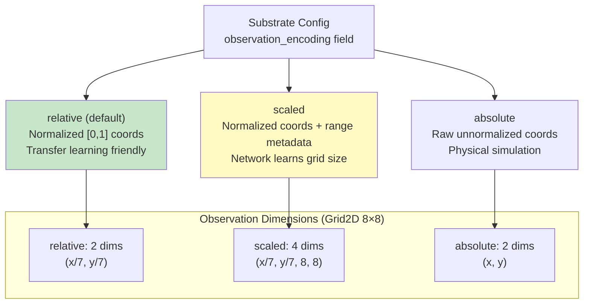

## Phase 3: Step-Time (Observation Construction)

### Main Observation Construction Flow

```mermaid
flowchart TD
    step_start[Environment Step Complete<br/>positions, meters, time updated]
    
    subgraph "Update VFS Registry"
        write_grid[Write: grid_encoding or local_window]
        write_position[Write: position]
        write_meters[Write: energy, hygiene, etc.]
        write_affordance[Write: affordance_at_position]
        write_temporal[Write: time_sin, time_cos, etc.]
    end
    
    subgraph "Build Observation Tensor"
        init_list[observations = []]
        
        loop_start[For each ObservationField]
        read_var[Read variable from registry]
        check_perm{Readable by<br/>agent?}
        error_perm[ERROR: Permission denied]
        
        apply_norm{Has<br/>normalization?}
        minmax[Apply minmax normalization]
        zscore[Apply zscore normalization]
        
        ensure_2d[Ensure [num_agents, *] shape]
        append[Append to observations list]
        loop_end[Next field]
        
        concat[torch.cat(observations, dim=1)]
        output[Return observations<br/>[num_agents, obs_dim]]
    end
    
    step_start --> write_grid
    write_grid --> write_position
    write_position --> write_meters
    write_meters --> write_affordance
    write_affordance --> write_temporal
    
    write_temporal --> init_list
    init_list --> loop_start
    loop_start --> read_var
    read_var --> check_perm
    check_perm -->|No| error_perm
    check_perm -->|Yes| apply_norm
    
    apply_norm -->|minmax| minmax
    apply_norm -->|zscore| zscore
    apply_norm -->|None| ensure_2d
    
    minmax --> ensure_2d
    zscore --> ensure_2d
    ensure_2d --> append
    append --> loop_end
    loop_end -->|More fields| loop_start
    loop_end -->|Done| concat
    concat --> output
    
    style error_perm fill:#ffccbc
    style output fill:#c8e6c9
```

### Spatial Encoding: Full vs Partial Observability

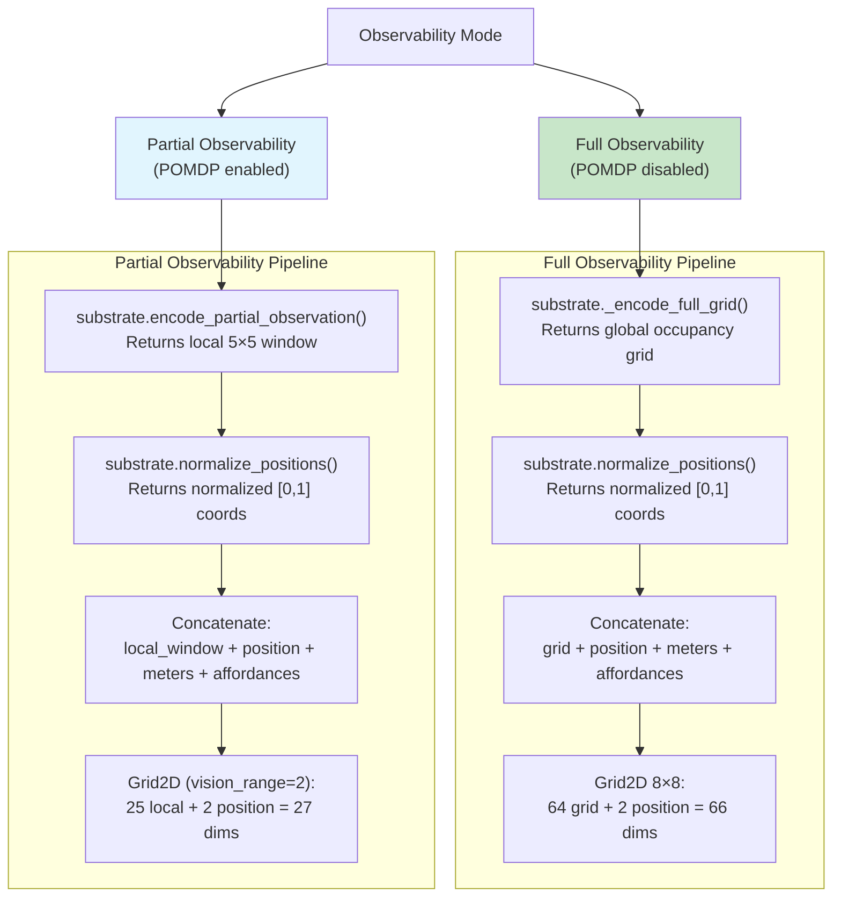

### Grid Encoding (Full Observability)

```mermaid
graph TB
    input[Agent Positions<br/>[num_agents, 2]]
    affordances[Affordance Positions<br/>{name: [2]}]
    
    init_grid["Initialize empty grid<br/>[width × height]"]
    mark_affordances["Mark affordances<br/>grid[aff_y * width + aff_x] = 1.0"]
    broadcast["Broadcast to all agents<br/>[num_agents, width × height]"]
    mark_agents["Mark agent positions<br/>grid[agent_y * width + agent_x] += 1.0"]
    clamp["Clamp to [0, 2]<br/>0=empty, 1=affordance, 2=agent"]
    
    output["Grid Encoding<br/>[num_agents, width × height]"]
    
    input --> broadcast
    affordances --> init_grid
    init_grid --> mark_affordances
    mark_affordances --> broadcast
    broadcast --> mark_agents
    mark_agents --> clamp
    clamp --> output
    
    style init_grid fill:#d1c4e9
    style output fill:#c8e6c9
```

### Local Window Encoding (Partial Observability)

```mermaid
graph TB
    input[Agent Positions<br/>[num_agents, 2]]
    affordances[Affordance Positions<br/>{name: [2]}]
    vision_range[Vision Range<br/>e.g., 2 for 5×5 window]
    
    init_windows["Initialize local grids<br/>[num_agents, window_size, window_size]"]
    
    loop_start["For each agent"]
    extract_window["Extract window<br/>[agent_x-range : agent_x+range+1]<br/>[agent_y-range : agent_y+range+1]"]
    mark_local_affs["Mark affordances in window<br/>If (aff_x, aff_y) in window"]
    loop_end["Next agent"]
    
    flatten["Flatten windows<br/>[num_agents, window_size²]"]
    output["Local Window Encoding<br/>[num_agents, 25] for 5×5"]
    
    input --> init_windows
    affordances --> loop_start
    vision_range --> loop_start
    init_windows --> loop_start
    loop_start --> extract_window
    extract_window --> mark_local_affs
    mark_local_affs --> loop_end
    loop_end -->|More agents| loop_start
    loop_end -->|Done| flatten
    flatten --> output
    
    style extract_window fill:#d1c4e9
    style output fill:#e1f5fe
```

### Meter Encoding

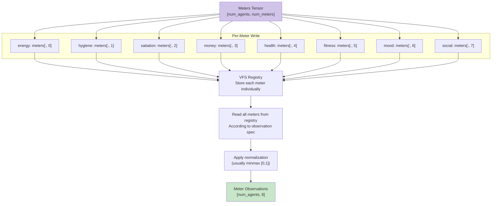

### Affordance Encoding (One-Hot)

```mermaid
graph TB
    positions[Agent Positions<br/>[num_agents, 2]]
    affordances[Deployed Affordances<br/>{name: [2]}]
    vocab["Affordance Vocabulary<br/>14 types from YAML"]
    
    init["Initialize encoding<br/>[num_agents, num_types + 1]<br/>Last dim is 'none'"]
    default["Set all to 'none'<br/>encoding[:, -1] = 1.0"]
    
    loop_start["For each affordance in vocabulary"]
    check_deployed{Is deployed<br/>on grid?}
    check_agents["Check which agents on affordance<br/>substrate.is_on_position()"]
    mark["Mark agents<br/>encoding[on_aff, idx] = 1.0<br/>encoding[on_aff, -1] = 0.0"]
    loop_end["Next affordance"]
    
    output["Affordance Encoding<br/>[num_agents, 15]<br/>14 types + 1 'none'"]
    
    positions --> init
    affordances --> loop_start
    vocab --> loop_start
    
    init --> default
    default --> loop_start
    loop_start --> check_deployed
    check_deployed -->|Yes| check_agents
    check_deployed -->|No| loop_end
    check_agents --> mark
    mark --> loop_end
    loop_end -->|More affordances| loop_start
    loop_end -->|Done| output
    
    style vocab fill:#d1c4e9
    style output fill:#c8e6c9
```

**Key Insight**: Encoding uses FULL vocabulary (14 types) even if not all are deployed. This ensures observation dimensions stay constant across curriculum levels, enabling checkpoint transfer.

### Temporal Encoding

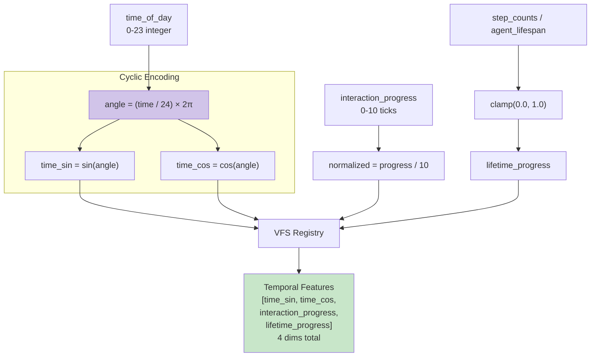

**Rationale**: Sin/cos encoding preserves cyclical nature of time (23:00 is close to 00:00).

### Normalization Application

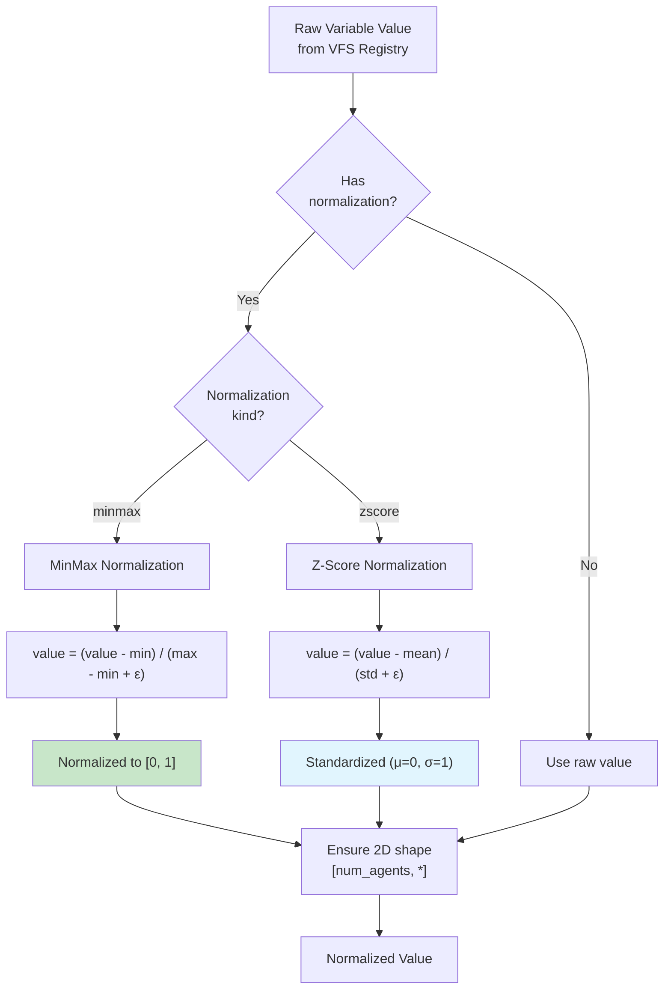

## Observation Dimension Breakdown

### Level 1: Full Observability (Grid2D 8×8)

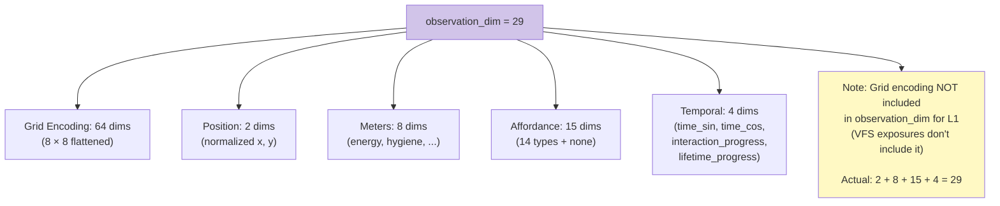

### Level 2: Partial Observability (Grid2D, vision_range=2)

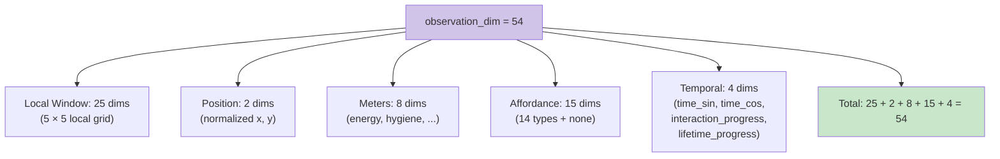

## VFS Access Control During Observation Construction

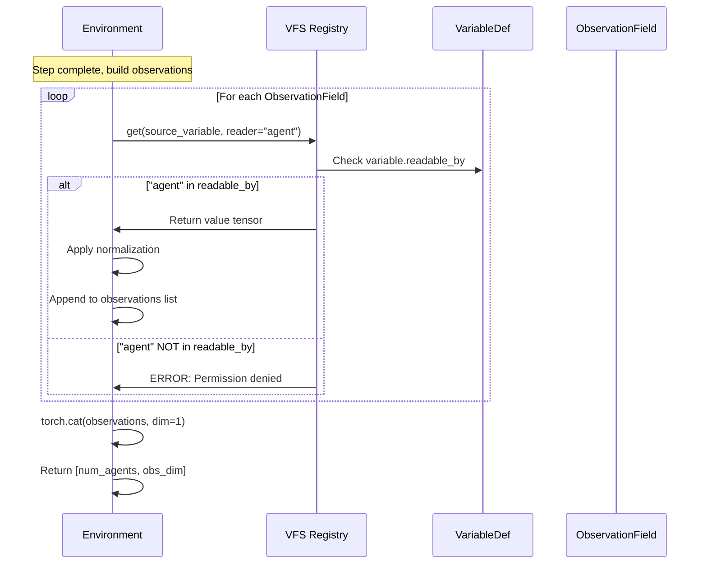

## Summary

### Observation Construction Path

```
YAML Config → VFS Schema Validation → ObservationField Spec → VariableRegistry → 
Environment State Update → VFS Write → VFS Read → Normalization → Concatenation → 
Observation Tensor [num_agents, obs_dim]
```

### Key Design Principles

1. **Fixed Observation Vocabulary**: All levels observe same 14 affordances (for transfer learning)
2. **VFS-Driven Construction**: Observations built declaratively from VFS registry
3. **Access Control Enforcement**: Only variables marked `readable_by: [agent]` are exposed
4. **Normalization Flexibility**: MinMax or Z-score normalization configurable per field
5. **Substrate Abstraction**: Encoding mode (relative/scaled/absolute) controlled by substrate config
6. **POMDP Support**: Local window encoding for partial observability

### Observation Dimensions by Level

| Level | Grid/Window | Position | Meters | Affordance | Temporal | **Total** |
|-------|-------------|----------|--------|------------|----------|-----------|
| L0 (3×3) | 9 | 2 | 8 | 15 | 4 | **38** |
| L0.5 (7×7) | 49 | 2 | 8 | 15 | 4 | **78** |
| L1 (8×8, full) | 64 | 2 | 8 | 15 | 4 | **93** |
| L2 (8×8, POMDP) | 25 (local) | 2 | 8 | 15 | 4 | **54** |
| L3 (8×8, temporal) | 64 | 2 | 8 | 15 | 4 | **93** |

**Note**: Actual observation dimensions depend on VFS exposure configuration. The table above shows common configurations.

### Performance Considerations

- **Hot Path**: `_get_observations()` called every step for all agents
- **GPU Tensors**: All operations on GPU (no CPU transfers)
- **Batched Operations**: Single tensor operation for all agents
- **No Python Loops**: Vectorized affordance encoding using `is_on_position()`
- **Registry Overhead**: Acceptable (write once, read once per observation field)
