# Action Masking Pipeline

## Overview

Action masking prevents agents from selecting invalid actions, improving sample efficiency and training stability. The masking pipeline has multiple stages:

1. **Base Mask**: Disabled actions from configuration
2. **Boundary Constraints**: Spatial substrate edge detection
3. **Operating Hours**: Temporal affordance availability
4. **Affordance Availability**: INTERACT action validity
5. **Dead Agent Masking**: Disable all actions for dead agents

## Main Pipeline Flow

```mermaid
flowchart TD
    start[get_action_masks called<br/>Every step before action selection]
    
    base_mask["Base Mask<br/>ActionSpace.get_base_action_mask()<br/>All actions = True (default enabled)"]
    
    subgraph "Boundary Constraints (Spatial Only)"
        check_spatial{position_dim<br/>>= 2?}
        skip_spatial[Skip boundary checks<br/>Aspatial substrates]
        
        check_edges["Check agent positions<br/>at_top, at_bottom, at_left, at_right"]
        mask_movements["Mask invalid movements<br/>UP at top → False<br/>DOWN at bottom → False<br/>LEFT at left → False<br/>RIGHT at right → False"]
        
        check_3d{position_dim<br/>== 3?}
        check_z_edges["Check Z-axis positions<br/>at_floor, at_ceiling"]
        mask_z["Mask Z movements<br/>UP_Z at ceiling → False<br/>DOWN_Z at floor → False"]
    end
    
    subgraph "Operating Hours (Temporal Mechanics)"
        check_temporal{enable_temporal<br/>mechanics?}
        skip_temporal[Skip operating hours]
        
        check_all_affordances["For each affordance"]
        check_open{is_open(affordance,<br/>time_of_day)?}
        mask_closed["Mask closed affordances<br/>action_masks[:, aff_idx] = False"]
    end
    
    subgraph "INTERACT Action Validity"
        init_interact_valid["on_valid_affordance = all False"]
        loop_affordances["For each deployed affordance"]
        check_on_affordance["is_on_position(agent_pos, aff_pos)"]
        mark_valid["on_valid_affordance |= on_this_aff"]
        
        apply_interact_mask["action_masks[:, INTERACT_idx] &= on_valid_affordance"]
    end
    
    subgraph "Dead Agent Masking"
        check_dead["dead = (health <= 0) | (energy <= 0)"]
        mask_all_dead["action_masks[dead] = all False"]
    end
    
    output["Return action_masks<br/>[num_agents, action_dim] bool"]
    
    start --> base_mask
    base_mask --> check_spatial
    
    check_spatial -->|Yes| check_edges
    check_spatial -->|No| skip_spatial
    
    check_edges --> mask_movements
    mask_movements --> check_3d
    
    check_3d -->|Yes| check_z_edges
    check_3d -->|No| check_temporal
    
    check_z_edges --> mask_z
    mask_z --> check_temporal
    skip_spatial --> check_temporal
    
    check_temporal -->|Yes| check_all_affordances
    check_temporal -->|No| skip_temporal
    
    check_all_affordances --> check_open
    check_open -->|Open| init_interact_valid
    check_open -->|Closed| mask_closed
    mask_closed --> init_interact_valid
    
    skip_temporal --> init_interact_valid
    
    init_interact_valid --> loop_affordances
    loop_affordances --> check_on_affordance
    check_on_affordance --> mark_valid
    mark_valid -->|More affordances| loop_affordances
    mark_valid -->|Done| apply_interact_mask
    
    apply_interact_mask --> check_dead
    check_dead --> mask_all_dead
    mask_all_dead --> output
    
    style base_mask fill:#d1c4e9
    style mask_all_dead fill:#ffccbc
    style output fill:#c8e6c9
```

## 1. Base Mask (ActionSpace Configuration)

### Base Mask Initialization


### ActionSpace Structure


## 2. Boundary Constraints (Spatial Substrates)

### Grid2D Boundary Masking


### Example: Agent at Grid Edge


### Grid3D Z-Axis Masking


### Aspatial Substrates (No Boundary Masking)


## 3. Operating Hours (Temporal Mechanics)

### Affordance Operating Hours Check


### Operating Hours Examples


### Temporal Masking Timeline

```mermaid
gantt
    title Operating Hours (0-23) for Various Affordances
    dateFormat HH
    axisFormat %H
    
    section Hospital
    Open 24/7 :active, hospital, 00, 24h
    
    section Job
    Closed :done, job_closed1, 00, 9h
    Open :active, job_open, 09, 8h
    Closed :done, job_closed2, 17, 7h
    
    section Restaurant
    Closed :done, rest_closed1, 00, 11h
    Open :active, rest_open, 11, 12h
    Closed :done, rest_closed2, 23, 1h
    
    section Bar
    Closed :done, bar_closed, 00, 18h
    Open :active, bar_open, 18, 6h
    
    section Gym
    Closed :done, gym_closed1, 00, 6h
    Open :active, gym_open, 06, 16h
    Closed :done, gym_closed2, 22, 2h
```



## 4. INTERACT Action Validity

### INTERACT Masking Logic

```mermaid
flowchart TD
    start[Check INTERACT action validity]
    
    init["on_valid_affordance = all False<br/>[num_agents] bool tensor"]
    
    loop_start["For each deployed affordance"]
    
    check_temporal{enable_temporal<br/>mechanics?}
    check_open{is_affordance_open<br/>(time_of_day)?}
    skip_closed["Skip this affordance<br/>(already masked in step 3)"]
    
    check_position["is_on_position(agent_pos, aff_pos)<br/>Returns [num_agents] bool"]
    
    update_valid["on_valid_affordance |= on_this_affordance<br/>Accumulate agents on any open affordance"]
    
    loop_end["Next affordance"]
    
    apply_mask["action_masks[:, INTERACT_idx] &= on_valid_affordance<br/>INTERACT only valid if on open affordance"]
    
    output["INTERACT mask updated"]
    
    start --> init
    init --> loop_start
    
    loop_start --> check_temporal
    check_temporal -->|Yes| check_open
    check_temporal -->|No| check_position
    
    check_open -->|Open| check_position
    check_open -->|Closed| skip_closed
    
    check_position --> update_valid
    skip_closed --> loop_end
    
    update_valid --> loop_end
    loop_end -->|More affordances| loop_start
    loop_end -->|Done| apply_mask
    
    apply_mask --> output
    
    style init fill:#d1c4e9
    style apply_mask fill:#c8e6c9
```

### Affordance Position Check


## 5. Dead Agent Masking

### Dead Agent Detection


### Death Condition Examples


## Action Mask Tensor Structure

### Grid2D Action Space (8 actions)


### Aspatial Action Space (2 actions)


## Integration with Action Selection

### Masked Action Selection Flow


### Masking During Epsilon-Greedy


## Summary

### Masking Priority Order

```
1. Base Mask (configuration-disabled actions)
2. Boundary Constraints (spatial edge detection)
3. Operating Hours (temporal affordance availability)
4. INTERACT Validity (affordance position check)
5. Dead Agent Masking (health <= 0 OR energy <= 0) [OVERRIDES ALL]
```

### Masking by Substrate Type

| Substrate | Boundary Masking | INTERACT Masking | Dead Agent Masking |
|-----------|------------------|------------------|-------------------|
| **Grid2D** | ✅ Edge detection (UP/DOWN/LEFT/RIGHT) | ✅ Exact position match | ✅ Always applied |
| **Grid3D** | ✅ Edge + Z-axis (UP_Z/DOWN_Z) | ✅ Exact position match | ✅ Always applied |
| **GridND** | ✅ Per-dimension edge detection | ✅ Exact position match | ✅ Always applied |
| **Continuous** | ❌ No boundaries | ✅ Proximity threshold | ✅ Always applied |
| **ContinuousND** | ❌ No boundaries | ✅ Proximity threshold | ✅ Always applied |
| **Aspatial** | ❌ No position concept | ✅ Always True (agents "everywhere") | ✅ Always applied |

### Performance Considerations

- **Hot Path**: `get_action_masks()` called every step before action selection
- **GPU Tensors**: All operations vectorized (no Python loops over agents)
- **Boolean Masking**: Efficient tensor indexing with boolean masks
- **Cached Indices**: Action indices (INTERACT, WAIT, UP_Z, DOWN_Z) cached at initialization

### Key Design Principles

1. **Safety First**: Invalid actions never selected (prevents crashes, illegal moves)
2. **Sample Efficiency**: Reduces exploration space, speeds learning
3. **Pedagogical Value**: Students see why agents avoid edges, respect hours
4. **Vectorized**: Single tensor operation for all agents
5. **Substrate-Agnostic**: Masking logic adapts to substrate type (Grid2D, Aspatial, etc.)
6. **Dead Agent Override**: Dead agents can't act (final safety check)
