# Reward Computation

## Overview

Townlet uses a **hybrid reward structure** combining:

1. **Extrinsic Rewards**: Interoception-aware survival (health × energy)
2. **Intrinsic Rewards**: RND novelty-seeking (optional)
3. **Weighted Combination**: Adaptive annealing based on performance

This creates a natural progression from exploration (high intrinsic weight) to exploitation (low intrinsic weight) as agents master the environment.

## Main Reward Pipeline

```mermaid
flowchart TD
    start[Environment Step Complete]
    
    subgraph "Extrinsic Reward Computation"
        meters["Meters<br/>[num_agents, num_meters]"]
        extract_health["health = meters[:, health_idx]"]
        extract_energy["energy = meters[:, energy_idx]"]
        clamp["Clamp to [0, 1]"]
        multiply["extrinsic = health × energy"]
        check_dead{Dead?<br/>(dones == True)}
        zero_reward["extrinsic = 0.0"]
    end
    
    subgraph "Intrinsic Reward Computation"
        check_exploration{Has intrinsic<br/>exploration?}
        skip_intrinsic["intrinsic = 0.0"]
        
        observations["Observations<br/>[num_agents, obs_dim]"]
        rnd_forward["RND Target/Predictor<br/>Forward pass"]
        prediction_error["MSE(target, predictor)<br/>Novelty signal"]
        intrinsic_reward["intrinsic = prediction_error"]
    end
    
    subgraph "Weight Annealing (Adaptive)"
        check_adaptive{Is Adaptive<br/>Intrinsic?}
        static_weight["intrinsic_weight = 1.0"]
        
        survival_variance["Compute survival variance<br/>over last 100 episodes"]
        check_variance{variance <<br/>threshold?}
        decay_weight["intrinsic_weight *= 0.99"]
        keep_weight["Keep current weight"]
    end
    
    subgraph "Final Reward Combination"
        combine["total = extrinsic + intrinsic × weight"]
        output["Total Rewards<br/>[num_agents]"]
    end
    
    start --> meters
    meters --> extract_health
    meters --> extract_energy
    extract_health --> clamp
    extract_energy --> clamp
    clamp --> multiply
    multiply --> check_dead
    check_dead -->|Yes| zero_reward
    check_dead -->|No| combine
    zero_reward --> combine
    
    start --> check_exploration
    check_exploration -->|No| skip_intrinsic
    check_exploration -->|Yes| observations
    observations --> rnd_forward
    rnd_forward --> prediction_error
    prediction_error --> intrinsic_reward
    skip_intrinsic --> combine
    intrinsic_reward --> combine
    
    check_exploration --> check_adaptive
    check_adaptive -->|No| static_weight
    check_adaptive -->|Yes| survival_variance
    survival_variance --> check_variance
    check_variance -->|Yes| decay_weight
    check_variance -->|No| keep_weight
    decay_weight --> combine
    keep_weight --> combine
    static_weight --> combine
    
    combine --> output
    
    style multiply fill:#c8e6c9
    style prediction_error fill:#e1f5fe
    style combine fill:#fff9c4
```

## 1. Extrinsic Reward: Interoception-Aware Survival

### Reward Formula

```
extrinsic_reward = {
    health × energy   if alive (dones == False)
    0.0               if dead (dones == True)
}
```

Both `health` and `energy` are normalized to [0, 1].

### Interoception-Aware Design Rationale

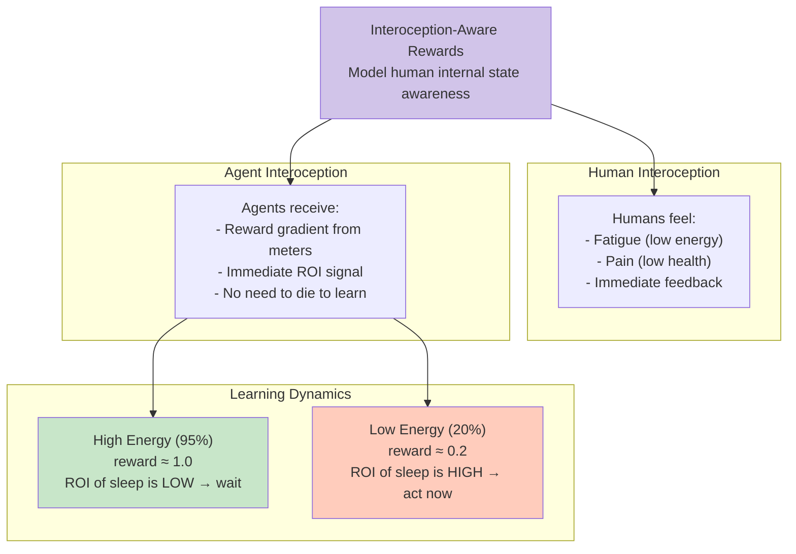

### Reward Computation Flow

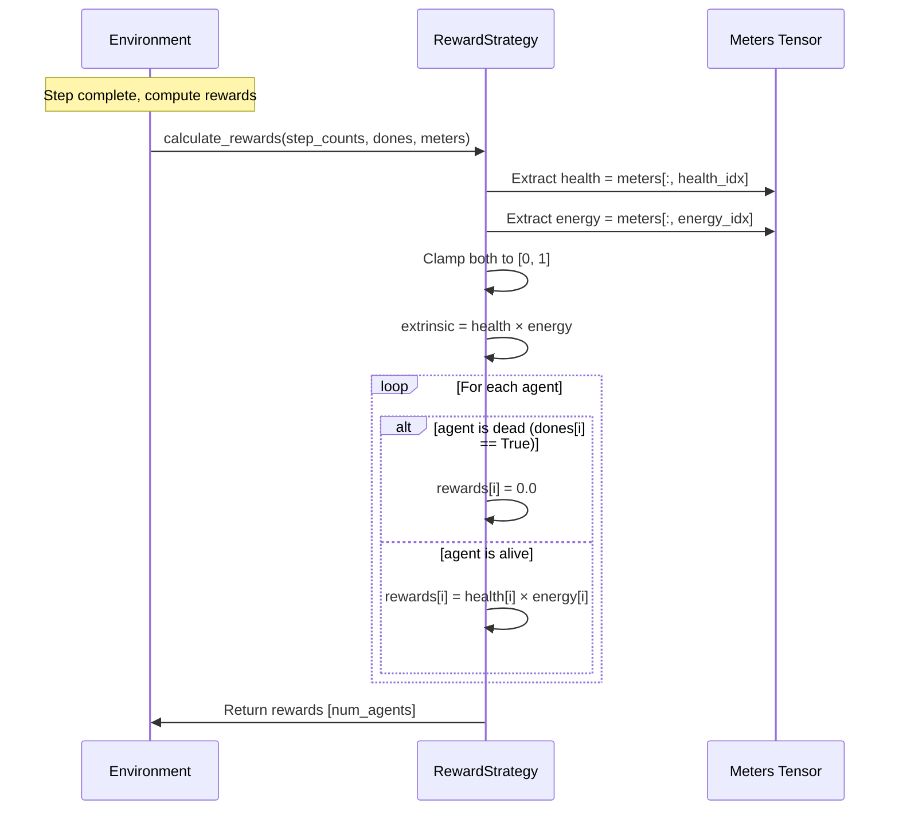

### Example Reward Calculations

```mermaid
graph TB
    subgraph "Agent 0: Healthy"
        agent0_state["energy=1.0, health=1.0<br/>alive=True"]
        agent0_calc["reward = 1.0 × 1.0 = 1.0"]
        agent0_note["Perfect state<br/>Maximum reward"]
    end
    
    subgraph "Agent 1: Low Energy"
        agent1_state["energy=0.2, health=0.9<br/>alive=True"]
        agent1_calc["reward = 0.2 × 0.9 = 0.18"]
        agent1_note["Low reward gradient<br/>Strong signal to rest"]
    end
    
    subgraph "Agent 2: Balanced"
        agent2_state["energy=0.7, health=0.8<br/>alive=True"]
        agent2_calc["reward = 0.7 × 0.8 = 0.56"]
        agent2_note["Medium reward<br/>Stable state"]
    end
    
    subgraph "Agent 3: Dead"
        agent3_state["energy=0.0, health=0.5<br/>alive=False"]
        agent3_calc["reward = 0.0"]
        agent3_note["Death overrides<br/>No reward"]
    end
    
    agent0_state --> agent0_calc
    agent0_calc --> agent0_note
    
    agent1_state --> agent1_calc
    agent1_calc --> agent1_note
    
    agent2_state --> agent2_calc
    agent2_calc --> agent2_note
    
    agent3_state --> agent3_calc
    agent3_calc --> agent3_note
    
    style agent0_note fill:#c8e6c9
    style agent1_note fill:#ffccbc
    style agent3_note fill:#ffccbc
```

### Reward Gradient Visualization

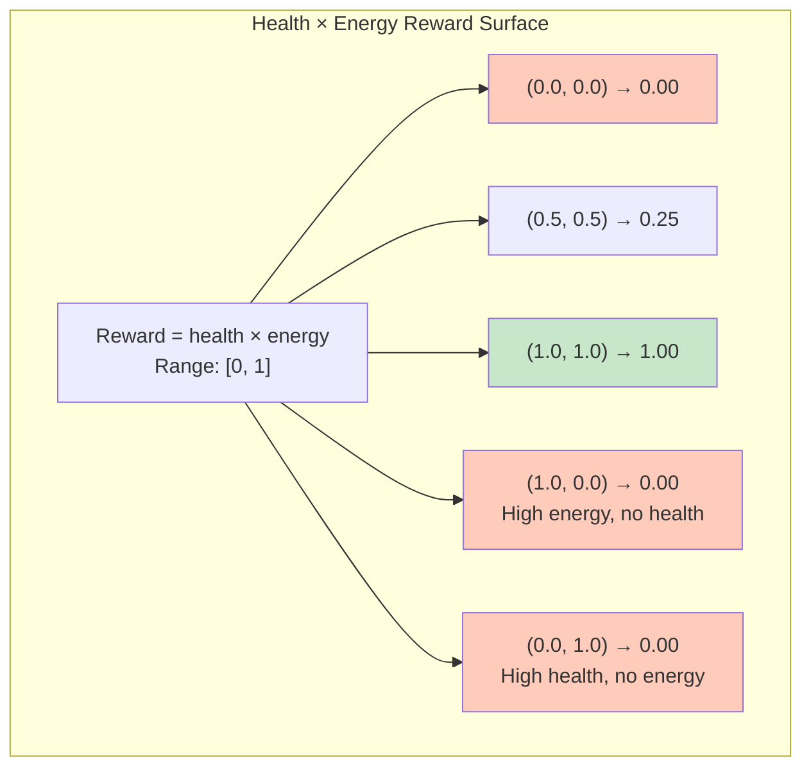

## 2. Intrinsic Reward: RND Novelty-Seeking

### RND (Random Network Distillation) Architecture

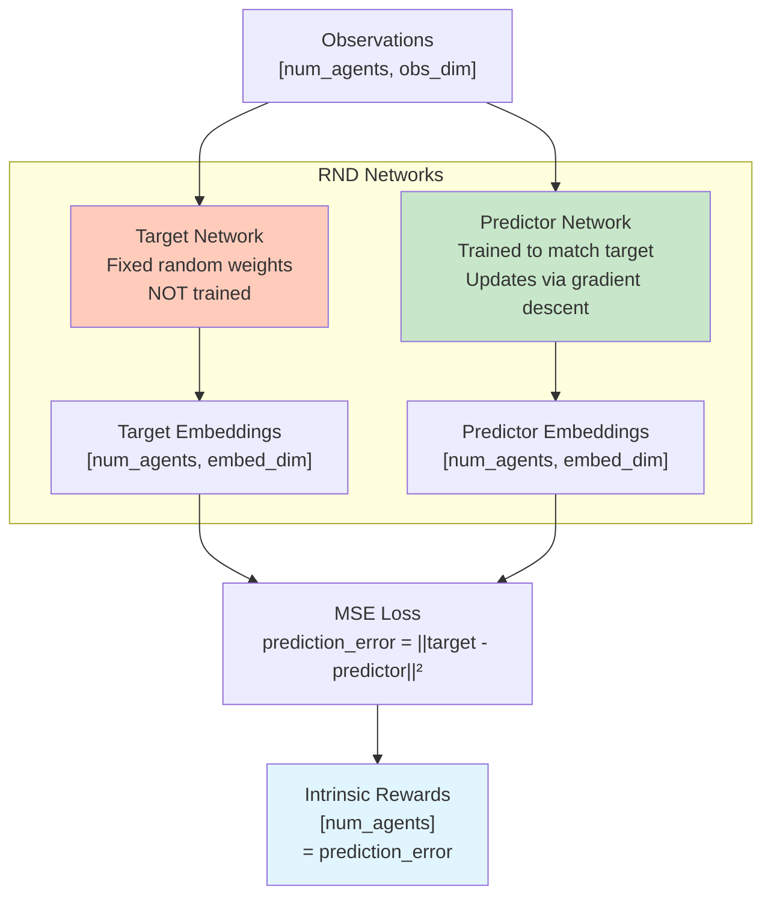

### RND Novelty Detection Logic

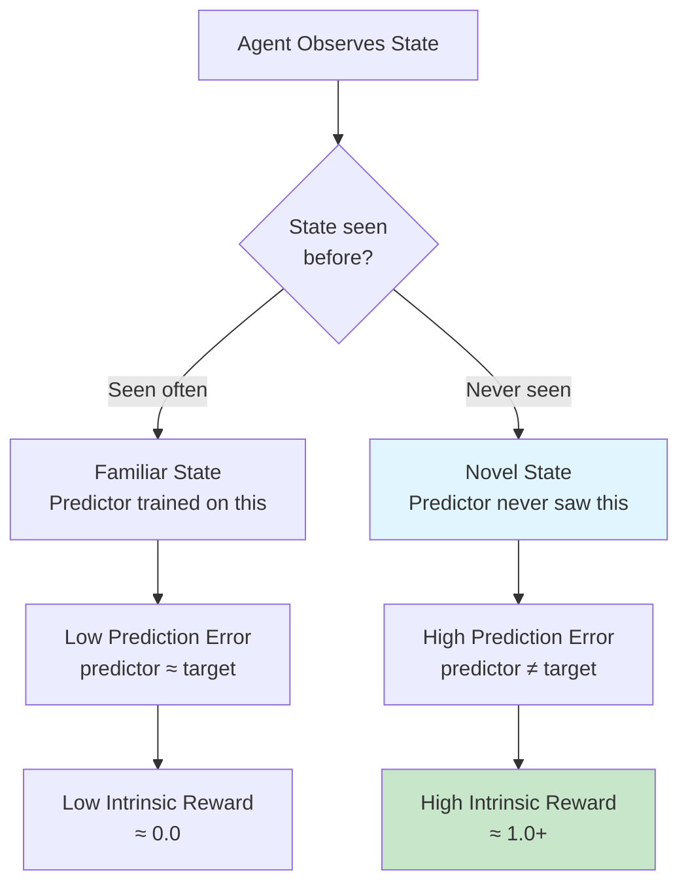

### RND Training Loop

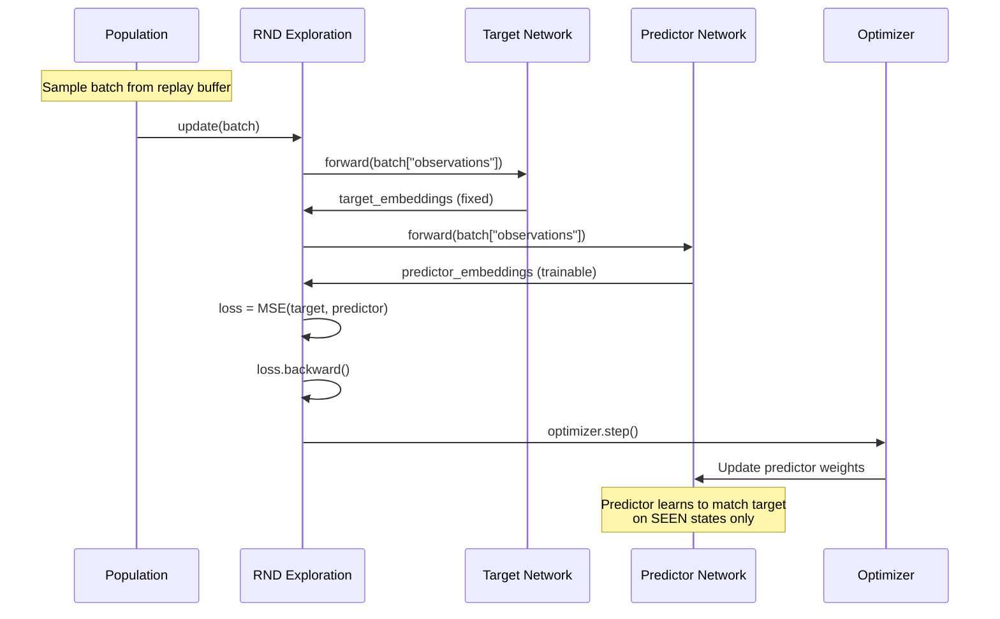

### Intrinsic Reward Computation

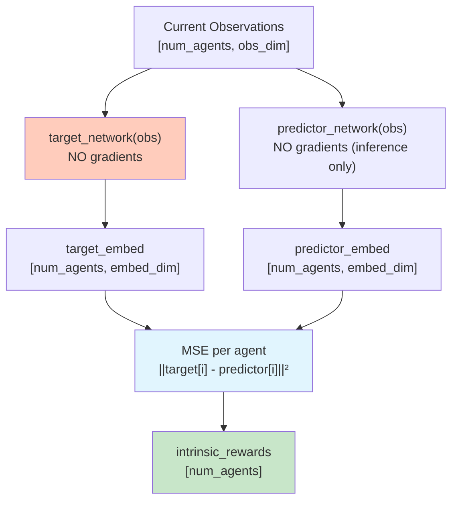

## 3. Adaptive Intrinsic Weight Annealing

### Annealing Strategy

```mermaid
flowchart TD
    start[Episode Complete]
    
    update_history["Update survival_history<br/>Append survival_time"]
    
    check_window{len(history)<br/>>= 100?}
    skip_check["Skip annealing<br/>Not enough data"]
    
    compute_variance["variance = var(history[-100:])<br/>Measure performance consistency"]
    
    check_threshold{variance <<br/>threshold?}
    
    keep_weight["Keep intrinsic_weight<br/>Agent still learning"]
    
    decay["intrinsic_weight *= 0.99<br/>Reduce exploration"]
    
    clamp["intrinsic_weight = max(weight, min_weight)<br/>Enforce floor (e.g., 0.0)"]
    
    done["Updated Weight"]
    
    start --> update_history
    update_history --> check_window
    
    check_window -->|No| skip_check
    check_window -->|Yes| compute_variance
    
    compute_variance --> check_threshold
    
    check_threshold -->|No| keep_weight
    check_threshold -->|Yes| decay
    
    keep_weight --> done
    
    decay --> clamp
    clamp --> done
    
    skip_check --> done
    
    style decay fill:#ffccbc
    style keep_weight fill:#c8e6c9
```

### Annealing Logic Rationale

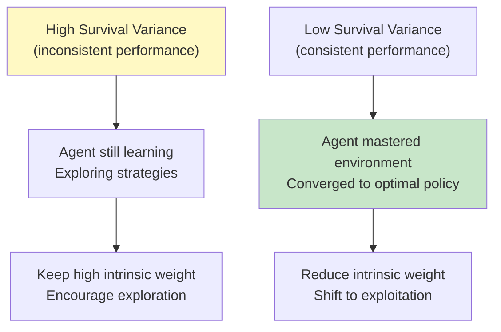

### Weight Decay Timeline Example

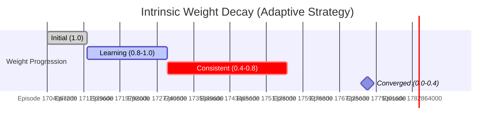

## 4. Final Reward Combination

### Combination Formula

```
total_reward = extrinsic_reward + intrinsic_reward × intrinsic_weight

where:
  extrinsic_reward = health × energy (if alive, else 0.0)
  intrinsic_reward = RND prediction error (if enabled, else 0.0)
  intrinsic_weight = adaptive weight (1.0 → 0.0 over training)
```

### Combination Flow

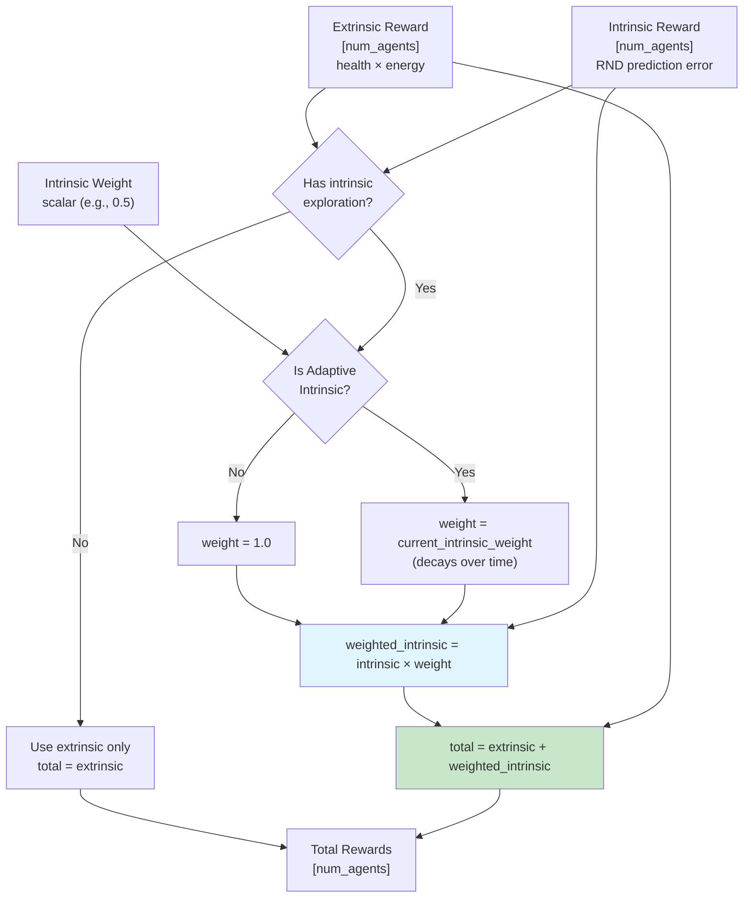

### Example Reward Combinations

```mermaid
graph TB
    subgraph "Early Training (weight=1.0)"
        early_extrinsic["extrinsic = 0.5"]
        early_intrinsic["intrinsic = 0.8"]
        early_weight["weight = 1.0"]
        early_total["total = 0.5 + 0.8×1.0 = 1.3"]
        early_note["High intrinsic contribution<br/>Agent explores"]
    end
    
    subgraph "Mid Training (weight=0.5)"
        mid_extrinsic["extrinsic = 0.7"]
        mid_intrinsic["intrinsic = 0.6"]
        mid_weight["weight = 0.5"]
        mid_total["total = 0.7 + 0.6×0.5 = 1.0"]
        mid_note["Balanced exploration/exploitation"]
    end
    
    subgraph "Late Training (weight=0.1)"
        late_extrinsic["extrinsic = 0.9"]
        late_intrinsic["intrinsic = 0.3"]
        late_weight["weight = 0.1"]
        late_total["total = 0.9 + 0.3×0.1 = 0.93"]
        late_note["Mostly extrinsic<br/>Agent exploits"]
    end
    
    subgraph "Converged (weight=0.0)"
        conv_extrinsic["extrinsic = 0.95"]
        conv_intrinsic["intrinsic = 0.1"]
        conv_weight["weight = 0.0"]
        conv_total["total = 0.95 + 0.1×0.0 = 0.95"]
        conv_note["Pure extrinsic<br/>Pure exploitation"]
    end
    
    early_extrinsic --> early_total
    early_intrinsic --> early_total
    early_weight --> early_total
    early_total --> early_note
    
    mid_extrinsic --> mid_total
    mid_intrinsic --> mid_total
    mid_weight --> mid_total
    mid_total --> mid_note
    
    late_extrinsic --> late_total
    late_intrinsic --> late_total
    late_weight --> late_total
    late_total --> late_note
    
    conv_extrinsic --> conv_total
    conv_intrinsic --> conv_total
    conv_weight --> conv_total
    conv_total --> conv_note
    
    style early_note fill:#e1f5fe
    style conv_note fill:#c8e6c9
```

## Reward Progression Timeline

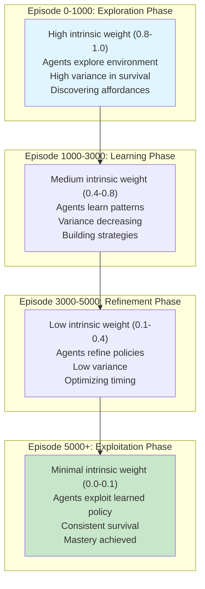

## Summary

### Reward Components

| Component | Formula | Range | Purpose |
|-----------|---------|-------|---------|
| **Extrinsic** | health × energy | [0, 1] | Survival gradient |
| **Intrinsic** | RND prediction error | [0, ∞) | Novelty bonus |
| **Weight** | Adaptive decay | [0, 1] | Exploration → Exploitation |
| **Total** | extrinsic + intrinsic × weight | [0, ∞) | Combined signal |

### Key Design Principles

1. **Interoception-Aware**: Agents feel their internal state (like humans)
2. **Sparse by Design**: No proximity shaping, agents must explore
3. **Multiplicative Penalty**: Both health AND energy matter (not additive)
4. **Dead Agents**: Zero reward (episode termination signal)
5. **Adaptive Annealing**: Intrinsic weight decays as performance stabilizes
6. **Curriculum Integration**: Extrinsic rewards modulated by curriculum difficulty

### Reward Ranges by Training Stage

| Stage | Extrinsic Range | Intrinsic Range | Weight | Total Range |
|-------|-----------------|-----------------|--------|-------------|
| **Early** | [0.0, 0.5] | [0.5, 2.0] | 1.0 | [0.5, 2.5] |
| **Mid** | [0.3, 0.8] | [0.2, 1.0] | 0.5 | [0.4, 1.3] |
| **Late** | [0.6, 0.95] | [0.1, 0.5] | 0.1 | [0.6, 1.0] |
| **Converged** | [0.8, 1.0] | [0.0, 0.2] | 0.0 | [0.8, 1.0] |

### Performance Considerations

- **Hot Path**: Reward computation every step for all agents
- **GPU Tensors**: All operations vectorized (no Python loops)
- **RND Inference**: Forward pass only (no gradients during reward computation)
- **Dead Agent Masking**: `torch.where()` for conditional reward zeroing
