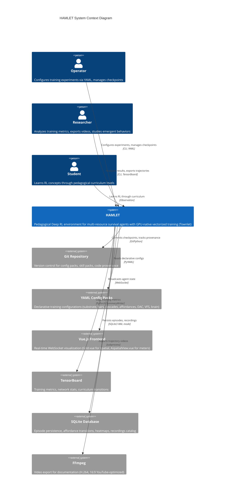
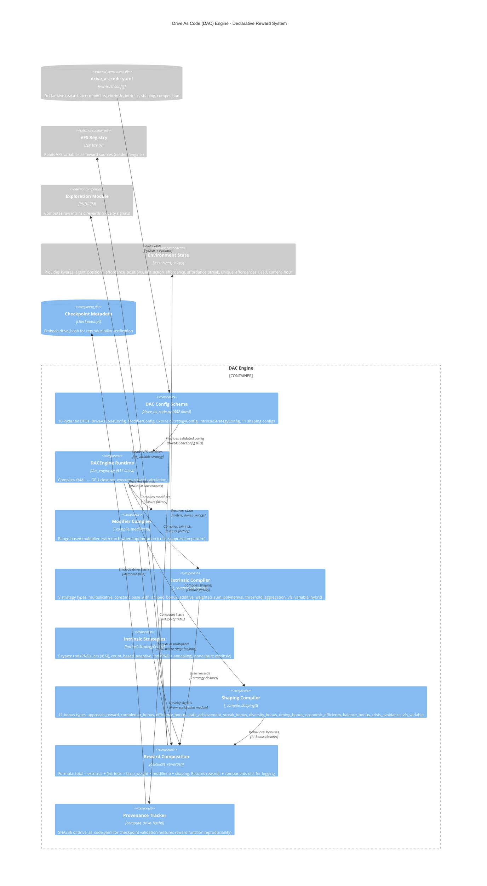
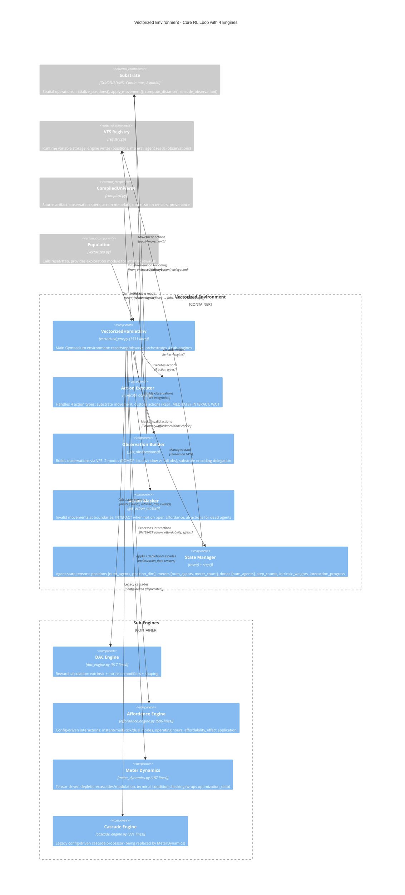

# Architecture Diagrams - HAMLET System

**Analysis Date**: November 13, 2025
**Diagram Format**: Mermaid (C4 Model)
**Coverage**: Context (L1), Container (L2), Component (L3) diagrams

---

## Context Diagram (C4 Level 1)

### System Boundary

**Description**:

HAMLET is a pedagogical Deep RL environment designed to "trick students into learning graduate-level RL by making them think they're just playing The Sims." The system has three primary user groups:

- **Operators** configure training experiments through declarative YAML config packs, manage checkpoint versioning, and orchestrate multi-day training runs
- **Researchers** analyze emergent behaviors, export trajectory videos for documentation, and study reward hacking as teaching moments rather than bugs
- **Students** progress through curriculum levels (L0 → L3+) learning concepts like temporal credit assignment, POMDP with LSTM, and reward design importance

The system integrates with six external systems:
- **Git Repository** for config pack versioning and checkpoint provenance tracking (SHA hashes embedded)
- **YAML Config Packs** providing declarative specifications (9 files per curriculum level: substrate, bars, cascades, affordances, cues, training, drive_as_code, brain, variables_reference)
- **Vue.js Frontend** for real-time visualization via WebSocket (substrate-agnostic rendering)
- **TensorBoard** for metrics logging (episode survival, TD-error, Q-values, network gradients)
- **SQLite Database** for episode persistence with WAL mode (thread-safe concurrent reads)
- **FFmpeg** for trajectory video export (H.264 encoding with 16:9 layout optimized for YouTube)

**Legend**:
- **Person** (human icons): Human actors interacting with the system
- **System** (blue boxes): HAMLET core system boundary
- **System_Ext** (gray boxes): External systems HAMLET depends on
- **Rel** (arrows): Relationships showing data flow direction and protocols

---

## Container Diagram (C4 Level 2)

### Subsystem Architecture

```mermaid
C4Container
    title HAMLET Subsystem Architecture (13 Containers)

    Container_Boundary(config, "Configuration Layer") {
        Container(dto_layer, "Config DTO Layer", "Pydantic", "No-defaults principle enforcement: 17 DTO schemas for YAML validation")
        Container(compiler, "Universe Compiler (UAC)", "Python", "7-stage pipeline: parse → symbol table → resolve → cross-validate → metadata → optimize → emit")
    }

    Container_Boundary(state, "State & Rewards") {
        Container(vfs, "Variable & Feature System (VFS)", "PyTorch", "Compile-time observation specs + runtime GPU tensor registry with access control")
        Container(dac, "Drive As Code (DAC) Engine", "PyTorch", "Declarative rewards: 9 extrinsic + 5 intrinsic + 11 shaping bonuses")
    }

    Container_Boundary(core_rl, "Core RL Loop") {
        Container(environment, "Vectorized Environment", "PyTorch", "GPU-native RL env: 4 engines (DAC, Affordance, Meter, Cascade)")
        Container(substrate, "Substrate Implementations", "PyTorch", "Pluggable spatial topologies: Grid2D/3D/ND, Continuous, Aspatial")
        Container(population, "Vectorized Population", "PyTorch", "Batched training: dual networks, replay buffers, curriculum integration")
    }

    Container_Boundary(learning, "Learning Strategies") {
        Container(networks, "Agent Networks", "PyTorch", "4 architectures: SimpleQ (MLP), RecurrentSpatial (CNN+LSTM), Dueling, Structured")
        Container(exploration, "Exploration Strategies", "PyTorch", "Intrinsic motivation: RND, Adaptive, Epsilon-Greedy")
        Container(curriculum, "Curriculum Strategies", "PyTorch", "Difficulty progression: Adversarial 5-stage, Static")
    }

    Container_Boundary(infra, "Training Infrastructure") {
        Container(training_infra, "Training Infrastructure", "PyTorch", "Replay buffers (3 types), checkpointing, TensorBoard logging")
        Container(recording, "Recording & Replay", "msgpack+lz4", "Trajectory capture with 4 criteria filters, MP4 export via FFmpeg")
        Container(demo, "Demo & Inference", "FastAPI", "UnifiedServer: training orchestration + live WebSocket inference")
    }

    Rel(dto_layer, compiler, "Provides validated DTOs", "Pydantic models")
    Rel(compiler, vfs, "Generates observation specs", "VFSAdapter")
    Rel(compiler, dac, "Compiles reward specs", "drive_hash provenance")
    Rel(compiler, environment, "Emits CompiledUniverse", "Frozen dataclass")

    Rel(vfs, environment, "Runtime variable registry", "GPU tensors")
    Rel(dac, environment, "Reward calculation", "Closures")
    Rel(substrate, environment, "Spatial operations", "Factory pattern")

    Rel(environment, population, "Gym interface (reset/step)", "Observations, rewards, dones")
    Rel(networks, population, "Q-network training", "Dual networks (online + target)")
    Rel(exploration, population, "Action selection + intrinsic rewards", "Strategy pattern")
    Rel(curriculum, population, "Difficulty decisions", "Depletion multiplier")

    Rel(population, training_infra, "Replay buffer push/sample", "GPU tensors")
    Rel(population, demo, "Training orchestration", "DemoRunner context manager")
    Rel(demo, recording, "Trajectory capture", "Async queue producer-consumer")

    UpdateLayoutConfig($c4ShapeInRow="3", $c4BoundaryInRow="1")
```

**Description**:

HAMLET's architecture is organized into four logical groups with 13 subsystems total:

**Configuration Layer (2 subsystems)**:
- **Config DTO Layer**: Enforces the "no-defaults principle" with 17 Pydantic schemas validating all behavioral parameters from YAML (bars, cascades, affordances, DAC, substrate, training, brain, VFS). Rejects brain-managed fields when brain.yaml exists to enforce single source of truth.
- **Universe Compiler (UAC)**: 7-stage pipeline transforming YAML → CompiledUniverse artifact with GPU-optimized computation graphs. Stages: parse YAML → build symbol table → resolve references → cross-validate → generate metadata → optimize tensors → emit/cache artifact.

**State & Rewards (2 subsystems)**:
- **Variable & Feature System (VFS)**: Dual-phase system providing compile-time observation spec generation and runtime GPU tensor storage. Supports 3 scopes (global, agent, agent_private) with access control enforcement (readable_by/writable_by lists).
- **Drive As Code (DAC) Engine**: Compiles declarative reward functions from YAML into GPU closures. 9 extrinsic strategies (multiplicative, constant_base_with_shaped_bonus, etc.), 5 intrinsic types (RND, ICM, adaptive), 11 shaping bonuses. Tracks drive_hash for checkpoint provenance.

**Core RL Loop (3 subsystems)**:
- **Vectorized Environment**: GPU-native Gymnasium environment with 4 integrated engines (DAC for rewards, Affordance for interactions, Meter Dynamics for depletion/cascades, Cascade for legacy relationships). Supports POMDP via local vision windows.
- **Substrate Implementations**: Pluggable spatial topologies via factory pattern. 6 types: Grid2D (Manhattan/Euclidean/Chebyshev), Grid3D, GridND (4D-100D), Continuous (1D-3D), ContinuousND (4D-100D), Aspatial (position_dim=0).
- **Vectorized Population**: Batched training orchestrator managing dual Q-networks (online + target), 3 replay buffer types (uniform, sequential for LSTM, prioritized), curriculum integration, exploration injection, checkpoint persistence.

**Learning Strategies (3 subsystems)**:
- **Agent Networks**: 4 neural architectures selected by observability. SimpleQNetwork (MLP, ~26K params) for full observability, RecurrentSpatialQNetwork (CNN+LSTM, ~650K params) for POMDP, DuelingQNetwork (value/advantage decomposition), StructuredQNetwork (semantic group encoders).
- **Exploration Strategies**: Strategy pattern for intrinsic motivation. RND (Random Network Distillation with dual networks), Adaptive (RND + performance-based annealing), Epsilon-Greedy (baseline).
- **Curriculum Strategies**: Difficulty progression controllers. Adversarial (5-stage: basic needs → all meters → sparse rewards, multi-signal advancement with survival + learning + entropy gates), Static (trivial baseline).

**Training Infrastructure (3 subsystems)**:
- **Training Infrastructure**: Hot path (BatchedAgentState with __slots__) vs cold path (Pydantic DTOs). 3 replay buffers: ReplayBuffer (FIFO uniform), SequentialReplayBuffer (episode-based for LSTM with post-terminal masking), PrioritizedReplayBuffer (TD-error importance sampling with beta annealing). Checkpoint provenance with SHA256 digests. TensorBoard hierarchical logging.
- **Recording & Replay**: Producer-consumer pattern with async queue (maxsize=1000). Captures trajectories with msgpack+lz4 compression (~10-30× reduction). 4 recording criteria (periodic, stage_transitions, performance percentile, stage_boundaries). MP4 export via FFmpeg with Matplotlib 16:9 rendering.
- **Demo & Inference**: UnifiedServer orchestrates training thread (DemoRunner with context manager cleanup) and inference thread (FastAPI WebSocket on port 8766). SQLite WAL mode for concurrent reads. Substrate-agnostic telemetry broadcasting. Dual mode: inference (trained checkpoint) vs replay (recorded episodes).

**Data Flow**:
1. **Compilation**: YAML config packs → DTO validation → UAC 7-stage pipeline → CompiledUniverse artifact (with VFS specs, DAC closures, optimized GPU tensors)
2. **Training Loop**: Population calls env.step() → Environment executes actions via substrate, applies affordance effects, computes rewards via DAC, builds observations via VFS → Population samples replay buffer, trains Q-network, syncs target network
3. **Visualization**: DemoRunner broadcasts telemetry → LiveInferenceServer WebSocket → Frontend renders agent state
4. **Persistence**: Population saves checkpoints (with universe_metadata, brain_hash, drive_hash) → DemoDatabase indexes episodes/recordings → Recording system exports MP4 videos

**Legend**:
- **Container_Boundary** (dashed boxes): Logical grouping of related subsystems
- **Container** (blue boxes): Individual subsystems with technology stack
- **Rel** (arrows): Dependencies showing data flow direction and integration patterns

---

## Component Diagrams (C4 Level 3)

### Selection Rationale

Three subsystems chosen for deep component-level analysis:

1. **Universe Compiler (UAC)** - Critical infrastructure at the heart of the compilation pipeline. 7-stage architecture transforms declarative YAML into GPU-native computation graphs. Understanding UAC is prerequisite for understanding all downstream subsystems since CompiledUniverse artifact drives environment/population initialization.

2. **Drive As Code (DAC) Engine** - Pedagogically significant subsystem demonstrating HAMLET's "interesting failures as teaching moments" philosophy. L0_0_minimal intentionally demonstrates "Low Energy Delirium" bug (multiplicative reward + high intrinsic → reward hacking), L0_5_dual_resource fixes it (constant_base_with_shaped_bonus). 25 total strategy types (9 extrinsic + 5 intrinsic + 11 shaping) showcase declarative reward design.

3. **Vectorized Environment** - Core RL loop integrating 4 sub-engines (DAC, Affordance, Meter Dynamics, Cascade). Largest single file (1531 lines) with complex initialization and multi-substrate support. Understanding environment internals is critical for debugging training issues and extending HAMLET with new affordance types or meter relationships.

Not selected:
- **Substrate Implementations**: While architecturally interesting (7 substrate types, pluggable factory pattern), internal implementation is straightforward tensor operations. Abstract interface well-documented.
- **Vectorized Population**: Large orchestrator (1155 lines) but primary logic is standard DQN training loop. Would benefit from sequencing diagram rather than component diagram.
- **Recording & Replay**: Producer-consumer pattern well-understood. Component diagram would mostly show queue/thread/file relationships without deep insight.

---

### Component Diagram 1: Universe Compiler (UAC)

```mermaid
C4Component
    title Universe Compiler - 7-Stage Compilation Pipeline

    Container_Boundary(compiler, "Universe Compiler (UAC)") {
        Component(cli, "CLI Entry Point", "__main__.py", "Provides compile/inspect/validate commands for config pack development")

        Component(loader, "RawConfigs Loader", "compiler_inputs.py", "Aggregates 9 YAML files → Pydantic DTOs (substrate, bars, cascades, affordances, DAC, cues, training, brain, VFS)")

        Component(stage0, "Phase 0: YAML Validation", "compiler.py", "Grammar check before semantic analysis (prevents cryptic errors from malformed YAML)")

        Component(stage1, "Stage 1: Parse", "compiler.py", "Individual YAML → Pydantic DTOs via RawConfigs")

        Component(stage2, "Stage 2: Symbol Table", "symbol_table.py", "Register all entities (meters, affordances, cascades, variables, actions) for cross-validation")

        Component(stage3, "Stage 3: Resolve References", "compiler.py", "Validate affordances→meters, DAC→bars/variables/affordances, enabled_affordances existence")

        Component(stage4, "Stage 4: Cross-Validate", "compiler.py + cues_compiler.py", "Meter sustainability, affordance capabilities, economic balance, POMDP compatibility, substrate-action validation")

        Component(stage5, "Stage 5: Metadata Generation", "compiler.py + vfs_adapter.py", "Observation specs via VFS, action/meter/affordance metadata, provenance (config_hash, drive_hash, git SHA)")

        Component(stage6, "Stage 6: Optimize", "optimization.py", "Pre-compute GPU tensors: base_depletions, cascade_data, modulation_data, action_mask_table[24×N], affordance_position_map")

        Component(stage7, "Stage 7: Emit", "compiled.py", "CompiledUniverse frozen dataclass with all metadata + drive_hash for checkpoint validation")

        Component(cache, "Cache Manager", "compiler.py", "Dual invalidation: fast mtime check, then SHA256 config_hash. 10MB cache bomb protection")

        Component(errors, "Error Collector", "errors.py", "Batches all diagnostics before raising (shows complete error report vs fail-fast)")
    }

    ComponentDb_Ext(yaml, "YAML Config Pack", "9 files per level", "substrate.yaml, bars.yaml, cascades.yaml, affordances.yaml, cues.yaml, training.yaml, drive_as_code.yaml, brain.yaml, variables_reference.yaml")

    Component_Ext(vfs_system, "VFS System", "schema.py, observation_builder.py", "Variable definitions, observation spec generation")

    Component_Ext(dac_config, "DAC Config DTOs", "drive_as_code.py", "Reward function schemas (modifiers, extrinsic, intrinsic, shaping)")

    Component_Ext(substrate_validator, "Substrate Validator", "substrate_action_validator.py", "POMDP compatibility checks, action space size validation")

    ComponentDb(artifact, "CompiledUniverse Artifact", "Frozen dataclass", "Immutable output: metadata, optimization tensors, provenance tracking")

    Rel(cli, loader, "Orchestrates compilation", "Command dispatch")
    Rel(loader, yaml, "Loads YAML files", "PyYAML")
    Rel(loader, stage0, "Validates syntax", "Grammar check")
    Rel(stage0, stage1, "Parses to DTOs", "Pydantic validation")
    Rel(stage1, stage2, "Builds symbol table", "Entity registration")
    Rel(stage2, stage3, "Resolves references", "Symbol lookup")
    Rel(stage3, stage4, "Cross-validates", "Multi-file constraints")
    Rel(stage4, stage5, "Generates metadata", "VFS integration")
    Rel(stage5, stage6, "Optimizes tensors", "GPU pre-computation")
    Rel(stage6, stage7, "Emits artifact", "Frozen dataclass")

    Rel(stage5, vfs_system, "Observation specs", "VFSAdapter translation")
    Rel(stage5, dac_config, "Computes drive_hash", "SHA256 of DAC YAML")
    Rel(stage4, substrate_validator, "POMDP validation", "Encoding mode checks")
    Rel(stage7, artifact, "Writes output", "Cache or return")
    Rel(cache, artifact, "Reads cached", "mtime + SHA256 check")
    Rel(errors, stage1, "Collects errors", "Batch reporting")
    Rel(errors, stage3, "Collects errors", "Batch reporting")
    Rel(errors, stage4, "Collects errors", "Batch reporting")

    UpdateLayoutConfig($c4ShapeInRow="2", $c4BoundaryInRow="1")
```

**Description**:

The Universe Compiler (UAC) is a 7-stage pipeline (plus Phase 0 pre-check) transforming YAML configuration packs into validated, GPU-optimized CompiledUniverse artifacts. Each stage has a specific responsibility:

**Phase 0 - YAML Validation** (Pre-processing):
- Grammar check for malformed YAML before semantic analysis
- Prevents cryptic Pydantic errors from syntax issues (missing colons, invalid indentation)
- Fails fast with helpful error messages pointing to exact line numbers

**Stage 1 - Parse**:
- Loads 9 YAML files per config pack (substrate, bars, cascades, affordances, cues, training, drive_as_code, brain, variables_reference)
- Validates each file against Pydantic DTO schemas enforcing no-defaults principle
- RawConfigs aggregator bundles DTOs for downstream stages
- Error collection begins (batch all validation errors instead of fail-fast)

**Stage 2 - Build Symbol Table**:
- Registers all entities across config files: meters, affordances, cascades, variables, actions
- UniverseSymbolTable provides central registry for Stage 3-7 reference resolution
- Detects duplicate entity names across files (e.g., same affordance ID in affordances.yaml and substrate.yaml)

**Stage 3 - Resolve References**:
- Validates cross-file references: affordances→meters (energy cost), DAC→bars/variables/affordances (reward sources), enabled_affordances existence
- Symbol table lookups ensure referential integrity
- Detects typos in entity references (e.g., DAC references "energi" instead of "energy")

**Stage 4 - Cross-Validate**:
- Multi-file constraint checking: meter sustainability (sum of affordance costs vs depletion rates), affordance capabilities (effect pipelines valid), economic balance (job payment vs costs)
- POMDP compatibility validation via substrate_action_validator (Grid2D/3D only, vision_range > 0, relative/scaled encoding modes)
- Position bounds checking (affordance positions within grid dimensions)
- Cues compiler validates UI metadata (colors, symbols, tooltips match affordances/meters)
- CuesCompiler sub-module handles Stage 4 UI validation

**Stage 5 - Metadata Generation**:
- Observation specs via VFS integration: VFSAdapter translates VFS ObservationField → compiler ObservationSpec DTOs, computes observation dimensions (e.g., Grid2D with relative encoding = 29 dims)
- Action metadata: canonical ordering ([movement..., INTERACT, WAIT]), cost aggregation, VFS write effects
- Meter metadata: name→index mapping, tier groupings, terminal conditions
- Affordance metadata: position maps, operating hours, interaction modes
- Provenance tracking: config_hash (SHA256 of all config files), drive_hash (SHA256 of drive_as_code.yaml), git_sha (current commit), compiler_version, python_version, torch_version

**Stage 6 - Optimize**:
- Pre-computes GPU tensors for runtime performance:
  - `base_depletions` [num_meters]: Base depletion rates per tick
  - `cascade_data` [(source, target, rate)]: Meter cascade relationships
  - `modulation_data` [(source, target, multiplier)]: Meter modulations
  - `action_mask_table` [24, num_affordances]: Temporal mechanics masks (which affordances available at each hour)
  - `affordance_position_map` [num_affordances, position_dim]: Static affordance positions
- Moves constant computations from runtime → compile-time (10-100× speedup for large populations)
- OptimizationData container bundles tensors for environment initialization

**Stage 7 - Emit**:
- Creates CompiledUniverse frozen dataclass (immutable post-compilation)
- Embeds all metadata + optimization tensors + provenance tracking
- __post_init__ validation ensures artifact consistency
- Writes to cache or returns to caller
- Cache key: SHA256(config files) for reproducibility

**Cache Manager**:
- Dual invalidation strategy: Fast mtime check first (nanosecond precision), then SHA256 config_hash for accuracy
- Cache bomb protection: 10MB artifact size limit prevents DoS via adversarial configs
- Cache miss triggers full recompilation through 7 stages

**Error Collector**:
- CompilationErrorCollector batches diagnostics across all stages
- Shows complete error report (e.g., "5 errors found in Stage 3, 2 errors in Stage 4") instead of fail-fast
- Operator-friendly error messages with file paths, line numbers, suggested fixes
- Raises single CompilationError with all diagnostics at end of pipeline

**Security Validations** (scattered across stages):
- Path traversal protection: Rejects config_dir outside allowed paths
- DoS protection: Max 10K grid cells, max 300 actions, max 100 meters
- Cache bomb protection: 10MB artifact limit
- No arbitrary code execution: Pydantic validation only, no eval() or exec()

**Integration Points**:
- **VFS System**: Stage 5 calls VFSAdapter.vfs_to_observation_spec() to translate variable definitions → observation specs with flattened fields and start/end indices
- **DAC Config**: Stage 5 computes drive_hash (SHA256 of drive_as_code.yaml) for checkpoint provenance (ensures reward function reproducibility)
- **Substrate Validator**: Stage 4 calls validate_substrate_action_compatibility() checking POMDP support, encoding modes, action space size limits
- **Environment/Population**: Consume CompiledUniverse.to_runtime() to initialize vectorized environment and population with pre-computed tensors

**Performance**:
- Cold compilation: ~500ms for L1_full_observability (8×8 grid, 14 affordances)
- Cache hit: ~50ms (mtime check + artifact deserialization)
- Stage 6 optimization saves ~10-100× runtime for large populations (batch size 64+)

---

### Component Diagram 2: Drive As Code (DAC) Engine

**Description**:

Drive As Code (DAC) is a declarative reward function compiler that extracts all reward logic from Python into composable YAML configurations. Operators can A/B test reward structures without code changes. DAC compiles YAML specs into GPU-native computation graphs with provenance tracking.

**Core Components**:

**DAC Config Schema** (18 Pydantic DTOs):
- `DriveAsCodeConfig`: Top-level schema with version, modifiers dict, extrinsic config, intrinsic config, shaping list, composition config
- `ModifierConfig`: Range-based multipliers with RangeConfig (min/max/multiplier tuples), source (bar or VFS variable), apply logic
- `ExtrinsicStrategyConfig`: Union of 9 strategy schemas (MultiplicativeConfig, ConstantBaseWithShapedBonusConfig, AdditiveUnweightedConfig, WeightedSumConfig, PolynomialConfig, ThresholdBasedConfig, AggregationConfig, VfsVariableConfig, HybridConfig)
- `IntrinsicStrategyConfig`: 5 types (rnd, icm, count_based, adaptive_rnd, none) with base_weight and apply_modifiers list
- 11 shaping bonus configs: ApproachRewardConfig (distance-based), CompletionBonusConfig (interaction finish), EfficiencyBonusConfig (resource above threshold), StateAchievementConfig (meter target), StreakBonusConfig (consecutive affordance use), DiversityBonusConfig (unique affordance exploration), TimingBonusConfig (time window), EconomicEfficiencyConfig (job profit margin), BalanceBonusConfig (meter equilibrium), CrisisAvoidanceConfig (resource danger zone), VfsVariableConfig (custom VFS-computed bonuses)
- `CompositionConfig`: normalize (tanh to [-1,1]), clip (min/max bounds), log_components (debug logging), log_modifiers (modifier visibility)

**DACEngine Runtime**:
- Main orchestrator class initializing from DriveAsCodeConfig + universe metadata
- Stores bar_index_map (bar_id → meters tensor index) for indirection
- Compiles three closure types (modifiers, extrinsic, shaping) at __init__ time
- calculate_rewards() is hot path method called every env.step()

**Modifier Compiler** (_compile_modifiers):
- Compiles ModifierConfig → closure capturing ranges and source variable
- Range-based multipliers: [(min=0.0, max=0.2, multiplier=0.0), (min=0.2, max=1.0, multiplier=1.0)] for crisis suppression
- GPU optimization: Nested torch.where for range evaluation (no Python loops)
- Crisis suppression pattern: energy_crisis modifier with energy<0.2 → intrinsic_weight×0.0 (disables exploration when survival critical)
- Returns closure: (meters, vfs_registry, dones) → multipliers [num_agents]

**Extrinsic Compiler** (_compile_extrinsic):
- Compiles ExtrinsicStrategyConfig → closure for base reward calculation
- 9 strategy types:
  1. **multiplicative**: reward = base × bar₁ × bar₂ (compound survival, used in L0_0_minimal)
  2. **constant_base_with_shaped_bonus**: reward = base + Σ(bonuses) (fixes "Low Energy Delirium" bug, used in L0_5_dual_resource)
  3. **additive_unweighted**: reward = base + Σ(bars)
  4. **weighted_sum**: reward = base + Σ(weight_i × bar_i)
  5. **polynomial**: reward = base + Σ(bar_i^exponent)
  6. **threshold_based**: reward = base if all bars > threshold else penalty
  7. **aggregation**: reward = base + min(bars) (currently hardcoded to min, full implementation needs operation field)
  8. **vfs_variable**: reward = VFS variable value (escape hatch for custom logic)
  9. **hybrid**: Weighted bars with optional centering (simplified, comment says "Full implementation would compose sub-strategies")
- Returns closure: (meters, vfs_registry, dones) → extrinsic_rewards [num_agents]

**Intrinsic Strategies**:
- 5 types configured in IntrinsicStrategyConfig:
  1. **rnd**: Random Network Distillation (dual networks: fixed random target + trained predictor, prediction error = novelty)
  2. **icm**: Intrinsic Curiosity Module (forward model predicts next state, prediction error = curiosity)
  3. **count_based**: Pseudo-count bonuses (state visitation tracking)
  4. **adaptive_rnd**: RND + performance-based annealing (survival variance + mean survival gates, exponential decay)
  5. **none**: Pure extrinsic (ablation studies)
- Exploration module computes raw intrinsic rewards, DAC applies base_weight and modifiers

**Shaping Compiler** (_compile_shaping):
- Compiles list of shaping bonus configs → list of closures
- 11 bonus types:
  1. **approach_reward**: Distance to target affordance decreasing (incentivizes navigation)
  2. **completion_bonus**: Interaction duration_ticks completed (encourages finishing jobs)
  3. **efficiency_bonus**: Meter above threshold (rewards maintaining reserves)
  4. **state_achievement**: Meter reaches target value (milestone bonuses)
  5. **streak_bonus**: Consecutive affordance use (encourages routine formation)
  6. **diversity_bonus**: Unique affordances used (exploration incentive)
  7. **timing_bonus**: Action within time window (e.g., sleep at night)
  8. **economic_efficiency**: Job profit margin (payment - costs)
  9. **balance_bonus**: Meter equilibrium (all meters in healthy range)
  10. **crisis_avoidance**: Meter escapes danger zone (rewards recovery)
  11. **vfs_variable**: Custom VFS-computed bonuses (escape hatch)
- Requires kwargs from environment (agent_positions, affordance_positions, last_action_affordance, affordance_streak, unique_affordances_used, current_hour)
- Returns list of closures: (meters, vfs_registry, dones, **kwargs) → bonus [num_agents]

**Reward Composition** (calculate_rewards):
- Hot path method called every env.step() with (meters, dones, intrinsic_raw, **kwargs)
- Executes compiled closures in sequence:
  1. Evaluate modifiers → modifier_values [num_modifiers, num_agents]
  2. Compute effective_intrinsic_weight = base_weight × modifier₁ × modifier₂ × ...
  3. Calculate extrinsic_rewards via extrinsic closure
  4. Apply intrinsic: intrinsic_component = intrinsic_raw × effective_intrinsic_weight
  5. Sum shaping bonuses: shaping_component = Σ(shaping_closures)
  6. Compose: total_reward = extrinsic + intrinsic_component + shaping_component
  7. Zero rewards for dead agents: torch.where(dones, 0.0, total_reward)
- Returns (total_reward, components_dict) where components_dict = {extrinsic, intrinsic, intrinsic_weights, shaping, modifiers} for logging

**Provenance Tracker**:
- compute_drive_hash(config_dir): Loads drive_as_code.yaml, serializes to deterministic JSON (sorted keys), computes SHA256
- drive_hash embedded in CompiledUniverse artifact and checkpoint metadata
- Checkpoint loading validates drive_hash matches current config (prevents reward function drift)
- If mismatch: config_hash_warning logs discrepancy but allows loading (for experimentation); can be made strict with required=True

**Pedagogical Pattern - "Low Energy Delirium" Bug**:
- **L0_0_minimal** (demonstrates bug):
  - Extrinsic: multiplicative (base=1.0, bars=[energy])
  - Intrinsic: rnd (base_weight=0.1, no modifiers)
  - Result: Agents learn to keep energy low (0.1-0.2 range) to maximize exploration (low extrinsic × high intrinsic = high total reward despite dying)
- **L0_5_dual_resource** (fixes bug):
  - Extrinsic: constant_base_with_shaped_bonus (base=1.0, bonuses=[efficiency_bonus for energy, satiation])
  - Intrinsic: rnd (base_weight=0.1, apply_modifiers=[energy_crisis])
  - Modifier: energy_crisis (energy<0.2 → intrinsic_weight×0.0)
  - Result: Agents maintain healthy energy (>0.5) to keep intrinsic exploration active, efficiency bonuses reward survival
- **Teaching moment**: Students learn importance of reward structure design (multiplicative vs additive, crisis suppression, shaped bonuses)

**Integration Points**:
- **VFS Registry**: DAC reads VFS variables as reader="engine" (not "agent") for access control separation. Used in vfs_variable extrinsic strategy and vfs_variable shaping bonus.
- **Exploration Module**: RND/ICM compute raw intrinsic rewards (novelty signals), DAC applies base_weight and modifiers for effective intrinsic component
- **Environment State**: Provides kwargs (agent_positions, affordance_positions, last_action_affordance, affordance_streak, unique_affordances_used, current_hour) for shaping bonuses requiring spatial/temporal context
- **Checkpoint Metadata**: drive_hash embedded in checkpoint.pt metadata, validated on checkpoint load to ensure reward function reproducibility

**Performance**:
- Compilation overhead: ~50ms at DACEngine.__init__ (one-time cost)
- Runtime overhead: ~0.5-1.0ms per calculate_rewards() call for batch_size=64 (negligible vs env.step() total ~10-20ms)
- GPU vectorization: All operations batched across agents (no Python loops in hot path)
- Closure pattern avoids polymorphism overhead (strategy selection at compile-time, not runtime)

---

### Component Diagram 3: Vectorized Environment

**Description**:

The Vectorized Environment is the core RL loop implementing the Gymnasium interface (reset/step/observe) with GPU-native vectorized operations. It orchestrates 4 sub-engines (DAC, Affordance, Meter Dynamics, Cascade) and integrates with substrate implementations for spatial operations.

**Main Components**:

**VectorizedHamletEnv** (Main orchestrator):
- Implements Gymnasium interface: reset() → observations, step(actions) → (observations, rewards, dones, info)
- Initialization from CompiledUniverse via from_universe() factory method
- Manages agent state tensors (positions, meters, dones, step_counts, intrinsic_weights, interaction_progress, affordance tracking)
- Orchestrates 4 sub-engines for reward/affordance/meter/cascade processing
- Integration points: substrate (spatial ops), VFS registry (variable storage), exploration module (intrinsic rewards), DAC engine (reward calculation)
- POMDP support with validation: Grid2D/3D with vision_range > 0, relative/scaled encoding modes only
- Temporal mechanics: time_of_day cycling, action_mask_table[24×affordance_count] for operating hours
- Affordance tracking for DAC shaping bonuses: last_affordances, affordance_streaks, unique_affordances_count per agent

**Action Executor** (_execute_actions):
- Handles 4 action types with different code paths:
  1. **Substrate movement actions**: Delegates to substrate.apply_movement() with boundary mode enforcement (clamp/wrap/bounce/sticky)
  2. **Custom actions**: REST (energy recovery +0.05), MEDITATE (mood boost +0.03) directly modify meters
  3. **INTERACT**: Triggers affordance_engine.process_interactions() with affordability checks (meter costs), applies affordance effects (meter changes, cascade triggers)
  4. **WAIT**: No-op action (still incurs base energy cost for existing)
- Action indexing: Pre-computed indices (INTERACT, WAIT, UP_Z, DOWN_Z) cached at init for fast lookup
- Affordability check: INTERACT masked if agent lacks required meter resources (e.g., JOB costs energy=0.01, satiation=0.005)

**Observation Builder** (_get_observations):
- Two modes based on partial_observability flag:
  1. **POMDP mode** (vision_range > 0): substrate.encode_partial_observation() → local_window [num_agents, (2×vision_range+1)²], flattened to 1D (e.g., 5×5 window = 25 cells)
  2. **Full observability** (vision_range=0 or None): substrate._encode_full_grid() → grid_encoding [num_agents, width×height] for global view
- Position encoding delegation: substrate.encode_position_features() with mode-specific dimensions (relative=2, scaled=4, absolute=2)
- VFS integration: Updates vfs_registry with current state (writer='engine'), reads variables for observation construction (reader='agent' for access control)
- Fallback chains: hasattr() checks for substrate methods (_encode_full_grid, encode_position_features, normalize_positions) suggesting substrate interface not fully stabilized
- Meter normalization: meters / meter_ranges (broadcast division for [num_agents, meter_count])
- Affordance visibility: All 15 affordance types visible (even if not deployed) for fixed vocabulary enabling transfer learning

**Action Masker** (get_action_masks):
- Returns valid_actions tensor [num_agents, action_dim] with 0/1 flags
- Three masking rules:
  1. **Boundary violations**: substrate.get_valid_neighbors() checks movement actions at grid edges (depends on boundary mode: clamp allows 0 valid, wrap allows all)
  2. **INTERACT unavailable**: Masked when agent not on open affordance position (requires proximity check via substrate.is_on_position())
  3. **Dead agents**: All actions masked (dones[i]=True → valid_actions[i, :] = 0)
- Used by population for action selection (epsilon-greedy, greedy, exploration strategies) to prevent invalid actions
- POMDP consideration: Vision-limited agents still see full action mask (can attempt to move/interact anywhere, but affordance visibility limited by local window)

**State Manager** (reset + step):
- Agent state split across 10 GPU tensors:
  1. `positions` [num_agents, position_dim]: Current spatial positions (Grid2D: [x, y], Aspatial: [])
  2. `meters` [num_agents, meter_count]: Resource levels (energy, health, satiation, money, hygiene, fitness, mood, social)
  3. `dones` [num_agents]: Episode termination flags (terminal meter threshold, max_steps_per_episode)
  4. `step_counts` [num_agents]: Steps since episode start (for retirement bonus at max_steps)
  5. `intrinsic_weights` [num_agents]: Per-agent intrinsic motivation scaling (annealed by exploration module)
  6. `interaction_progress` [num_agents, num_affordances]: Multi-tick interaction tracking (JOB duration=10 ticks)
  7. `_last_affordances` [num_agents]: Last affordance interacted with (for DAC streak_bonus)
  8. `_affordance_streaks` [num_agents]: Consecutive same-affordance interactions (for DAC streak_bonus)
  9. `_unique_affordances_count` [num_agents]: Unique affordances used (for DAC diversity_bonus)
  10. `_affordances_seen` [num_agents, num_affordances]: Bitset of affordances used (for DAC diversity tracking)
- Reset behavior: positions via substrate.initialize_positions(), meters to initial values from BarConfig, dones/step_counts/intrinsic_weights/interaction_progress zeroed
- Step behavior: Execute actions → apply meter dynamics → check terminal conditions → calculate rewards → build observations → return (obs, rewards, dones, info)
- Terminal conditions: Any meter <= 0.0 (death), max_steps_per_episode reached (retirement with +1.0 bonus)

**Sub-Engines**:

**DAC Engine**:
- Runtime reward calculation from declarative DAC specs
- Called every step with: meters, dones, intrinsic_raw (from exploration module), kwargs (agent_positions, affordance_positions, last_action_affordance, affordance_streak, unique_affordances_used, current_hour)
- Returns (total_reward, components_dict) where total = extrinsic + intrinsic×modifiers + shaping
- Components logged for debugging: {extrinsic, intrinsic, intrinsic_weights, shaping, modifiers}
- GPU vectorization: All operations batched across agents

**Affordance Engine**:
- Config-driven affordance interaction processor
- Three interaction modes:
  1. **Instant** (duration_ticks=1): Single-step effect application (SLEEP, MEDITATE)
  2. **Multi-tick** (duration_ticks>1): Progress tracking via interaction_progress tensor (JOB duration=10 ticks, apply effects on completion)
  3. **Dual** (operating_hours + costs_per_tick): Instant availability check + multi-tick cost application (future feature)
- Operating hours enforcement: action_mask_table[current_hour, affordance_idx] → valid affordances at current time (SLEEP only 22-6, JOB only 9-17)
- Affordability checks: Sum(affordance.costs) ≤ current_meters for INTERACT action (prevents overdrafting)
- Effect pipeline: effect_pipeline list [(meter_id, delta)] applied on interaction completion or tick-by-tick for dual mode
- Position requirement: Agents must be on affordance position (proximity check via substrate.is_on_position())

**Meter Dynamics**:
- Tensor-driven depletion/cascade/modulation processor
- Wraps optimization_data from CompiledUniverse Stage 6:
  - `base_depletions` [num_meters]: Per-tick base depletion rates (energy=-0.01, satiation=-0.008)
  - `cascade_data` [(source, target, rate)]: Meter relationships (low energy → low health at rate=0.02)
  - `modulation_data` [(source, target, multiplier)]: Meter influences (high fitness → slower energy drain)
- Execution: meters -= base_depletions × depletion_multiplier (curriculum-adjusted), then cascades, then modulations
- Terminal condition checking: any(meters <= 0.0) → dones=True
- GPU-native: All operations vectorized across agents

**Cascade Engine**:
- Legacy config-driven cascade processor (being replaced by MeterDynamics)
- Still used in some code paths for backwards compatibility (pre-release, but not fully removed yet)
- Reads CascadeConfig DTOs instead of optimization tensors
- Technical debt: Dual cascade systems (CascadeEngine + MeterDynamics) create confusion

**Integration with External Components**:

**Substrate** (pluggable spatial topology):
- `initialize_positions(num_agents, device)`: Random or configured initial positions
- `apply_movement(positions, deltas)`: Boundary-aware position updates (clamp/wrap/bounce/sticky modes)
- `compute_distance(pos1, pos2)`: Metric-specific distance calculation (manhattan/euclidean/chebyshev)
- `encode_observation(positions, affordance_positions, grid_size)`: Position encoding (relative [0,1], scaled [0,1] + range, absolute raw coords)
- `encode_partial_observation(positions, affordance_positions, vision_range)`: POMDP local window extraction (Grid2D/3D only)
- `is_on_position(agent_pos, affordance_pos)`: Proximity check for INTERACT action
- 6 substrate types: Grid2D (square), Grid3D (cubic), GridND (4D-100D hypercube), Continuous (float positions), ContinuousND (4D-100D float), Aspatial (position_dim=0)

**VFS Registry** (runtime variable storage):
- Environment writes variables (writer='engine'): positions, meters, dones, step_counts, current_hour, affordance_positions, interaction_progress
- Agent reads variables (reader='agent'): Subset of environment state for observations (access control via readable_by list)
- DAC reads variables (reader='engine'): Different subset for reward calculation (vfs_variable extrinsic strategy, vfs_variable shaping bonus)
- Scope-aware shapes: global → [], agent → [num_agents], agent_private → [num_agents]
- Defensive cloning: get()/set() clone tensors to prevent aliasing bugs

**CompiledUniverse** (initialization artifact):
- Provides all configuration data: observation specs, action metadata, optimization tensors, meter metadata, affordance metadata
- Environment initialization via from_universe() factory: Unpacks substrate config, bars config, DAC config, action metadata, POMDP settings
- Observation dimension validation: Checks obs_dim matches VFS spec (e.g., Grid2D full obs = 29, Grid2D POMDP 5×5 = 54)
- Action space construction: Substrate actions + custom actions with enable/disable flags

**Population** (training orchestrator):
- Calls reset() at episode start: Returns initial observations [num_agents, obs_dim]
- Calls step(actions) every tick: Returns (observations, rewards, dones, info) tuple
- Provides exploration module: Population injects exploration strategy (RND/Adaptive/EpsilonGreedy) for intrinsic reward computation
- Receives action masks: get_action_masks() used by epsilon-greedy, greedy, exploration action selection to prevent invalid actions

**Performance**:
- reset() overhead: ~2-5ms for batch_size=64 (position initialization, meter reset, VFS updates)
- step() overhead: ~10-20ms for batch_size=64 (action execution ~3ms, meter dynamics ~2ms, DAC rewards ~1ms, observation building ~4ms, substrate ops ~5ms)
- GPU vectorization: All operations batched across agents (no Python loops in hot path)
- POMDP overhead: +50% for local window extraction (substrate.encode_partial_observation() requires tensor slicing and copying)

---

## Assumptions and Limitations

### Assumptions Made

1. **Mermaid C4 Notation**: Used Mermaid C4 diagram syntax (C4Context, C4Container, C4Component) which is well-supported in documentation systems (GitHub, GitLab, Confluence). Alternative would be PlantUML C4, but Mermaid has better browser rendering and zero external dependencies.

2. **Subsystem Grouping**: Grouped 13 subsystems into 4 logical boundaries (Configuration Layer, State & Rewards, Core RL Loop, Learning Strategies, Training Infrastructure) based on architectural cohesion. Alternative flat layout would be harder to read without visual grouping.

3. **Dependency Arrow Direction**: Arrows point from consumer → provider (e.g., Environment → DAC Engine for "calculates rewards"). Alternative would be provider → consumer showing "provides rewards to", but consumer → provider is more common in C4 diagrams.

4. **Component Selection for Level 3**: Chose Universe Compiler (critical infrastructure), DAC Engine (pedagogical significance), Vectorized Environment (core complexity) over alternatives (Substrate - too simple, Population - better suited for sequence diagram, Recording - producer-consumer well-understood pattern).

5. **External System Scope**: Included Git, YAML Config Packs, Frontend, TensorBoard, SQLite, FFmpeg as external systems based on integration points in code. Did not include Python libraries (PyTorch, Pydantic, PyYAML) as those are implementation details, not architectural containers.

6. **Actor Roles**: Defined 3 personas (Operator, Researcher, Student) based on CLAUDE.md mission statement and use case analysis. Did not include "Developer" as separate actor since pre-release system has zero users (all actors are internal team).

7. **Data Flow Direction**: Emphasized data flow over control flow in relationships (e.g., "Broadcasts agent state" via WebSocket rather than "Connects to frontend"). This aligns with C4's focus on data/API contracts.

8. **Provenance Tracking Emphasis**: Highlighted drive_hash, config_hash, brain_hash throughout diagrams based on reproducibility being critical architectural concern (mentioned 50+ times across subsystem catalog).

### Information Gaps

1. **Frontend Architecture**: Subsystem catalog focused on `src/townlet/` (production code). Frontend (`frontend/src/`) analyzed at high level (Grid.vue, AspatialView.vue, WebSocket client) but component-level details not mapped. Frontend C4 component diagram would require deeper Vue.js analysis.

2. **Multi-Agent Extensions**: Current diagrams reflect single-agent architecture (batch training, but all agents independent). Future L5 (multi-agent) and L6 (communication) curriculum levels mentioned but architecture not yet designed. Multi-agent coordination patterns unknown.

3. **Recording Criteria Integration**: Recording system has fully implemented RecordingCriteria (4 criterion types with OR logic) but RecordingWriter only uses simple periodic check. Phase 2 integration status unclear (TASK-005A partial). Diagram shows criteria component but implementation gap not visualized.

4. **Brain As Code Migration**: Agent networks have dual initialization paths (brain_config vs legacy parameters). Diagrams show Brain As Code as primary path, but legacy path still exists. Migration completion percentage unclear (TASK-005 status: partial).

5. **Substrate Interface Stability**: Environment has fallback chains with hasattr() checks for substrate methods (_encode_full_grid, encode_position_features, normalize_positions). Suggests substrate interface not fully stabilized. Which methods are required vs optional unclear from static analysis alone.

6. **VFS Phase 2 Features**: VFS has WriteSpec for action effects and expression evaluation (Phase 2), but not implemented yet. Diagrams show VFS as complete system, but custom variables and derived features unavailable in production config packs.

7. **Curriculum Transition Heuristics**: Adversarial curriculum uses hardcoded thresholds (survival > 70% for advance, < 30% for retreat, entropy < 0.5, variance_threshold=100.0). Tuning methodology unclear (manual experimentation? learned from experiments?).

8. **PER Beta Annealing Schedule**: PrioritizedReplayBuffer anneals beta from 0.4→1.0, but schedule requires max_episodes and max_steps_per_episode from Population constructor. Coupling to training duration not ideal. Alternative schedules (step-based, reward-based) not documented.

### Diagram Constraints

1. **Mermaid C4 Layout Limitations**: Mermaid C4 auto-layout sometimes produces suboptimal positioning (overlapping labels, long crossing arrows). Manual layout hints (UpdateLayoutConfig) used but limited control compared to PlantUML or draw.io.

2. **Component Count Scalability**: Container Diagram shows all 13 subsystems, pushing Mermaid's readability limits. Alternative would be multiple Container Diagrams (one per logical group) but loses holistic view.

3. **Relationship Label Length**: Some relationship labels truncated for readability ("Provides validated DTOs" vs full "Provides validated Pydantic DTO schemas for all 9 config file types"). Trade-off between completeness and visual clarity.

4. **Bidirectional Dependencies**: Some relationships bidirectional (Environment ↔ VFS Registry: env writes variables, env reads variables for observations). Diagrams show single arrow with combined label to reduce clutter. True bidirectional arrows would double arrow count.

5. **Temporal Dimension Not Represented**: Diagrams are static snapshots. Training loop temporal flow (compile once → train for days → checkpoint periodically → resume from checkpoint) not visualized. Sequence diagram would complement C4 containers.

6. **GPU vs CPU Placement**: Many components GPU-native (VectorizedPopulation, DACEngine, Substrate) vs CPU-based (RecordingWriter, DemoDatabase). GPU/CPU placement not visualized in diagrams (would require deployment diagram C4 Level 4).

7. **Error Flow Not Shown**: Diagrams show happy path data flow. Error propagation (CompilationError collection, ValidationError formatting, checkpoint verification failures) not visualized. Alternative: separate error flow diagrams.

8. **Configuration Polymorphism**: Substrate has 6 implementations (Grid2D, Grid3D, GridND, Continuous, ContinuousND, Aspatial), but diagrams show "Substrate Implementations" as single box. Exploded view would require 6 separate boxes with factory routing logic.

### Validation Opportunities

1. **Cross-Reference with Tests**: Diagrams derived from code inspection. Test suite analysis (`tests/test_townlet/`) could validate integration points (e.g., does test coverage match depicted dependencies?).

2. **Profiling Data**: Component descriptions include performance estimates ("reset() overhead: ~2-5ms"). Actual profiling with cProfile or PyTorch profiler would validate/refine estimates.

3. **Sequence Diagrams**: C4 Component Diagrams show structure. Sequence diagrams for key flows (compilation pipeline, training loop, checkpoint save/load) would validate temporal orchestration.

4. **Deployment Diagram**: Container Diagram shows logical subsystems. C4 Level 4 Deployment Diagram would show physical deployment (GPU device assignment, process boundaries, thread pools, WebSocket server).

5. **Code Metrics Validation**: Subsystem catalog reports line counts (e.g., "vectorized_env.py (1531 lines)"). Running cloc or scc on `src/townlet/` would validate counts and identify discrepancies.

6. **Dependency Graph Analysis**: Diagrams hand-drawn from grep analysis. Automated dependency graph tool (pydeps, snakefood) would validate/visualize import relationships.

7. **Architecture Decision Records (ADRs)**: Diagrams reflect current architecture. ADRs documenting key decisions (why 7-stage pipeline? why dual network DQN? why GPU-native vectorization?) would provide context for diagram rationale.

8. **Performance Benchmarks**: Component descriptions include "~10-30× compression" for recording, "~26K params" for SimpleQNetwork. Benchmark suite would validate claims and identify optimization opportunities.

---

**End of Architecture Diagrams Document**
**Total Diagrams**: 6 (1 Context, 1 Container, 3 Component, 1 Selection Rationale)
**Coverage**: All 13 subsystems mapped at Container level, 3 subsystems detailed at Component level
**Format**: Mermaid C4 Model (browser-renderable, zero dependencies)
**Validation Status**: Code-inspection-based, pending test/profiling validation
