```mermaid
C4Component
  title Component Diagram - Universe Compiler (UAC) 7-Stage Pipeline

  Container_Boundary(uac, "Universe Compiler (UAC)") {
    Component(entry, "UniverseCompiler.compile()", "Entry Point", "Main orchestrator invoking 7 stages sequentially")

    Component(stage0, "Stage 0: Parse", "YAML Parsing", "Load YAML files → RawConfigs with Pydantic validation")
    Component(stage1, "Stage 1: Symbol Table", "UniverseSymbolTable", "Build cross-file reference registry: bar_id → BarConfig, affordance_id → AffordanceConfig")
    Component(stage2, "Stage 2: Resolve", "Reference Resolution", "Resolve cascade sources, affordance effects, DAC modifiers via symbol table")
    Component(stage3, "Stage 3: Cross-Validate", "Validation", "Economic balance, cascade cycles, POMDP compatibility, duplicate IDs")
    Component(stage4, "Stage 4: Metadata", "Metadata Generation", "ObservationSpec, ActionSpaceMetadata, MeterMetadata, AffordanceMetadata DTOs")
    Component(stage5, "Stage 5: Optimize", "OptimizationData", "Pre-compute affordance costs, interaction durations, meter indices as GPU tensors")
    Component(stage6, "Stage 6: Emit", "CompiledUniverse", "Freeze immutable artifact with provenance (drive_hash, compiler_version, git_sha)")

    Component(vfs_builder, "VFSObservationSpecBuilder", "VFS Integration", "Auto-generate standard variables (spatial, meters, affordances, temporal) + custom variables")
    Component(cues_compiler, "CuesCompiler", "UI Metadata", "Extract affordance display names, icons, descriptions from cues.yaml")
    Component(cache, "Cache Manager", "Disk Cache", "Two-level validation: mtime check → content hash (SHA256)")
  }

  System_Ext(yaml_files, "YAML Config Pack", "substrate.yaml, bars.yaml, drive_as_code.yaml, etc.")
  System_Ext(runtime, "Runtime Systems", "VectorizedHamletEnv, DemoRunner, CLI tools")

  Rel(yaml_files, entry, "Loads", "config_dir path")
  Rel(entry, stage0, "Invokes", "parse_configs()")
  Rel(stage0, stage1, "RawConfigs", "Parsed YAML as DTOs")
  Rel(stage1, stage2, "SymbolTable", "bar_id/affordance_id lookups")
  Rel(stage2, stage3, "Resolved Configs", "With cross-references")
  Rel(stage3, stage4, "Validated Configs", "Error-free")
  Rel(stage4, stage5, "Metadata DTOs", "ObservationSpec, ActionSpaceMetadata")
  Rel(stage5, stage6, "OptimizationData", "Pre-computed GPU tensors")
  Rel(stage6, runtime, "Returns", "CompiledUniverse")

  Rel(stage4, vfs_builder, "Generates observation specs", "ObservationField[]")
  Rel(stage0, cues_compiler, "Compiles cues", "UI metadata")
  Rel(entry, cache, "Checks cache", "mtime + hash")
  Rel(cache, stage6, "Loads cached artifact", "If valid")

  UpdateLayoutConfig($c4ShapeInRow="2", $c4BoundaryInRow="1")
```

```mermaid
C4Component
  title Component Diagram - Vectorized Environment Internal Components

  Container_Boundary(env, "VectorizedHamletEnv") {
    Component(orchestrator, "VectorizedHamletEnv.step()", "Main Loop", "Orchestrates per-step execution: movement → affordances → meters → observations → rewards")

    Component(substrate, "Substrate", "Spatial Logic", "Grid2D/Grid3D/Continuous/Aspatial - computes movement, boundaries, distance")
    Component(affordance_engine, "AffordanceEngine", "Interaction Logic", "Multi-tick interactions, position-dependent activation, cooldowns")
    Component(meter_dynamics, "MeterDynamics", "Resource Management", "Passive depletion, cascade propagation, terminal conditions")
    Component(cascade_engine, "CascadeEngine", "Meter Relationships", "Graph-based cascade: health → 0.3×satiation, social → mood")
    Component(dac_engine, "DACEngine", "Reward Computation", "Extrinsic + (intrinsic × modifiers) + shaping with dead-agent zeroing")
    Component(obs_builder, "ObservationBuilder", "State Encoding", "VFS registry → normalized tensor [num_agents, obs_dim]")
    Component(vfs_registry, "VariableRegistry", "State Storage", "GPU tensors for VFS variables with access control (reader=agent/engine)")
    Component(action_space, "ComposedActionSpace", "Action Vocabulary", "Substrate + custom + affordance interactions with masking")
  }

  System_Ext(compiled_universe, "CompiledUniverse", "UAC artifact")
  System_Ext(population, "VectorizedPopulation", "Training loop")

  Rel(population, orchestrator, "Calls step(actions)", "[num_agents] action indices")
  Rel(compiled_universe, orchestrator, "Initializes", "Metadata, optimization tensors")

  Rel(orchestrator, substrate, "Apply movement actions", "MOVE_UP/DOWN/etc. → new positions")
  Rel(orchestrator, affordance_engine, "Process INTERACT", "Check proximity, apply costs/effects")
  Rel(orchestrator, meter_dynamics, "Deplete meters", "Apply passive depletion, check terminals")
  Rel(meter_dynamics, cascade_engine, "Propagate cascades", "health loss → cascade to satiation")
  Rel(orchestrator, vfs_registry, "Write state", "Update position, meters, affordances, temporal")
  Rel(orchestrator, obs_builder, "Build observations", "VFS registry → normalized tensor")
  Rel(orchestrator, dac_engine, "Compute rewards", "meters, affordances, dones → total_reward")
  Rel(orchestrator, action_space, "Get valid actions", "Position + substrate → action mask")

  Rel(orchestrator, population, "Returns", "observations, rewards, dones, info")

  UpdateLayoutConfig($c4ShapeInRow="2", $c4BoundaryInRow="1")
```

```mermaid
C4Component
  title Component Diagram - Drive As Code (DAC) Compilation and Execution Flow

  Container_Boundary(dac, "Drive As Code (DAC)") {
    Component(yaml_config, "drive_as_code.yaml", "Config", "Declarative reward specification: extrinsic, intrinsic, modifiers, shaping")
    Component(schema, "DriveAsCodeConfig", "Pydantic Schema", "Validation: version, strategy types, bar references, ranges")

    Component(dac_engine_init, "DACEngine.__init__()", "Compilation", "Parse config → compile modifiers → compile extrinsic → compile intrinsic → compile shaping")

    Component(modifier_compiler, "Modifier Compiler", "Factory", "Range-based multiplier closures: torch.where(bar < threshold, low, high)")
    Component(extrinsic_compiler, "Extrinsic Compiler", "Factory", "9 strategy closures: multiplicative, constant_base, weighted_sum, polynomial, etc.")
    Component(intrinsic_compiler, "Intrinsic Compiler", "Factory", "5 strategy references: RND, ICM, count_based, adaptive, none")
    Component(shaping_compiler, "Shaping Compiler", "Factory", "11 bonus closures: approach, completion, streak, diversity, efficiency, etc.")

    Component(calculate_rewards, "DACEngine.calculate_rewards()", "Runtime", "Execute compiled graph: modifiers → extrinsic → intrinsic → shaping → compose")
    Component(composition, "Composition Pipeline", "Aggregation", "total = extrinsic + (intrinsic × effective_weight) + shaping; zero dead agents")
  }

  System_Ext(uac, "Universe Compiler", "Validates DriveAsCodeConfig at Stage 3")
  System_Ext(env, "VectorizedHamletEnv", "Calls calculate_rewards() each step")
  System_Ext(vfs_registry, "VariableRegistry", "Reads VFS variables for modifiers/bonuses")
  System_Ext(exploration, "ExplorationStrategy", "Computes intrinsic_base (RND prediction error, ICM loss, etc.)")

  Rel(yaml_config, schema, "Parses", "Pydantic validation")
  Rel(uac, schema, "Validates", "Bar references, ranges, strategy types")
  Rel(schema, dac_engine_init, "Initializes", "DriveAsCodeConfig")

  Rel(dac_engine_init, modifier_compiler, "Compiles modifiers", "create_modifier_fn()")
  Rel(dac_engine_init, extrinsic_compiler, "Compiles extrinsic", "create_*_extrinsic_fn()")
  Rel(dac_engine_init, intrinsic_compiler, "Validates intrinsic", "strategy enum")
  Rel(dac_engine_init, shaping_compiler, "Compiles shaping", "create_*_bonus_fn()")

  Rel(env, calculate_rewards, "Calls each step", "meters, dones, affordances, info")
  Rel(calculate_rewards, modifier_compiler, "Executes modifiers", "Get multipliers")
  Rel(calculate_rewards, extrinsic_compiler, "Executes extrinsic", "Base survival reward")
  Rel(exploration, calculate_rewards, "Provides intrinsic_base", "Novelty signal")
  Rel(calculate_rewards, intrinsic_compiler, "Applies modifiers", "intrinsic_weight × modifiers")
  Rel(calculate_rewards, shaping_compiler, "Executes shaping", "Behavioral bonuses")
  Rel(calculate_rewards, composition, "Aggregates", "total = extrinsic + intrinsic + shaping")

  Rel(modifier_compiler, vfs_registry, "Reads variables", "For variable-based modifiers")
  Rel(shaping_compiler, vfs_registry, "Reads variables", "For variable-based bonuses")

  Rel(composition, env, "Returns", "total_reward [num_agents], components dict")

  UpdateLayoutConfig($c4ShapeInRow="3", $c4BoundaryInRow="1")
```

# C4 Architecture Diagrams

**Project:** HAMLET Deep Reinforcement Learning Environment (Townlet System)
**Analysis Date:** 2025-11-13
**Workspace:** `docs/arch-analysis-2025-11-13-2013/`
**Source:** Subsystem catalog (`02-subsystem-catalog.md`)

---

## Table of Contents

1. [Context Diagram (C4 Level 1)](#context-diagram-c4-level-1)
2. [Container Diagram (C4 Level 2)](#container-diagram-c4-level-2)
3. [Component Diagrams (C4 Level 3)](#component-diagrams-c4-level-3)
   - [UAC (Universe Compiler)](#uac-universe-compiler)
   - [Vectorized Environment](#vectorized-environment)
   - [DAC (Drive As Code)](#dac-drive-as-code)
4. [Assumptions and Limitations](#assumptions-and-limitations)

---

## Context Diagram (C4 Level 1)

### System Context


### Narrative

The **HAMLET System** serves three primary user roles:

- **Researchers** execute training runs via CLI scripts (`uv run scripts/run_demo.py --config configs/L1_full_observability`), load checkpoints for inference, and analyze telemetry logs (reward components, Q-values, curriculum stage transitions). Their workflow centers on reproducible experimentation with different network architectures (SimpleQNetwork for full observability, RecurrentSpatialQNetwork for POMDP) and training hyperparameters.

- **Students** interact with the system pedagogically through hands-on configuration. They author `drive_as_code.yaml` reward functions, run short training sessions, and observe emergent behaviors like "Low Energy Delirium" (reward hacking via multiplicative rewards + high intrinsic weight). The system deliberately produces "interesting failures" as teaching moments rather than bugs to fix.

- **Operators** manage the declarative configuration pipeline. They author YAML config packs (`substrate.yaml`, `bars.yaml`, `drive_as_code.yaml`, etc.), run validation via `python -m townlet.compiler validate`, and maintain checkpoint provenance (git_sha, drive_hash, compiler_version).

**External Dependencies:**

- **PyTorch** provides GPU-native tensor operations ([num_agents, ...] batch dimensions), neural network modules (LSTM, CNN, MLP layers), and training primitives (Adam optimizer, gradient clipping, target network synchronization). All state (observations, actions, rewards, Q-values) flows through PyTorch tensors for vectorized efficiency.

- **WebSocket Clients** (typically the Vue.js frontend at `localhost:5173`) receive real-time simulation state from the inference server on port 8766. The server broadcasts agent positions, meter values, affordance activations, RND novelty heat maps, and action history at 5-10 Hz for live visualization during training or inference.

### Legend

- **Person** (light blue): Human actors with distinct goals and workflows
- **System** (dark blue): HAMLET core system boundary
- **System_Ext** (gray): External dependencies outside HAMLET control
- **Rel** (arrows): Data/control flow with protocol annotations

---

## Container Diagram (C4 Level 2)

### System Containers - Architectural Layers

```mermaid
C4Container
  title Container Diagram - HAMLET Subsystems (4-Layer Architecture)

  Container_Boundary(config_layer, "Configuration Layer") {
    Container(uac, "Universe Compiler (UAC)", "Python", "7-stage pipeline: parse → symbol table → resolve → cross-validate → metadata → optimize → emit")
    Container(vfs, "Variable & Feature System", "Python", "Declarative state space configuration with GPU tensor registry and access control")
    Container(dac, "Drive As Code (DAC)", "Python", "YAML reward compiler with extrinsic/intrinsic/shaping composition and modifier chaining")
  }

  Container_Boundary(execution_layer, "Execution Layer") {
    Container(env, "Vectorized Environment", "Python/PyTorch", "GPU-native batched simulation with DACEngine, AffordanceEngine, MeterDynamics")
    Container(networks, "Agent Networks", "PyTorch", "Q-network architectures: SimpleQNetwork (MLP), RecurrentSpatialQNetwork (LSTM + encoders)")
    Container(population, "Population", "Python/PyTorch", "Vectorized training coordinator: Q-networks, replay buffer, optimizer, batched step()")
  }

  Container_Boundary(intelligence_layer, "Intelligence Layer") {
    Container(exploration, "Exploration", "Python/PyTorch", "Action selection strategies: epsilon-greedy, RND, adaptive intrinsic with Welford normalization")
    Container(training_state, "Training State", "Python", "DTOs + GPU tensors: BatchedAgentState, ReplayBuffer, PopulationCheckpoint")
    Container(curriculum, "Curriculum", "Python/PyTorch", "Difficulty progression: StaticCurriculum, AdversarialCurriculum with PerformanceTracker")
  }

  Container_Boundary(presentation_layer, "Presentation Layer") {
    Container(frontend, "Frontend Visualization", "Vue.js/WebSocket", "Real-time rendering: Grid.vue (spatial), AspatialView.vue (resource dashboard)")
  }

  System_Ext(pytorch, "PyTorch", "GPU compute")
  System_Ext(yaml_configs, "YAML Configs", "Config packs")
  System_Ext(websocket_client, "Browser", "Visualization")

  Rel(yaml_configs, uac, "Compiles", "substrate.yaml, bars.yaml, drive_as_code.yaml, variables_reference.yaml")
  Rel(uac, vfs, "Generates observation specs", "ObservationField[]")
  Rel(uac, dac, "Validates DAC config", "DriveAsCodeConfig")
  Rel(uac, env, "Initializes", "CompiledUniverse")

  Rel(vfs, env, "Provides runtime registry", "VariableRegistry")
  Rel(dac, env, "Computes rewards", "DACEngine.calculate_rewards()")

  Rel(population, env, "Steps environment", "actions → observations/rewards/dones")
  Rel(population, networks, "Forward passes", "Q-values, LSTM hidden states")
  Rel(population, exploration, "Selects actions", "epsilon-greedy/RND")
  Rel(population, curriculum, "Gets batch decisions", "difficulty, active_meters, depletion_multiplier")
  Rel(population, training_state, "Stores transitions", "ReplayBuffer.push()")

  Rel(exploration, env, "Computes intrinsic rewards", "RND prediction error")
  Rel(curriculum, training_state, "Updates metrics", "PerformanceTracker")

  Rel(env, frontend, "Streams state", "WebSocket JSON @ 8766")
  Rel(pytorch, networks, "Provides layers", "LSTM, CNN, MLP, LayerNorm")
  Rel(pytorch, population, "GPU tensors", "torch.nn.functional")
  Rel(websocket_client, frontend, "Displays visualization", "HTTP @ 5173")

  UpdateLayoutConfig($c4ShapeInRow="3", $c4BoundaryInRow="1")
```



### Narrative

The HAMLET architecture organizes 10 subsystems into 4 functional layers:

#### Configuration Layer

The **Configuration Layer** transforms declarative YAML specifications into runtime-ready data structures:

- **UAC (Universe Compiler)** orchestrates the 7-stage pipeline that parses config packs, builds symbol tables for cross-file references (bars, affordances, cascades, variables), resolves dependencies, runs cross-validation (economic balance, cascade cycles, POMDP compatibility), generates metadata (observation dimensions, action space vocabulary), optimizes runtime lookups (pre-computed affordance cost tensors), and emits the immutable `CompiledUniverse` artifact with provenance tracking (drive_hash, compiler_version, git_sha).

- **VFS (Variable & Feature System)** provides compile-time observation spec generation (`VFSObservationSpecBuilder`) and runtime GPU-backed storage (`VariableRegistry`) with access control enforcement. It auto-generates standard variables (spatial coordinates, meters, affordances, temporal features) and supplements them with custom variables from `variables_reference.yaml`.

- **DAC (Drive As Code)** compiles `drive_as_code.yaml` into GPU-native reward computation graphs. The `DACEngine` supports 9 extrinsic strategies (multiplicative, constant_base_with_shaped_bonus, etc.), 5 intrinsic strategies (RND, ICM, count-based, adaptive, none), and 11 shaping bonus types (streak, diversity, approach, efficiency, etc.) with context-sensitive modifier chaining for crisis suppression.

**Key dependency flow:** YAML configs → UAC parses → UAC generates VFS specs → UAC validates DAC config → UAC emits CompiledUniverse → Environment/VFS/DAC consume at runtime.

#### Execution Layer

The **Execution Layer** implements the core training loop with GPU-native vectorization:

- **Vectorized Environment** manages batched simulation for `num_agents` parallel environments. Each step computes: (1) agent movement via substrate, (2) affordance interactions via AffordanceEngine, (3) meter dynamics + cascades via MeterDynamics, (4) VFS variable updates, (5) observations via ObservationBuilder, (6) rewards via DACEngine. All state is stored as PyTorch tensors with `[num_agents, ...]` batch dimensions.

- **Agent Networks** implement Q-function approximators. `SimpleQNetwork` (29→256→128→8 MLP with LayerNorm) handles full observability. `RecurrentSpatialQNetwork` (vision CNN + position/meter/affordance encoders → LSTM → Q-head) handles POMDP with 5×5 local windows. `DuelingQNetwork` decomposes value/advantage streams. All networks support Double DQN (decoupled action selection/evaluation).

- **Population** coordinates batched training. It manages: (1) online/target Q-networks with periodic hard sync, (2) ReplayBuffer (circular FIFO with lazy tensor init), (3) Adam optimizer with gradient clipping (max_norm=10.0), (4) curriculum/exploration strategy integration, (5) episode accumulation for recurrent networks, (6) RND predictor co-training. The `step_population()` method orchestrates one training step: select actions → step environment → store transitions → sample mini-batch → compute TD targets (vanilla/Double DQN) → backprop → update target network.

**Key dependency flow:** Population → Curriculum (get_batch_decisions) → Exploration (select_actions) → Environment (step) → Networks (Q-values) → ReplayBuffer (store/sample) → Networks (train).

#### Intelligence Layer

The **Intelligence Layer** provides adaptive algorithms for exploration and difficulty progression:

- **Exploration** implements action selection and intrinsic motivation. `EpsilonGreedyExploration` provides exponential decay baseline. `RNDExploration` uses Random Network Distillation (fixed target + predictor network pair) with Welford online normalization for prediction error novelty. `AdaptiveIntrinsicExploration` wraps RND with variance-based annealing (reduces intrinsic weight when survival variance drops, indicating consistent success).

- **Training State** provides DTOs and GPU tensors. Cold path: `CurriculumDecision`, `ExplorationConfig`, `PopulationCheckpoint` (Pydantic frozen models for serialization). Hot path: `BatchedAgentState` (__slots__ class with [batch, ...] tensors), `ReplayBuffer` (circular buffer with dual extrinsic+intrinsic rewards). All structures support checkpoint serialization for reproducible training.

- **Curriculum** manages difficulty progression. `StaticCurriculum` provides fixed baselines. `AdversarialCurriculum` auto-tunes 5 stages (basic needs + shaped rewards → full complexity + sparse rewards) based on `PerformanceTracker` metrics (survival rate, learning progress, Q-value entropy). Advancement requires conjunction (high survival AND positive learning AND low entropy); retreat uses disjunction (low survival OR negative learning).

**Key dependency flow:** Curriculum ← Training State (metrics) → Exploration (intrinsic rewards) → Population (action selection/reward logging).

#### Presentation Layer

The **Presentation Layer** renders real-time simulation state:

- **Frontend Visualization** consumes WebSocket streams from the inference server (port 8766) and displays substrate-aware layouts. `Grid.vue` renders spatial substrates (2D SVG grid with agent positions, affordances, RND heat map overlay, movement trails). `AspatialView.vue` renders non-spatial substrates (meter dashboard with tier hierarchy, affordance grid, action history). `MeterPanel.vue` displays cascades (Primary: energy/health/money → Secondary: mood/satiation/fitness → Tertiary: hygiene/social) with relationship annotations and critical-state animations (pulse, strobe).

**Key dependency flow:** Environment → WebSocket server (live_inference.py) → Frontend (Pinia store) → Vue components (Grid/Aspatial/MeterPanel).

### Cross-Cutting Concerns

- **GPU Tensor Flow:** All subsystems use PyTorch tensors with explicit device management (CPU for checkpoints, CUDA for training). Batch dimensions `[num_agents, ...]` enable vectorized operations 10-100× faster than Python loops.

- **Checkpoint Provenance:** UAC embeds `drive_hash` (SHA256 of DAC config), `compiler_version`, and `git_sha` into CompiledUniverse. Checkpoints persist these values for reproducibility verification.

- **No-Defaults Principle:** All behavioral parameters explicit in config YAML. DTOs enforce required fields (no silent defaults). Changing code defaults would break old configs (pre-release = zero backwards compatibility).

### Legend

- **Container** (light blue): Subsystems within HAMLET
- **Container_Boundary** (dashed box): Architectural layers grouping related subsystems
- **System_Ext** (gray): External systems
- **Rel** (arrows): Dependencies with data flow annotations

---

## Component Diagrams (C4 Level 3)

### Selection Rationale

Component diagrams provide internal detail for 3 subsystems selected for architectural significance:

1. **UAC (Universe Compiler):** Multi-stage pipeline architecture demonstrating separation of concerns, comprehensive validation, and immutable artifact pattern. Critical for reproducibility and config-driven design.

2. **Vectorized Environment:** GPU-native execution engine with multiple internal components (DACEngine, AffordanceEngine, MeterDynamics). Central to training loop performance and pedagogical value.

3. **DAC (Drive As Code):** Compiler architecture transforming declarative YAML into GPU computation graphs. Exemplifies configuration-as-code philosophy and reward function composability.

---

### UAC (Universe Compiler)

#### Component Architecture



#### Narrative

The **Universe Compiler (UAC)** implements a 7-stage pipeline architecture for transforming YAML config packs into runtime-ready `CompiledUniverse` artifacts:

**Stage 0: Parse** loads YAML files and validates syntax using Pydantic schemas (`SubstrateConfig`, `BarConfig`, `CascadeConfig`, `AffordanceConfig`, `DriveAsCodeConfig`, `VariablesReferenceConfig`). Parsing errors (missing required fields, type mismatches, invalid enum values) are collected and reported with file/line numbers. The output is a `RawConfigs` object containing all parsed DTOs.

**Stage 1: Symbol Table** constructs a cross-file reference registry (`UniverseSymbolTable`) mapping identifiers to their definitions: `bar_id → BarConfig`, `affordance_id → AffordanceConfig`, `cascade_id → CascadeConfig`. This enables downstream stages to resolve references like `cascade.source: energy` or `affordance.effect.bar: health` without re-parsing files.

**Stage 2: Resolve** traverses all configurations and replaces string references with object references via the symbol table. For example, `cascade.source: "energy"` becomes `cascade.source: BarConfig(id="energy", ...)`. DAC modifiers referencing bars (`energy_crisis` watching `energy < 0.2`) are also resolved here.

**Stage 3: Cross-Validate** runs semantic validation across the entire configuration:
- **Economic balance:** Validates that affordance costs can be sustained by affordance payments (e.g., `work_job` pays $22.50, enough to cover `eat_food` at $5 + other needs).
- **Cascade cycles:** Detects circular meter dependencies (e.g., `energy → health → fitness → energy`) via graph traversal.
- **POMDP compatibility:** Ensures vision_range is compatible with substrate (Grid2D/3D only, not GridND with N≥4).
- **Duplicate IDs:** Checks for collision across bars, affordances, actions, variables.

Validation errors accumulate and are reported together (fail-fast would hide downstream errors).

**Stage 4: Metadata** generates DTOs for runtime systems:
- **ObservationSpec:** Integrates VFS-generated `ObservationField[]` (from `VFSObservationSpecBuilder`) with substrate-specific encodings (relative/scaled/absolute coordinates). Observation dimensions validated against expected values (29 for Grid2D full obs, 54 for Grid2D POMDP).
- **ActionSpaceMetadata:** Composes substrate actions (MOVE_UP, MOVE_DOWN) + custom actions (REST, MEDITATE) + affordance interactions into global vocabulary. All curriculum levels share same action IDs for checkpoint transfer.
- **MeterMetadata/AffordanceMetadata:** Serialize bar configurations and affordance definitions for visualization and debugging.

**Stage 5: Optimize** pre-computes runtime lookups as GPU tensors:
- Affordance costs: `[num_affordances]` tensor of energy/money costs for vectorized batch subtraction.
- Interaction durations: `[num_affordances]` tensor for multi-tick mechanics.
- Meter indices: Mapping `bar_id → index` for O(1) array access instead of dict lookups.

**Stage 6: Emit** freezes the `CompiledUniverse` dataclass (Pydantic `frozen=True`) and embeds provenance:
- `drive_hash`: SHA256 of `drive_as_code.yaml` content for reward function reproducibility.
- `compiler_version`: UAC semantic version for compatibility checking.
- `git_sha`: Commit hash of HAMLET codebase for exact replication.

Checkpoints persist these values. Loading a checkpoint with mismatched `drive_hash` raises an error (reward function changed → results not comparable).

**Cache Manager** optimizes recompilation:
1. Fast path: Check `CompiledUniverse.cached.mtime` against YAML file modification times. If unchanged, skip compilation.
2. Validation: Compute SHA256 hash of all config file contents. Compare against cached hash. If match confirmed, load cached artifact. If mismatch, invalidate cache and recompile.

This two-level check avoids false positives from filesystem quirks (touch, git checkout) while maintaining O(1) fast path for unchanged configs.

**VFS Integration:** `VFSObservationSpecBuilder` auto-generates standard variables:
- Spatial: `agent_position` (Grid2D: vec2i, Grid3D: vec3i, Aspatial: none)
- Meters: One `agent` scope variable per bar (`energy`, `health`, etc.) with normalization specs
- Affordances: `global` scope tensor for available affordances (one-hot encoding)
- Temporal: `time_of_day`, `day_of_week`, `season`, `time_since_last_interaction`

Custom variables from `variables_reference.yaml` are appended. All variables undergo access control validation (readers/writers must be valid roles: agent, engine, acs, bac).

**CuesCompiler** extracts UI metadata from `cues.yaml`:
- Display names: "Eat Food" instead of `eat_food`
- Icons: "🍔" for affordances, "⚡" for energy
- Descriptions: "Restores 30 satiation, costs $5" for tooltips

Cues are optional; missing cues default to `affordance_id` as display name.

#### Key Patterns

- **Staged Error Accumulation:** Validation errors collected across all stages, reported together with context (file, line, stage). Prevents fail-fast hiding of downstream issues.
- **Immutable Artifact:** `CompiledUniverse` frozen after Stage 6. No runtime mutation → thread-safe, cacheable, serializable.
- **Provenance Tracking:** `drive_hash` + `compiler_version` + `git_sha` enable exact replication and checkpoint compatibility validation.
- **Compile-Once Architecture:** UAC runs once at environment init. No per-step compilation overhead.

#### Legend

- **Component** (light blue): Internal UAC stages and helpers
- **System_Ext** (gray): External inputs/consumers
- **Rel** (arrows): Data flow through pipeline stages

---

### Vectorized Environment

#### Component Architecture



#### Narrative

The **Vectorized Environment** executes GPU-native batched simulation through coordinated internal components. Each call to `VectorizedHamletEnv.step(actions)` orchestrates a multi-phase execution sequence:

**Phase 1: Movement (Substrate)**

The `substrate` component (Grid2D, Grid3D, Continuous, GridND, Aspatial) processes movement actions (MOVE_UP, MOVE_DOWN, MOVE_LEFT, MOVE_RIGHT for Grid2D). Boundary modes determine position updates:
- **clamp:** Positions clamped to [0, grid_size-1] (hard walls)
- **wrap:** Positions modulo grid_size (toroidal topology)
- **bounce:** Positions reflect at boundaries (elastic collision)
- **sticky:** Invalid movements ignored (position unchanged)

For aspatial substrates, movement actions are no-ops (position remains None). Substrate returns updated positions as `[num_agents, position_dim]` tensor.

**Phase 2: Affordance Interactions (AffordanceEngine)**

If action == INTERACT, `AffordanceEngine` checks:
1. **Proximity:** Agent within `interaction_range` of affordance? Uses substrate distance metric (manhattan, euclidean, chebyshev).
2. **Cooldown:** Affordance available or still on cooldown from previous use?
3. **Cost:** Agent has sufficient energy/money for affordance cost?

If checks pass, engine:
1. Deducts costs from meters (energy -= cost.energy, money -= cost.money)
2. Applies effects (satiation += effect.satiation, health += effect.health)
3. Starts multi-tick interaction (interaction_progress[agent] = duration)
4. Records affordance use for streak/diversity tracking

Multi-tick interactions persist across steps. `interaction_progress` decrements each step. If agent moves before completion, interaction cancels (progress resets to 0). Affordance effects apply only on completion (final tick).

**Phase 3: Meter Dynamics (MeterDynamics + CascadeEngine)**

`MeterDynamics` applies passive depletion to all meters each step:
```
energy -= 0.05  # Configurable via bars.yaml depletion_rate
health -= 0.02
```

After depletion, `CascadeEngine` propagates meter relationships defined in `cascades.yaml`:
```yaml
- id: health_cascade
  source: health
  target: satiation
  multiplier: 0.3
  trigger_threshold: 0.5
```

When `health < 0.5`, engine computes `satiation -= (0.5 - health) × 0.3` each step. Cascades form a directed acyclic graph (DAG) validated by UAC Stage 3 to prevent cycles.

After cascades, `MeterDynamics` checks terminal conditions:
```python
dones = (meters[:, energy_idx] <= 0) | (meters[:, health_idx] <= 0)
```

Dead agents (dones=True) are frozen: positions unchanged, meters clamped at 0, no affordance interactions.

**Phase 4: VFS State Update (VariableRegistry)**

`orchestrator` writes all observable state to `VariableRegistry` with `writer="engine"` permission:
- **Spatial:** `agent_position` (vec2i for Grid2D: [x, y])
- **Meters:** One variable per bar (`energy`, `health`, `satiation`, etc.) with normalized [0, 1] values
- **Affordances:** `available_affordances` (global scope tensor: [num_affordances] one-hot encoding)
- **Temporal:** `time_of_day` (0-23 int), `time_since_last_interaction` (steps since last INTERACT)
- **Velocity:** `agent_velocity` (vec2i: position delta from previous step)

VFS registry enforces access control. Writing with incorrect permission raises error. This ensures affordance effects can't directly modify agent_private variables.

**Phase 5: Observation Construction (ObservationBuilder)**

`ObservationBuilder` reads from `VariableRegistry` with `reader="agent"` permission and constructs normalized tensor:

For **full observability** (Grid2D, L0/L0.5/L1/L3):
```
[
  position_x,        # Normalized to [0, 1]
  position_y,
  energy,            # Already [0, 1] from VFS
  health,
  satiation,
  money,
  mood,
  fitness,
  hygiene,
  social,
  affordance_0,      # Distance to affordance or binary available
  affordance_1,
  ...,
  affordance_14,     # Fixed vocabulary (15 slots even if only 4 deployed)
  time_of_day,       # Normalized to [0, 1]
  day_of_week,
  season,
  time_since_last_interaction
]
```
Total: 2 (spatial) + 8 (meters) + 15 (affordances) + 4 (temporal) = **29 dimensions**

For **partial observability** (POMDP, L2):
```
[
  local_window_0_0,  # 5×5 grid around agent (meters, affordances)
  local_window_0_1,
  ...,
  local_window_4_4,  # 25 cells × 1 feature = 25 dims
  position_x,        # Global position still visible
  position_y,
  energy,
  health,
  satiation,
  money,
  mood,
  fitness,
  hygiene,
  social,
  affordance_0,      # Distances to affordances (outside local window)
  ...,
  affordance_14,
  time_of_day,
  day_of_week,
  season,
  time_since_last_interaction
]
```
Total: 25 (local window) + 2 + 8 + 15 + 4 = **54 dimensions**

Observation encoding mode (relative/scaled/absolute) configured via `substrate.yaml: observation_encoding`. **Relative** (default) normalizes coordinates to [0, 1] for transfer learning. **Scaled** adds grid size metadata. **Absolute** uses raw coordinates.

**Phase 6: Reward Computation (DACEngine)**

`DACEngine.calculate_rewards()` executes compiled reward computation graph:

1. **Modifiers:** Compute context-sensitive multipliers (e.g., `energy_crisis` suppresses intrinsic when energy < 0.2):
   ```python
   modifier = torch.where(meters[:, energy_idx] < 0.2, 0.1, 1.0)
   ```

2. **Extrinsic:** Base survival reward (9 strategy types):
   - **multiplicative:** `base × energy × health` (L0_0_minimal)
   - **constant_base_with_shaped_bonus:** `base + Σ(bonuses)` (L0_5_dual_resource, fixes "Low Energy Delirium")
   - **weighted_sum:** `Σ(weight_i × bar_i)`
   - etc.

3. **Intrinsic:** Exploration drive computed by ExplorationStrategy (RND prediction error, ICM forward/inverse model loss, count-based pseudo-counts):
   ```python
   intrinsic_weight = base_weight × modifier_1 × modifier_2 × ...
   intrinsic_reward = intrinsic_base × intrinsic_weight
   ```

4. **Shaping:** Behavioral bonuses (11 types):
   - **approach_reward:** Reward for moving closer to affordances
   - **completion_bonus:** Flat reward for finishing multi-tick interactions
   - **streak_bonus:** Increasing reward for consecutive uses of same affordance
   - **diversity_bonus:** Reward for using new affordances (unique count)
   - etc.

5. **Composition:** Total reward with dead-agent zeroing:
   ```python
   total = extrinsic + intrinsic + shaping
   total = torch.where(dones, 0.0, total)
   ```

DAC returns dict with component tensors (`extrinsic`, `intrinsic`, `shaping`) for telemetry logging.

**Phase 7: Return to Population**

`orchestrator` packages results:
```python
return observations, rewards, dones, info
```

Where:
- `observations`: `[num_agents, obs_dim]` normalized tensor
- `rewards`: `[num_agents]` total reward from DACEngine
- `dones`: `[num_agents]` boolean terminal flags
- `info`: dict with component rewards, affordance activations, curriculum decisions

Population consumes these for `BatchedAgentState` construction and ReplayBuffer storage.

#### Key Patterns

- **GPU-Native Batching:** All state ([positions, meters, observations, rewards]) stored as PyTorch tensors with `[num_agents, ...]` batch dimension. No Python loops over agents.
- **State Machine for Interactions:** `interaction_progress` tensor tracks multi-tick affordance use. Position-dependent reset (movement cancels interaction).
- **VFS as State Bus:** Centralized registry for all observable features. Components write with `writer="engine"`, ObservationBuilder reads with `reader="agent"`.
- **Lazy Evaluation:** DACEngine compiled once at `__init__`, reused for all reward calculations. No per-step recompilation.
- **Action Masking:** Invalid movements blocked before Q-network evaluation (e.g., MOVE_UP when at grid edge). Preserves exploration budget for valid actions.

#### Legend

- **Component** (light blue): Internal environment subsystems
- **System_Ext** (gray): External dependencies
- **Rel** (arrows): Data/control flow within step()

---

### DAC (Drive As Code)

#### Component Architecture



#### Narrative

**Drive As Code (DAC)** implements a two-phase architecture: **compile-time** (config → closures) and **runtime** (execute closures → rewards).

#### Compile-Time Phase (DACEngine.__init__)

**Step 1: YAML Parsing**

Operators author `drive_as_code.yaml`:
```yaml
drive_as_code:
  version: "1.0"

  modifiers:
    energy_crisis:
      type: range
      source:
        type: bar
        bar: energy
      ranges:
        - min: 0.0
          max: 0.2
          multiplier: 0.1  # Suppress intrinsic when low energy
        - min: 0.2
          max: 1.0
          multiplier: 1.0

  extrinsic:
    type: constant_base_with_shaped_bonus
    base: 0.01
    bonuses:
      - type: bar
        bar: energy
        weight: 0.5
      - type: bar
        bar: health
        weight: 0.5

  intrinsic:
    strategy: rnd
    base_weight: 0.1
    apply_modifiers: [energy_crisis]  # Apply crisis suppression

  shaping:
    - type: streak_bonus
      affordances: [eat_food, work_job]
      base_bonus: 0.05
      max_streak: 10
      multiplier: 0.01
    - type: diversity_bonus
      base_bonus: 0.1
      per_unique: 0.02
```

`DriveAsCodeConfig` (Pydantic schema) validates:
- `version` == "1.0" (schema evolution)
- Extrinsic strategy in allowed types (multiplicative, constant_base_with_shaped_bonus, etc.)
- Intrinsic strategy in allowed types (rnd, icm, count_based, adaptive_rnd, none)
- Shaping bonus types in allowed types (approach_reward, completion_bonus, streak_bonus, etc.)
- Bar references resolve via UAC symbol table (energy, health exist in bars.yaml)
- Ranges are non-overlapping and cover [0, 1] (for bar-based modifiers)

**Step 2: Modifier Compilation**

`_compile_modifiers()` generates closure factories for each modifier:

```python
def create_modifier_fn(modifier_config):
    if modifier_config.type == "range":
        if modifier_config.source.type == "bar":
            bar_idx = bar_to_index[modifier_config.source.bar]
            ranges = modifier_config.ranges  # [(min, max, multiplier), ...]

            def modifier_fn(meters, vfs_registry, device):
                bar_values = meters[:, bar_idx]  # [num_agents]
                multipliers = torch.ones(meters.shape[0], device=device)
                for range_spec in ranges:
                    mask = (bar_values >= range_spec.min) & (bar_values < range_spec.max)
                    multipliers = torch.where(mask, range_spec.multiplier, multipliers)
                return multipliers

            return modifier_fn
```

Compiled modifiers are stored in `self._modifier_fns` dict for runtime lookup.

**Step 3: Extrinsic Compilation**

`_compile_extrinsic()` generates strategy-specific closure:

For `constant_base_with_shaped_bonus`:
```python
def create_constant_base_extrinsic_fn(base, bonuses):
    bonus_bar_indices = [bar_to_index[b.bar] for b in bonuses if b.type == "bar"]
    bonus_weights = [b.weight for b in bonuses if b.type == "bar"]

    def extrinsic_fn(meters, dones, device):
        base_tensor = torch.full((meters.shape[0],), base, device=device)
        bonus_sum = sum(meters[:, idx] * weight
                       for idx, weight in zip(bonus_bar_indices, bonus_weights))
        reward = base_tensor + bonus_sum
        reward = torch.where(dones, 0.0, reward)  # Zero dead agents
        return reward

    return extrinsic_fn
```

This fixes "Low Energy Delirium" bug (multiplicative reward → agents exploit low bars for exploration). Constant base ensures minimum survival reward regardless of bar state.

**Step 4: Intrinsic Validation**

Intrinsic rewards are computed by `ExplorationStrategy` (RND, ICM, etc.), not DAC. DAC only applies `base_weight` and modifiers:

```python
intrinsic_strategy = config.intrinsic.strategy  # "rnd", "icm", etc.
intrinsic_base_weight = config.intrinsic.base_weight  # 0.1
intrinsic_modifiers = config.intrinsic.apply_modifiers  # ["energy_crisis"]
```

DAC validates that `intrinsic_modifiers` reference existing modifiers (compiled in Step 2).

**Step 5: Shaping Compilation**

`_compile_shaping()` generates closures for 11 bonus types:

**streak_bonus:**
```python
def create_streak_bonus_fn(affordances, base_bonus, max_streak, multiplier):
    affordance_indices = [affordance_to_index[a] for a in affordances]

    def streak_bonus_fn(info, device):
        streaks = info["affordance_streaks"]  # [num_agents, num_affordances]
        relevant_streaks = streaks[:, affordance_indices]  # [num_agents, len(affordances)]
        max_agent_streak = relevant_streaks.max(dim=1).values  # [num_agents]
        clamped_streak = max_agent_streak.clamp(0, max_streak)
        bonus = base_bonus + clamped_streak * multiplier
        return bonus

    return streak_bonus_fn
```

**diversity_bonus:**
```python
def create_diversity_bonus_fn(base_bonus, per_unique):
    def diversity_bonus_fn(info, device):
        unique_counts = info["affordances_seen"]  # [num_agents] - count of unique affordances
        bonus = base_bonus + unique_counts * per_unique
        return bonus

    return diversity_bonus_fn
```

All 11 bonus types follow same closure factory pattern. Compiled shaping bonuses stored in `self._shaping_fns` list.

#### Runtime Phase (DACEngine.calculate_rewards)

**Step 1: Execute Modifiers**

```python
modifier_values = {}
for name, modifier_fn in self._modifier_fns.items():
    modifier_values[name] = modifier_fn(meters, vfs_registry, device)
    # Returns [num_agents] tensor of multipliers
```

**Step 2: Compute Extrinsic**

```python
extrinsic = self._extrinsic_fn(meters, dones, device)
# Returns [num_agents] tensor
```

**Step 3: Apply Intrinsic Weight Modifiers**

```python
intrinsic_weight = torch.full((num_agents,), self.intrinsic_base_weight, device=device)
for modifier_name in self.intrinsic_modifiers:
    intrinsic_weight *= modifier_values[modifier_name]
# Multiplicative chaining: weight = base × m1 × m2 × ...
```

**Step 4: Compute Intrinsic**

```python
intrinsic_base = info["intrinsic_rewards"]  # From ExplorationStrategy
intrinsic = intrinsic_base * intrinsic_weight
intrinsic = torch.where(dones, 0.0, intrinsic)  # Zero dead agents
```

**Step 5: Compute Shaping**

```python
shaping = torch.zeros(num_agents, device=device)
for shaping_fn in self._shaping_fns:
    bonus = shaping_fn(info, device)  # [num_agents]
    shaping += bonus
shaping = torch.where(dones, 0.0, shaping)  # Zero dead agents
```

**Step 6: Compose Total Reward**

```python
total = extrinsic + intrinsic + shaping
return total, {
    "extrinsic": extrinsic,
    "intrinsic": intrinsic,
    "shaping": shaping,
    "intrinsic_weight": intrinsic_weight
}
```

Components dict enables telemetry logging and debugging.

#### Key Patterns

- **Closure Factories:** Compile-time captures config state (bar indices, weights, thresholds) into closures. Runtime executes closures with current state (meters, dones, info). Zero recompilation overhead.

- **GPU Vectorization:** All reward computations leverage `torch.where` for conditional logic, tensor broadcasting for `[num_agents]` batch dimension, `torch.clamp`/`torch.stack` for aggregation. No Python loops.

- **Modifier Chaining:** Multipliers compose multiplicatively (`intrinsic_weight = base × m1 × m2`). Supports arbitrary number of context-sensitive suppressions (energy_crisis, health_crisis, etc.).

- **Dead Agent Handling:** `torch.where(dones, 0.0, reward)` zeros extrinsic/intrinsic/shaping for agents that died in current step. Prevents reward signal after terminal state.

- **Component Logging:** `calculate_rewards()` returns dict of component tensors for per-step analysis. Enables debugging reward hacking (e.g., "extrinsic low but intrinsic high → agent farming novelty").

- **VFS Integration:** Modifiers and bonuses read from `VariableRegistry` with `reader="engine"` access control. Supports both bar-based (meters[:, bar_idx]) and variable-based (vfs_registry.get()) sources.

#### Pedagogical Value: "Low Energy Delirium" Bug

DAC enables curriculum-based bug introduction and fixing:

**L0_0_minimal (Bug Demonstration):**
```yaml
extrinsic:
  type: multiplicative
  base: 1.0
  bars: [energy]

intrinsic:
  strategy: rnd
  base_weight: 0.1
  apply_modifiers: []  # No suppression
```

**Behavior:** Agents learn to exploit low energy (energy → 0) to maximize intrinsic rewards (RND prediction error high when near-death). Total reward = `0.01×energy + 1.0×intrinsic` → intrinsic dominates. Agents farm novelty instead of surviving.

**L0_5_dual_resource (Bug Fix):**
```yaml
extrinsic:
  type: constant_base_with_shaped_bonus
  base: 0.01
  bonuses:
    - type: bar
      bar: energy
      weight: 0.5

intrinsic:
  strategy: rnd
  base_weight: 0.1
  apply_modifiers: [energy_crisis]  # Suppress when energy < 0.2
```

**Behavior:** Constant base ensures minimum survival reward. Energy crisis modifier suppresses intrinsic when low energy. Total reward = `0.01 + 0.5×energy + (0.1×modifier)×intrinsic`. Agents prioritize survival over novelty.

**Learning Outcome:** Students observe reward hacking in L0_0, diagnose root cause (multiplicative reward structure + unmodulated intrinsic), implement fix in L0_5 (constant base + modifier), verify solution (survival time increases 3-5×).

#### Legend

- **Component** (light blue): DAC internal components
- **System_Ext** (gray): External systems
- **Rel** (arrows): Data flow through compilation and execution

---

## Assumptions and Limitations

### Assumptions

1. **Subsystem Boundaries:** Catalog assumes clear separation based on directory structure (`src/townlet/population/`, `src/townlet/vfs/`, etc.). Tight coupling within modules (e.g., DACEngine ← VectorizedHamletEnv) documented as dependencies, not separate subsystems.

2. **Dependency Directionality:** Arrows indicate primary data flow direction based on function calls and imports. Bidirectional dependencies (e.g., Population ↔ Environment via step/checkpoint) simplified to dominant direction (Population → Environment for training loop).

3. **External System Scope:** PyTorch and WebSocket treated as external despite being core infrastructure. Rationale: PyTorch is framework dependency, not HAMLET-specific code. WebSocket is protocol, not subsystem.

4. **Component Selection (Level 3):** Three subsystems (UAC, Vectorized Environment, DAC) selected for architectural significance (multi-stage pipeline, GPU-native execution, compiler pattern). Other subsystems (Population, Curriculum, Exploration) have simpler internal structure (strategy pattern, no complex pipelines).

5. **Mermaid C4 Syntax:** Diagrams use community C4 extension for Mermaid (not official C4 PlantUML). Syntax optimized for GitHub markdown rendering. Some C4 features (deployment diagrams, dynamic diagrams) not represented.

### Limitations

1. **Incomplete State Machine Detail:** Diagrams omit LSTM hidden state lifecycle (reset on episode start, persist during rollout, reset per transition in batch training). VectorizedEnvironment component diagram shows AffordanceEngine interaction_progress state machine but not recurrent network state flow.

2. **Missing Checkpoint Flow:** Container diagram shows subsystems but not checkpoint serialization/loading paths. Population, Training State, Curriculum, Exploration all support checkpoint_state()/load_state(), but this cross-cutting concern not visualized (would require dynamic/sequence diagrams).

3. **VFS Access Control Simplification:** Component diagrams mention "access control" but don't detail reader/writer permission matrix (agent, engine, acs, bac). Full matrix documented in subsystem catalog, not diagrams.

4. **Frontend-Backend Protocol:** Presentation layer shows WebSocket connection but omits message schema (position updates, meter deltas, affordance activations, heat map data). Protocol specified in `live_inference.py` and `simulation.js`, not architectural diagrams.

5. **Curriculum Stage Progression:** Curriculum subsystem shows AdversarialCurriculum but not 5-stage progression logic (advancement requires conjunction of 3 signals, retreat uses disjunction). Stage transition FSM would require state diagram, not C4.

6. **Pedagogical Context:** Diagrams focus on technical architecture, not pedagogical design patterns ("Low Energy Delirium" bug, curriculum progression from L0 → L3, transfer learning via fixed action vocabulary). These patterns documented in CLAUDE.md and catalog narrative.

7. **GPU Tensor Device Management:** Container diagram shows "PyTorch" external system but doesn't visualize CPU ↔ CUDA tensor movement (checkpoint loading to CPU, training on CUDA, observation construction on device). Device management is implementation detail, not architectural concern.

8. **No Timing/Performance Annotations:** Diagrams don't indicate hot path (step() called thousands of times per second) vs cold path (checkpoint loading once per session). Performance-critical components (Vectorized Environment, DACEngine, Agent Networks) not visually distinguished from configuration components (UAC, VFS).

---

**End of Document**
