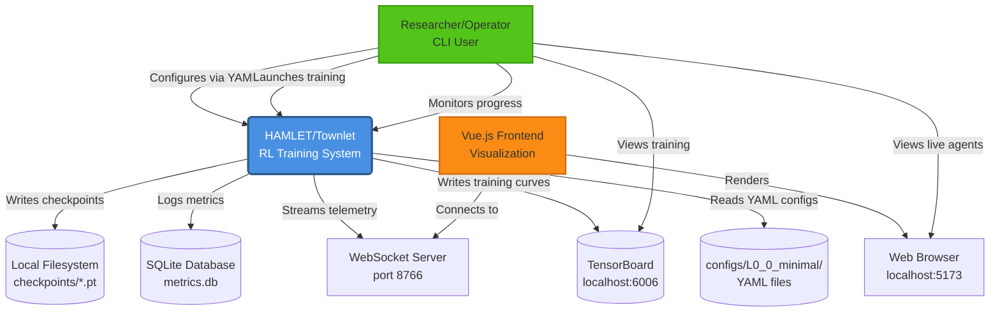
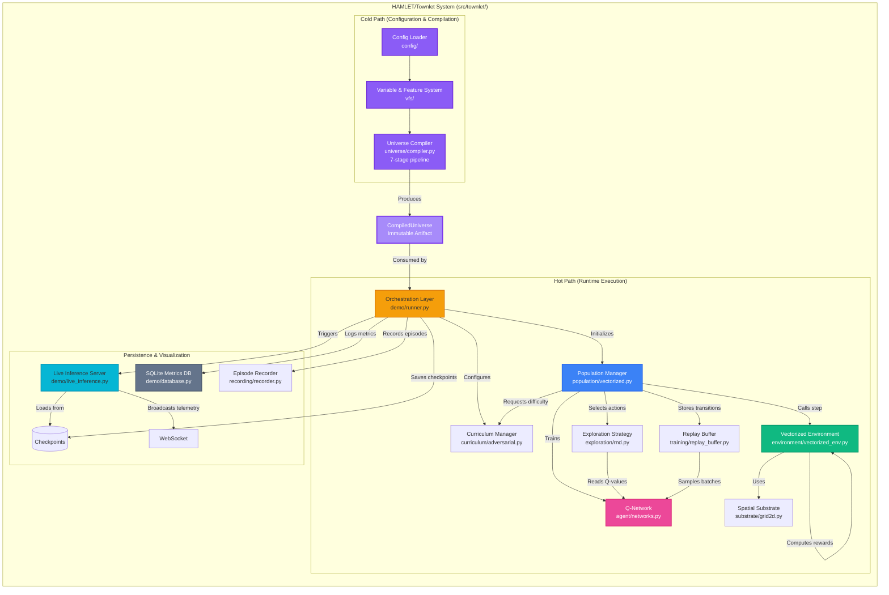
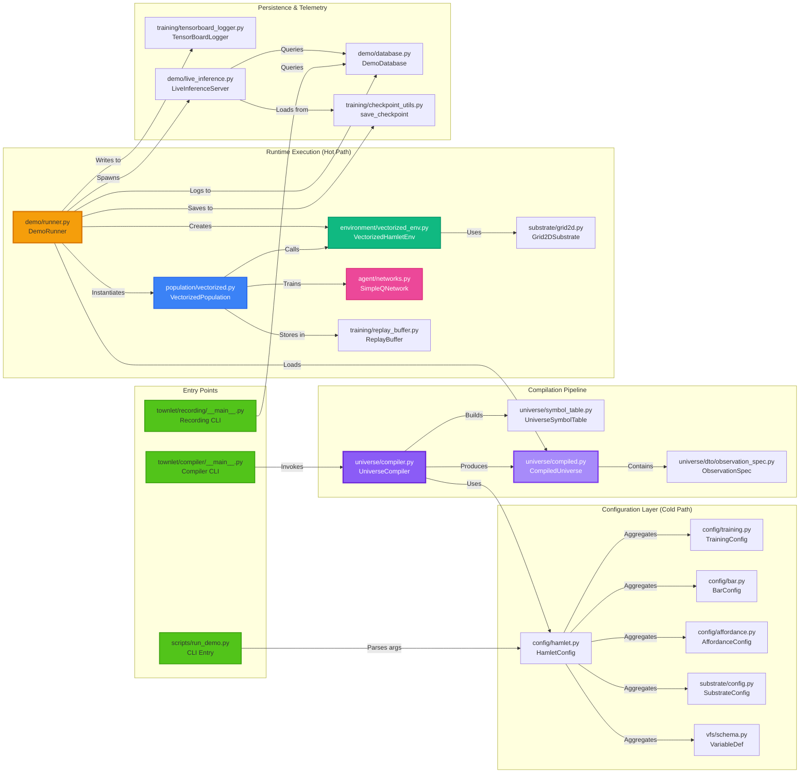

# HAMLET/Townlet System Architecture Analysis

**Generated**: 2025-11-12
**Scope**: Complete analysis of `src/` directory
**Methodology**: Autonomous codebase exploration with specialized subagents

---

## Executive Summary

The HAMLET/Townlet system is a **GPU-native pedagogical Deep Reinforcement Learning environment** implementing a vectorized training pipeline with adversarial curriculum learning. The architecture follows a **layered domain-driven design** with strict separation between compile-time configuration validation (cold path) and runtime training execution (hot path). The system comprises six major subsystems organized around clear interfaces: Configuration & Compilation, Environment Simulation, Agent Learning, Population Management, Orchestration & Runtime, and Recording & Visualization. All components are optimized for batched tensor operations with 98 Python files (~23K LOC) organized across 16 primary directories.

---

## Identified Subsystems

### 1. **Configuration & Compilation Subsystem**
**Location**: `src/townlet/{universe/, config/, vfs/}`
**Primary Responsibility**: Parse, validate, and compile YAML configurations into immutable runtime artifacts using a 7-stage compilation pipeline. Enforces the "no-defaults principle" where all behavioral parameters must be explicitly specified.

**Key Components**:
- `universe/compiler.py` - 7-stage pipeline (2249 LOC): parse → symbol table → resolve → cross-validate → metadata → optimization → emit/cache
- `config/` - 15 Pydantic DTO modules for type-safe configuration loading
- `vfs/` - Variable & Feature System providing declarative state space configuration

**Interfaces**:
- **Input**: YAML config packs (`substrate.yaml`, `bars.yaml`, `affordances.yaml`, etc.)
- **Output**: `CompiledUniverse` (immutable dataclass) with observation specs, action metadata, meter schemas

### 2. **Environment Simulation Subsystem**
**Location**: `src/townlet/{environment/, substrate/}`
**Primary Responsibility**: Execute vectorized game mechanics including meter dynamics, affordance interactions, spatial positioning, and reward computation. Supports multiple substrate types (Grid2D, Grid3D, GridND, Continuous, Aspatial).

**Key Components**:
- `environment/vectorized_env.py` - GPU-native batched environment (1378 LOC)
- `environment/affordance_engine.py` - Interaction execution logic
- `environment/meter_dynamics.py` - Per-step state updates
- `substrate/` - 6 positioning systems with pluggable interface

**Interfaces**:
- **Input**: Actions [batch_size], CurriculumDecisions
- **Output**: Observations [batch_size, obs_dim], Rewards [batch_size], Dones [batch_size]

### 3. **Agent Learning Subsystem**
**Location**: `src/townlet/{agent/, exploration/, training/}`
**Primary Responsibility**: Neural network architectures, action selection strategies, experience replay, and Q-learning algorithms (vanilla DQN and Double DQN).

**Key Components**:
- `agent/networks.py` - SimpleQNetwork (MLP, ~26K params) and RecurrentSpatialQNetwork (CNN+LSTM, ~650K params)
- `exploration/` - Epsilon-greedy, RND (Random Network Distillation), adaptive intrinsic motivation
- `training/replay_buffer.py` - Experience storage with sequential variant for LSTM

**Interfaces**:
- **Input**: Observations, Q-values, training state
- **Output**: Action indices, loss values, network gradients

### 4. **Population Management Subsystem**
**Location**: `src/townlet/{population/, curriculum/}`
**Primary Responsibility**: Coordinate multi-agent training with batched updates, manage curriculum progression (static or adversarial), and track per-agent runtime state.

**Key Components**:
- `population/vectorized.py` - Batched Q-learning training loop (933 LOC)
- `curriculum/adversarial.py` - Adaptive difficulty based on performance (484 LOC)
- `curriculum/static.py` - Fixed difficulty levels

**Interfaces**:
- **Input**: Environment observations, episode statistics
- **Output**: CurriculumDecisions (active_meters, depletion_multiplier), training metrics

### 5. **Orchestration & Runtime Subsystem**
**Location**: `src/townlet/demo/`
**Primary Responsibility**: Multi-day training orchestration, checkpoint management, live inference serving via WebSocket, and metrics persistence to SQLite.

**Key Components**:
- `demo/runner.py` - Multi-day training loop with checkpointing (934 LOC)
- `demo/live_inference.py` - FastAPI WebSocket server for visualization (1190 LOC)
- `demo/database.py` - SQLite persistence for episode metrics (407 LOC)
- `demo/unified_server.py` - Combined training + inference server (542 LOC)

**Interfaces**:
- **Input**: Config directory, checkpoint directory, episode targets
- **Output**: Checkpoints (PyTorch), metrics (SQLite), telemetry (WebSocket JSON)

### 6. **Recording & Visualization Subsystem**
**Location**: `src/townlet/recording/`
**Primary Responsibility**: Episode capture with filtering criteria, trajectory replay, and video export to MP4/GIF using FFmpeg.

**Key Components**:
- `recording/recorder.py` - Trajectory capture to LZ4-compressed MessagePack
- `recording/replay.py` - Trajectory playback for visualization
- `recording/video_export.py` - MP4/GIF generation pipeline
- `recording/criteria.py` - Filtering by stage, reason, reward thresholds

**Interfaces**:
- **Input**: Episode metadata, recorded steps, filtering criteria
- **Output**: Compressed recordings, rendered videos

---

## Architectural Diagrams

### Diagram 1: System Context Diagram (C1)

**Purpose**: Shows HAMLET/Townlet as a single system with external actors and integrations.



**Save to**: `docs/diagrams/c1_system_context.mmd`

---

### Diagram 2: Component Diagram (Internal Subsystems)

**Purpose**: Zooms into `src/townlet/` to show major subsystems and their interactions.



**Save to**: `docs/diagrams/c2_component_diagram.mmd`

---

### Diagram 3: Module Dependency Graph (Critical Paths)

**Purpose**: Shows the most important module-level dependencies and compilation flow.



**Save to**: `docs/diagrams/c3_dependency_graph.mmd`

---

## Architectural Patterns & Design Principles

### 1. **Cold Path / Hot Path Separation**

**Cold Path** (Configuration → Compilation):
- Pydantic-validated DTOs
- 7-stage compilation pipeline
- MessagePack caching for fast reloads
- No GPU operations
- Runs once per configuration change

**Hot Path** (Training Loop):
- PyTorch tensor operations
- GPU-optimized batched updates
- Minimal Python overhead
- Runs millions of times per training session

**Benefit**: Configuration errors caught early; runtime is pure tensor math.

### 2. **Substrate Agnosticism**

All positioning systems implement `SpatialSubstrate` ABC:
- `position_dim`, `position_dtype` - tensor shape metadata
- `initialize_positions()` - batch initialization
- `apply_movement()` - boundary-aware movement
- `compute_distance()` - configurable metrics
- `encode_observation()` - normalized coordinates

**Benefit**: Add new spatial topologies without touching environment/agent code.

### 3. **No-Defaults Principle**

All behavioral parameters must be explicitly specified in YAML configs. Pydantic DTOs enforce this at load time.

**Anti-pattern prevented**: Hidden code defaults → non-reproducible experiments.

### 4. **Observable by Design**

Key components expose their decision-making:
- `CurriculumManager.get_batch_decisions()` - Why was difficulty adjusted?
- `ExplorationStrategy.select_actions()` - Which actions were exploratory vs. greedy?
- `AdaptiveIntrinsicExploration` - Intrinsic weight annealing curves

**Benefit**: Pedagogical transparency for teaching RL concepts.

### 5. **Hub & Spoke Topology**

Two integration hubs coordinate subsystems:
- **Universe Compiler** (cold path) - Validates cross-module references
- **DemoRunner** (hot path) - Orchestrates training components

**Benefit**: Reduces coupling; each subsystem only talks to coordinator.

---

## Data Flow: End-to-End Training Pipeline

```
┌─────────────────────────────────────────────────────────────────┐
│ Phase 1: Configuration (Cold Path)                              │
└─────────────────────────────────────────────────────────────────┘

YAML Configs (configs/L1_full_observability/)
    ├── substrate.yaml
    ├── bars.yaml
    ├── affordances.yaml
    ├── cascades.yaml
    ├── training.yaml
    └── variables_reference.yaml
                ↓
UniverseCompiler.compile()
    ├── Stage 1: Parse YAML & validate syntax
    ├── Stage 2: Build symbol table (variables, affordances, meters)
    ├── Stage 3: Resolve references (e.g., bar dependencies in cascades)
    ├── Stage 4: Cross-validate relationships
    ├── Stage 5: Generate metadata DTOs
    ├── Stage 6: Optimize observation dimensions
    └── Stage 7: Emit CompiledUniverse + cache as MessagePack
                ↓
CompiledUniverse (Immutable Artifact)
    ├── hamlet_config: HamletConfig
    ├── variables_reference: Sequence[VariableDef]
    ├── metadata: UniverseMetadata
    ├── observation_spec: ObservationSpec (29 dims for L1)
    ├── action_space_metadata: ActionSpaceMetadata (8 actions)
    └── observation_activity: ObservationActivity

┌─────────────────────────────────────────────────────────────────┐
│ Phase 2: Training Initialization (Hot Path Setup)               │
└─────────────────────────────────────────────────────────────────┘

DemoRunner.__init__(config_dir="configs/L1_full_observability")
    ├── Load CompiledUniverse from cache
    ├── Instantiate VectorizedHamletEnv (batch_size=128)
    │   ├── Create Grid2DSubstrate (8×8 grid)
    │   ├── Initialize 14 affordances at random positions
    │   ├── Initialize 8 meters per agent (energy, health, etc.)
    │   └── Configure reward strategy (multiplicative: energy × health)
    ├── Instantiate VectorizedPopulation
    │   ├── Create SimpleQNetwork (29→256→128→8)
    │   ├── Create target network (copy of Q-network)
    │   ├── Create Adam optimizer (lr=0.001)
    │   └── Create ReplayBuffer (capacity=10000)
    ├── Instantiate AdversarialCurriculumManager
    ├── Instantiate RNDExploration (novelty-seeking)
    ├── Open DemoDatabase (SQLite)
    ├── Create TensorBoardLogger
    └── Ready for training loop

┌─────────────────────────────────────────────────────────────────┐
│ Phase 3: Training Loop (Hot Path Execution)                     │
└─────────────────────────────────────────────────────────────────┘

For each episode in range(max_episodes):

    1. Curriculum Decision
       curriculum_decisions = curriculum_manager.get_batch_decisions()
       # Returns: active_meters, depletion_multiplier per agent

    2. Environment Reset
       obs = env.reset(curriculum_decisions)  # [128, 29]

    3. Episode Rollout
       For each step until done:
           ├── Select actions (exploration strategy)
           │   q_values = q_network(obs)  # [128, 8]
           │   actions = exploration.select_actions(q_values)
           │
           ├── Environment step
           │   next_obs, rewards, dones, info = env.step(actions)
           │   # Update meters (depletion + affordance effects)
           │   # Apply cascade relationships (energy→health)
           │   # Compute rewards (energy × health)
           │
           └── Store transition
               replay_buffer.add(obs, actions, rewards, next_obs, dones)

    4. Training Step (every 4 environment steps)
       batch = replay_buffer.sample(batch_size=32)
       loss = compute_dqn_loss(batch, q_network, target_network)
       optimizer.zero_grad()
       loss.backward()
       torch.nn.utils.clip_grad_norm_(q_network.parameters(), max_norm=10)
       optimizer.step()

    5. Target Network Update (every 100 steps)
       target_network.load_state_dict(q_network.state_dict())

    6. Logging
       database.insert_episode(episode_id, survival_time, total_reward)
       tensorboard.log_scalars({"reward": total_reward, "loss": loss})

    7. Checkpointing (every 100 episodes)
       checkpoint_utils.save_checkpoint(
           path=f"checkpoints/checkpoint_{episode}.pt",
           q_network=q_network,
           optimizer=optimizer,
           episode=episode,
           config_hash=compiled_universe.config_hash
       )

┌─────────────────────────────────────────────────────────────────┐
│ Phase 4: Inference & Visualization                              │
└─────────────────────────────────────────────────────────────────┘

LiveInferenceServer (WebSocket on port 8766)
    ├── Poll checkpoint_dir for latest checkpoint
    ├── Load checkpoint when detected
    ├── Recreate population state (q_network, environment)
    ├── Run episodes in deterministic mode (greedy actions)
    └── Broadcast telemetry every step:
        {
          "episode_index": 42,
          "agents": [
            {
              "agent_id": "agent_0",
              "position": [3, 5],
              "meters": {"energy": 0.72, "health": 0.85},
              "affordance_interactions": {"Bed": 3, "Job": 1},
              "cumulative_reward": 145.2
            }
          ]
        }

Frontend (Vue.js)
    ├── WebSocket.connect("ws://localhost:8766/ws")
    ├── Render Grid.vue (8×8 SVG grid)
    ├── Draw agent sprites at positions
    ├── Draw affordance icons
    ├── Update meter bars
    └── Display novelty heatmap (RND exploration overlay)
```

---

## Key Metrics & Statistics

| Metric | Value |
|--------|-------|
| **Total Python Files** | 98 |
| **Total Lines of Code** | ~23,136 |
| **Largest Module** | `universe/compiler.py` (2,249 LOC) |
| **Primary Directories** | 16 |
| **Substrate Types** | 6 (Grid2D/3D/ND, Continuous/ND, Aspatial) |
| **Network Architectures** | 2 (SimpleQNetwork, RecurrentSpatialQNetwork) |
| **Exploration Strategies** | 3 (ε-greedy, RND, adaptive intrinsic) |
| **Curriculum Types** | 2 (static, adversarial) |
| **Config Modules** | 15 (Pydantic DTOs) |
| **CLI Entry Points** | 3 (run_demo, compiler, recording) |

---

## External Integrations

| System | Purpose | Location | Format |
|--------|---------|----------|--------|
| **SQLite** | Episode metrics, recordings | `demo/database.py` | SQLite3 + WAL mode |
| **WebSocket** | Live telemetry streaming | `demo/live_inference.py` | JSON over WebSocket |
| **TensorBoard** | Training curves | `training/tensorboard_logger.py` | Protocol Buffers |
| **PyTorch** | Checkpoints | `training/checkpoint_utils.py` | torch.save() |
| **MessagePack** | Universe cache | `universe/compiled.py` | msgpack binary |
| **FFmpeg** | Video export | `recording/video_export.py` | MP4/GIF via ffmpeg-python |
| **YAML** | Configuration | `config/base.py` | PyYAML with line tracking |

---

## Recommendations for Future Development

### High Priority
1. **Document Hot/Cold Path Contract**: Formalize the interface between `CompiledUniverse` and runtime components
2. **Resolve Environment↔Substrate Cycle**: Refactor `ActionConfig` to break bidirectional dependency
3. **Add Compilation Cache Invalidation Tests**: Ensure stale caches are detected

### Medium Priority
4. **Extract Database Interface**: Abstract `DemoDatabase` behind protocol for testing
5. **Split Universe Compiler by Stage**: Break 2249 LOC file into stage modules
6. **Add WebSocket Schema Versioning**: Prevent frontend breakage on telemetry changes

### Low Priority
7. **Consider MLflow Integration**: Already in dependencies but not wired
8. **Add Multi-GPU Support**: Extend `VectorizedPopulation` for data parallelism
9. **Cloud Checkpoint Sync**: Wrap file operations in `checkpoint_utils.py`

---

## Conclusion

The HAMLET/Townlet system demonstrates a **mature, production-ready architecture** with:
- ✅ Clear separation of concerns (cold/hot path, compile/runtime)
- ✅ Pluggable substrate design enabling diverse spatial topologies
- ✅ Type-safe configuration with Pydantic validation
- ✅ GPU-optimized vectorized operations throughout
- ✅ Comprehensive observability (TensorBoard, WebSocket, database)
- ✅ Pedagogical transparency (observable curriculum, exploration, rewards)

The codebase is well-suited for its stated mission: "Trick students into learning graduate-level RL by making them think they're just playing The Sims." The architecture enables experimentation without code changes (via YAML configs) while maintaining rigorous reproducibility through explicit parameter specification and checkpoint provenance tracking.

---

**Analysis Methodology**: This report was generated using autonomous subagent exploration with three specialized agents analyzing directory structure, import patterns, and external integrations in parallel. All findings were synthesized from actual codebase inspection rather than documentation inference.
