# STREAM-XXX: [Descriptive Title for Work Package]

**Created**: YYYY-MM-DD
**Updated**: YYYY-MM-DD (last status update)
**Type**: STREAM (Work package and implementation sequence document)
**Status**: [Planning | In Progress | On Hold | Completed]
**Overall Progress**: X% (Y of Z tasks completed)
**Method**: Research → Plan → Review Loop (see `methods/RESEARCH-PLAN-REVIEW-LOOP.md`)
**Analysis**: [Analysis method used, e.g., "Parallel subagent dependency extraction and synthesis"]

**Keywords**: [Add 5-8 searchable keywords]
**Subsystems**: [List all affected subsystems]
**Owner**: [Primary responsible person/team]
**Stakeholders**: [Who needs to be informed of progress]

---

## Work Package Charter

### Purpose and Scope

**What**: [One paragraph describing the work package]

**Why**: [Strategic value and business justification]

**Scope**:

- **In Scope**: [What's included]
- **Out of Scope**: [What's explicitly excluded]
- **Dependencies**: [External dependencies this package requires]

### Objectives and Success Criteria

**Primary Objectives**:

1. [Objective 1 - measurable]
2. [Objective 2 - measurable]
3. [Objective 3 - measurable]

**Success Criteria**:

- [ ] [Criterion 1 - specific and testable]
- [ ] [Criterion 2 - specific and testable]
- [ ] [Criterion 3 - specific and testable]

**Key Deliverables**:

- [Deliverable 1]: [Description and acceptance criteria]
- [Deliverable 2]: [Description and acceptance criteria]
- [Deliverable 3]: [Description and acceptance criteria]

---

## Status Dashboard

### Current Status (as of YYYY-MM-DD)

**Phase**: [Current phase name]
**Health**: [🟢 On Track | 🟡 At Risk | 🔴 Blocked]
**Progress**: X% complete (Y of Z tasks)
**Burn Rate**: [Actual hours used] / [Estimated hours] ([percentage]%)
**Projected Completion**: YYYY-MM-DD ([on schedule/X days early/Y days late])

### Phase Status

| Phase | Status | Progress | Effort (Est/Act) | Start Date | End Date | Notes |
|-------|--------|----------|------------------|------------|----------|-------|
| Phase 1: [Name] | [✓ Complete / ⏳ In Progress / ⏸ Blocked / ⏭ Pending] | X% | Yh / Zh | YYYY-MM-DD | YYYY-MM-DD | [Brief notes] |
| Phase 2: [Name] | [Status] | X% | Yh / Zh | YYYY-MM-DD | YYYY-MM-DD | [Brief notes] |
| Phase N: [Name] | [Status] | X% | Yh / Zh | YYYY-MM-DD | YYYY-MM-DD | [Brief notes] |

### Task Status

| Task | Status | Assignee | Progress | Effort (Est/Act) | Blockers |
|------|--------|----------|----------|------------------|----------|
| TASK-XXX: [Name] | [✓ Complete / ⏳ In Progress / ⏸ Blocked / ⏭ Pending] | [Name] | X% | Yh / Zh | [None / Issue link] |
| TASK-YYY: [Name] | [Status] | [Name] | X% | Yh / Zh | [Blocker description] |

---

## Risk Register

### Active Risks

**Risk 1: [Risk Title]**

- **ID**: RISK-XXX-001
- **Category**: [Technical / Resource / Schedule / Scope]
- **Probability**: [High / Medium / Low] ([X]%)
- **Impact**: [High / Medium / Low] ([description])
- **Risk Score**: [Probability × Impact] (1-9 scale)
- **Status**: [Open / Mitigating / Closed]
- **Owner**: [Responsible person]
- **Mitigation Strategy**:
  - [Action 1]
  - [Action 2]
- **Contingency Plan**: [Fallback if risk materializes]
- **Last Updated**: YYYY-MM-DD

**Risk 2: [Risk Title]**

- **ID**: RISK-XXX-002
- **Category**: [Category]
- **Probability**: [Level] ([X]%)
- **Impact**: [Level] ([description])
- **Risk Score**: [Score]
- **Status**: [Status]
- **Owner**: [Name]
- **Mitigation Strategy**:
  - [Action 1]
  - [Action 2]
- **Contingency Plan**: [Plan]
- **Last Updated**: YYYY-MM-DD

### Risk Summary

| Risk ID | Title | Category | Probability | Impact | Score | Status | Owner |
|---------|-------|----------|-------------|--------|-------|--------|-------|
| RISK-XXX-001 | [Title] | [Category] | [Level] | [Level] | [Score] | [Status] | [Name] |
| RISK-XXX-002 | [Title] | [Category] | [Level] | [Level] | [Score] | [Status] | [Name] |

**Risk Heatmap**:

```mermaid
%%{init: {'theme':'base'}}%%
quadrantChart
    title Risk Matrix (Probability vs Impact)
    x-axis "Low Probability" --> "High Probability"
    y-axis "Low Impact" --> "High Impact"
    quadrant-1 Monitor Closely (High Impact, Low Prob)
    quadrant-2 Critical Risks (High Impact, High Prob)
    quadrant-3 Low Priority (Low Impact, Low Prob)
    quadrant-4 Monitor (Low Impact, High Prob)
    R001: [0.7, 0.5]
    R002: [0.3, 0.8]
```

**Risk Score Legend**:

- **Critical (7-9)**: Immediate action required
- **High (5-6)**: Active mitigation needed
- **Medium (3-4)**: Monitor and plan
- **Low (1-2)**: Accept or monitor

---

## Issue Log

### Open Issues

**Issue 1: [Issue Title]**

- **ID**: ISSUE-XXX-001
- **Category**: [Bug / Design Decision / Clarification / Resource]
- **Severity**: [Critical / High / Medium / Low]
- **Status**: [Open / In Progress / Resolved / Closed]
- **Reported**: YYYY-MM-DD
- **Reporter**: [Name]
- **Assignee**: [Name]
- **Description**: [Detailed description of issue]
- **Impact**: [How this affects the work package]
- **Resolution Plan**:
  - [Action 1]
  - [Action 2]
- **Target Resolution**: YYYY-MM-DD
- **Last Updated**: YYYY-MM-DD

**Issue 2: [Issue Title]**

- **ID**: ISSUE-XXX-002
- **Category**: [Category]
- **Severity**: [Level]
- **Status**: [Status]
- **Reported**: YYYY-MM-DD
- **Reporter**: [Name]
- **Assignee**: [Name]
- **Description**: [Description]
- **Impact**: [Impact]
- **Resolution Plan**:
  - [Action 1]
  - [Action 2]
- **Target Resolution**: YYYY-MM-DD
- **Last Updated**: YYYY-MM-DD

### Issue Summary

| Issue ID | Title | Category | Severity | Status | Assignee | Target Date |
|----------|-------|----------|----------|--------|----------|-------------|
| ISSUE-XXX-001 | [Title] | [Category] | [Level] | [Status] | [Name] | YYYY-MM-DD |
| ISSUE-XXX-002 | [Title] | [Category] | [Level] | [Status] | [Name] | YYYY-MM-DD |

### Resolved Issues

| Issue ID | Title | Resolution | Resolved Date | Resolution Time |
|----------|-------|------------|---------------|-----------------|
| ISSUE-XXX-000 | [Title] | [Summary of resolution] | YYYY-MM-DD | [X days] |

---

## Blockers and Dependencies

### Active Blockers

**Blocker 1: [Blocker Title]**

- **ID**: BLOCK-XXX-001
- **Blocking**: [TASK-XXX, TASK-YYY]
- **Category**: [External Dependency / Resource / Technical / Approval]
- **Severity**: [Critical / High / Medium / Low]
- **Status**: [Blocked / Escalated / Resolving]
- **Blocked Since**: YYYY-MM-DD
- **Owner**: [Responsible for resolution]
- **Description**: [What is blocking progress]
- **Impact**: [Schedule impact, affected tasks]
- **Resolution Actions**:
  - [ ] [Action 1]
  - [ ] [Action 2]
- **Escalation Path**: [Who to escalate to if not resolved by date]
- **Target Resolution**: YYYY-MM-DD
- **Last Updated**: YYYY-MM-DD

### External Dependencies

| Dependency | Provider | Status | Required By | Impact if Delayed |
|------------|----------|--------|-------------|-------------------|
| [Dependency 1] | [External team/system] | [On Track / At Risk / Delayed] | YYYY-MM-DD | [Impact description] |
| [Dependency 2] | [External team/system] | [Status] | YYYY-MM-DD | [Impact description] |

### Blocker Timeline


---

## Resource Allocation

### Team Composition

| Role | Name | Allocation | Start Date | End Date | Tasks Assigned |
|------|------|------------|------------|----------|----------------|
| [Lead Engineer] | [Name] | [X]% | YYYY-MM-DD | YYYY-MM-DD | TASK-XXX, TASK-YYY |
| [Developer] | [Name] | [X]% | YYYY-MM-DD | YYYY-MM-DD | TASK-ZZZ |
| [Reviewer] | [Name] | [X]% | YYYY-MM-DD | YYYY-MM-DD | All tasks |

### Effort Tracking

| Phase | Estimated Effort | Actual Effort | Variance | Remaining |
|-------|------------------|---------------|----------|-----------|
| Phase 1 | [X]h | [Y]h | [+/-Z]h | [W]h |
| Phase 2 | [X]h | [Y]h | [+/-Z]h | [W]h |
| **Total** | **[X]h** | **[Y]h** | **[+/-Z]h** | **[W]h** |

### Capacity Planning

- **Total Available Capacity**: [X] person-hours per week
- **Current Utilization**: [Y]% ([Z] hours allocated)
- **Buffer Capacity**: [W]% ([V] hours available)

---

## Communication and Reporting

### Stakeholder Communication

| Stakeholder | Role | Interest | Influence | Communication Frequency | Channel |
|-------------|------|----------|-----------|-------------------------|---------|
| [Name] | [Role] | [High/Med/Low] | [High/Med/Low] | [Weekly/Biweekly/Monthly] | [Email/Slack/Meeting] |

### Status Report Schedule

- **Weekly Updates**: [Day and time] via [Channel]
- **Phase Reviews**: [After each phase completion]
- **Steering Committee**: [Monthly/Quarterly] on [Day]
- **Documentation**: [Where status reports are archived]

### Decision Log

| Date | Decision | Rationale | Impact | Decided By |
|------|----------|-----------|--------|------------|
| YYYY-MM-DD | [Decision made] | [Why this was chosen] | [What changed] | [Name/Group] |

---

## Task Renumbering (if applicable)

This STREAM document reflects the following task renumbering:

| Original | New | Description |
|----------|-----|-------------|
| TASK-XXX | TASK-YYY | [Description of task] |
| TASK-AAA | TASK-BBB | [Description of task] |

---

## Executive Summary

This document defines the optimal execution order for [TASK-XXX through TASK-YYY] based on dependency analysis, effort estimates, and architectural principles. The analysis reveals **[TASK-XXX]** as the critical starting point, with a total implementation timeline of **[X-Y hours]** using parallelization.

**Key Finding**: [Critical insight from dependency analysis]

---

## Optimal Task Execution Order

```mermaid
flowchart TD
    Phase1["PHASE 1: [PHASE NAME] (X-Yh)<br/>✓ TASK-XXX: [Task Name]"]
    Phase2A["PHASE 2: [PHASE NAME] (X-Yh)<br/>✓ TASK-XXX: [Task Name]"]
    Phase2B["✓ TASK-YYY: [Task Name]<br/>(PARALLEL)"]
    Phase3["PHASE 3: [PHASE NAME] (X-Yh)<br/>✓ TASK-XXX: [Task Name]"]

    Phase1 --> Phase2A
    Phase1 --> Phase2B
    Phase2A --> Phase3
    Phase2B --> Phase3

    style Phase1 fill:#e1f5e1,stroke:#4caf50,stroke-width:2px
    style Phase2A fill:#fff3e0,stroke:#ff9800,stroke-width:2px
    style Phase2B fill:#fff3e0,stroke:#ff9800,stroke-width:2px
    style Phase3 fill:#e3f2fd,stroke:#2196f3,stroke-width:2px
```



---

## Task Dependency Matrix

| Task | Effort | Priority | Depends On | Provides |
|------|--------|----------|------------|----------|
| **TASK-XXX** ([Name]) | X-Yh | [CRITICAL/HIGH/MEDIUM/LOW] | [Dependencies] | [What it provides] |
| **TASK-YYY** ([Name]) | X-Yh | [CRITICAL/HIGH/MEDIUM/LOW] | [Dependencies] | [What it provides] |
| **TASK-ZZZ** ([Name]) | X-Yh | [CRITICAL/HIGH/MEDIUM/LOW] | [Dependencies] | [What it provides] |

---

## Dependency Graph


---

## Phase-by-Phase Implementation Plan

### Phase 1: [Phase Name] (X-Yh)

**Goal**: [What this phase accomplishes]

#### TASK-XXX: [Task Name]

- **Effort**: X-Yh
- **Priority**: [CRITICAL/HIGH/MEDIUM/LOW]
- **Dependencies**: [None or list dependencies]
- **Deliverables**:
  - [Deliverable 1]
  - [Deliverable 2]
  - [Deliverable 3]
- **Why First**:
  - [Reason 1]
  - [Reason 2]
  - [Reason 3]

**Success Criteria**:

- [ ] [Criterion 1]
- [ ] [Criterion 2]
- [ ] [Criterion 3]

---

### Phase 2: [Phase Name] (X-Yh parallelized)

**Goal**: [What this phase accomplishes]

#### TASK-YYY: [Task Name]

- **Effort**: X-Yh
- **Priority**: [CRITICAL/HIGH/MEDIUM/LOW]
- **Dependencies**: [Dependencies]
- **Deliverables**:
  - [Deliverable 1]
  - [Deliverable 2]
- **Why Second**:
  - [Reason 1]
  - [Reason 2]

**Parallel Execution**: TASK-YYY + TASK-ZZZ

#### TASK-ZZZ: [Task Name]

- **Effort**: X-Yh
- **Priority**: [CRITICAL/HIGH/MEDIUM/LOW]
- **Dependencies**: [Dependencies]
- **Deliverables**:
  - [Deliverable 1]
  - [Deliverable 2]
- **Why Third**:
  - [Reason 1]
  - [Reason 2]

**Success Criteria (Phase 2)**:

- [ ] [Criterion 1]
- [ ] [Criterion 2]
- [ ] [Criterion 3]

**Time Savings**: Parallelization saves X-Yh vs sequential execution

---

### Phase N: [Phase Name] (X-Yh)

**Goal**: [What this phase accomplishes]

#### TASK-XXX: [Task Name]

- **Effort**: X-Yh
- **Priority**: [CRITICAL/HIGH/MEDIUM/LOW]
- **Dependencies**: [Dependencies]
- **Deliverables**:
  - [Deliverable 1]
  - [Deliverable 2]
- **Why Last**:
  - [Reason 1]
  - [Reason 2]

**Success Criteria**:

- [ ] [Criterion 1]
- [ ] [Criterion 2]

---

## Timeline and Effort Estimates

### Sequential Timeline (No Parallelization)

- **Phase 1**: X-Yh ([TASK-XXX])
- **Phase 2**: X-Yh ([TASK-YYY] + [TASK-ZZZ] sequential)
- **Phase 3**: X-Yh ([TASK-AAA])
- **Total**: **X-Yh** (excludes deferred tasks)

### Parallelized Timeline (Optimal)

- **Phase 1**: [TASK-XXX] = **X-Yh**
- **Phase 2**: max([TASK-YYY], [TASK-ZZZ]) = **X-Yh** (saves X-Yh)
- **Phase 3**: [TASK-AAA] = **X-Yh**
- **Total**: **X-Yh** (saves X-Yh vs sequential)

### Time Savings from Parallelization

- **Sequential**: X-Yh (≈X-Y working days)
- **Parallelized**: X-Yh (≈X-Y working days)
- **Savings**: X-Yh (X-Y% reduction, ≈X-Y working days)

### Critical Path

The critical path (cannot be shortened without reducing scope):


---

## Rationale by Design Principle

### 1. "[Design Principle Name]"

**Order**: [Description of ordering principle]

**From [Source Document]**:
> "[Quote from source document]"

**Applied**:

- [How principle was applied to this stream]

---

### 2. "[Design Principle Name]"

**Pattern**: [Description of pattern]

**Applied**: [How pattern affects task ordering]

---

### N. "[Design Principle Name]"

**Test**: "[Test question]"

**Applied across tasks**:

- [Application example 1]
- [Application example 2]

---

## Risk Analysis

### High-Risk Dependencies

**Risk 1: [Risk Name]**

- **Issue**: [Description of risk]
- **Impact**: [What happens if this occurs]
- **Mitigation**:
  - [Mitigation strategy 1]
  - [Mitigation strategy 2]

**Risk 2: [Risk Name]**

- **Issue**: [Description of risk]
- **Impact**: [What happens if this occurs]
- **Mitigation**:
  - [Mitigation strategy 1]
  - [Mitigation strategy 2]

---

### Low-Risk Opportunities

**Opportunity 1: [Opportunity Name]**

- **Advantage**: [What makes this an opportunity]
- **Benefit**: [Value gained]
- **Recommendation**: [Actionable recommendation]

**Opportunity 2: [Opportunity Name]**

- **Advantage**: [What makes this an opportunity]
- **Benefit**: [Value gained]
- **Recommendation**: [Actionable recommendation]

---

## Alternative Ordering: [Alternative Approach Name]

If preferring **[alternative strategy]**, [TASK-XXX] could move earlier/later:

### Alternative Sequence

1. [TASK-XXX] - X-Yh
2. **[TASK-YYY]** - X-Yh ← **[EARLIER/LATER]**
3. [TASK-ZZZ] - X-Yh

**Pros**:

- [Advantage 1]
- [Advantage 2]

**Cons**:

- [Disadvantage 1]
- [Disadvantage 2]

**Trade-off**: [Analysis of trade-off]

**Recommendation**: **[Chosen approach]** because:

- [Reason 1]
- [Reason 2]

---

## Success Metrics

### Phase Completion Criteria

**Phase 1 Complete When**:

- [ ] [Criterion 1]
- [ ] [Criterion 2]
- [ ] [Criterion 3]

**Phase 2 Complete When**:

- [ ] [Criterion 1]
- [ ] [Criterion 2]
- [ ] [Criterion 3]

**Phase N Complete When**:

- [ ] [Criterion 1]
- [ ] [Criterion 2]

---

## Integration Points

### Between Phases

**Phase 1 → Phase 2**:

- [TASK-XXX] provides [output] → [TASK-YYY] uses for [purpose]

**Phase 2 → Phase 3**:

- [TASK-YYY] provides [output] → [TASK-ZZZ] uses for [purpose]

**Phase N → Phase N+1**:

- [TASK-XXX] provides [output] → [TASK-YYY] uses for [purpose]

---

## Lessons Applied from Research Method

### From [Source Document]

**Lesson 1: "[Lesson Name]"** ✓

- [How lesson was applied]

**Lesson 2: "[Lesson Name]"** ✓

- [How lesson was applied]

**Lesson N: "[Lesson Name]"** ✓

- [How lesson was applied]

---

## Recommendations

### Immediate Next Steps

1. **Start [TASK-XXX]** - X-Yh
   - [Reason 1]
   - [Reason 2]

2. **Plan [TASK-YYY] and [TASK-ZZZ] concurrently**
   - [Planning activity 1]
   - [Planning activity 2]

3. **Defer [TASK-AAA] [indefinitely/until condition]**
   - [Rationale]

### Parallelization Strategy

- **Phase N**: Assign [TASK-XXX] and [TASK-YYY] to separate developers (saves X-Yh)
- **Total savings**: X-Yh (X-Y% reduction)

### Incremental Delivery

Rather than "big bang" delivery after X-Yh:

**Milestone 1** (X-Yh): [Phase Name] complete

- [Deliverable 1]
- [Deliverable 2]

**Milestone 2** (X-Yh): [Phase Name] complete

- [Deliverable 1]
- [Deliverable 2]

**Milestone N** (X-Yh): [Phase Name] complete

- [Deliverable 1]
- [Deliverable 2]

---

## Conclusion

The optimal task execution order is:

**[XXX] → ([YYY] ∥ [ZZZ]) → [AAA] → ([BBB] ∥ [CCC]) → [DDD] → ([EEE] deferred)**

This sequence:

- **Respects dependencies** ([explanation])
- **Maximizes parallelization** ([explanation])
- **Follows substrate hierarchy** ([explanation])
- **Prioritizes leverage** ([explanation])
- **Defers low-value work** ([explanation])
- **Enables incremental delivery** ([explanation])

**Total Timeline**: X-Yh parallelized (vs X-Yh sequential)

**Critical Path**: [TASK-XXX] → [TASK-YYY] → [TASK-ZZZ] → [TASK-AAA]

**Next Action**: Begin [TASK-XXX] for [reason/benefit].

---

## Appendix: Task Summaries

### TASK-XXX: [Task Name]

**GOAL**: [One-sentence description]

**DEPENDS ON**: [Dependencies]

**PROVIDES**: [What it delivers]

**EFFORT**: X-Y hours

**PRIORITY**: [CRITICAL/HIGH/MEDIUM/LOW]

**TASK FILE**: `docs/tasks/TASK-XXX-[DESCRIPTIVE-NAME].md`

---

### TASK-YYY: [Task Name]

**GOAL**: [One-sentence description]

**DEPENDS ON**: [Dependencies]

**PROVIDES**: [What it delivers]

**EFFORT**: X-Y hours

**PRIORITY**: [CRITICAL/HIGH/MEDIUM/LOW]

**TASK FILE**: `docs/tasks/TASK-YYY-[DESCRIPTIVE-NAME].md`

---

### TASK-ZZZ: [Task Name]

**GOAL**: [One-sentence description]

**DEPENDS ON**: [Dependencies]

**PROVIDES**: [What it delivers]

**EFFORT**: X-Y hours

**PRIORITY**: [CRITICAL/HIGH/MEDIUM/LOW]

**TASK FILE**: `docs/tasks/TASK-ZZZ-[DESCRIPTIVE-NAME].md`

---

**END OF STREAM SPECIFICATION**
